# PPO Exploitation Gap

**Research question.** Given a fixed amount of experience `D`, what prevents
PPO from reaching the best policy that can be extracted from `D`? Can that gap be reduced by a careful selection of hyperparameters or does it require a change to the optimization mechanism of PPO itself ? 

This is a study of PPO's *optimization/exploitation* behavior in isolation
from exploration: the environment, the data-collection policy, and the
dataset itself are all held fixed, so that any performance difference
between experiments is attributable to how well each one extracts
information already present in `D` — not to differences in what was
collected.

## Motivating paper

This project is directly motivated by:

> Glen Berseth, ["Is Exploration or Optimization the Problem for Deep
> Reinforcement Learning?"](https://arxiv.org/pdf/2508.01329) (2025)

That paper introduces the **experience optimal policy** `π̂*` — the best
policy recoverable from an agent's own collected experience — and defines
**practical sub-optimality** as the gap between it and the learned policy,
`V(π̂*(s0)) − V(π_θ(s0))`. It reports that across many
environments and both PPO and DQN, the experience-optimal value is typically 
2–3× the learned policy's own value — in the paper's own words, these algorithms 
"only exploit half of the good experience they generate." — i.e. that much of 
deep RL's difficulty on hard tasks is an
*exploitation/optimization* problem, not an *exploration* problem.

This project adapts that core idea into a controlled, single-algorithm
study: instead of comparing PPO against DQN across many environments with
different data-generating processes, we fix one environment, one dataset
`D`, and study PPO against modified versions of itself, so that the
resulting exploitation-gap numbers are cleanly attributable to a single
algorithmic change at a time. See "Relationship to the motivating paper"
below for the precise correspondence and the places this project
deliberately diverges.

## The core decomposition

For a learned policy `π_alg` trained on a fixed dataset `D`, define the
**experience-optimal policy** `π_D*` as the best policy extractable from the
information in `D` (not the globally optimal policy `π*` for the
environment). Then:

```
J(π*) − J(π_alg) = [J(π*) − J(π_D*)]  +  [J(π_D*) − J(π_alg)]
                     exploration/data       exploitation/optimization
                          gap                        gap
```

This project only ever intervenes on the second term. The first term is a
property of how `D` was collected and is held fixed throughout.

**Terminology, kept strictly distinct throughout the codebase:**

<div align="center">

| Term | Means | Does NOT mean |
|---|---|---|
| Exploitation *frequency* | how often the agent acts greedily w.r.t. its current policy (e.g. deterministic/mode action at eval time) | how *good* that greedy behavior actually is |
| Exploitation *quality* | how much of the value latent in `D` the learned policy actually recovers | how deterministic the policy is |
| Optimization | the mechanical process of updating θ to improve the PPO objective | value estimation |

</div>

A policy can be 100% "exploitative" in the frequency sense (always takes
its best-known action) while still being very bad at exploitation in the
quality sense (its best-known action is wrong, because the critic/advantage
estimate or the policy update failed to extract what `D` actually supports).
This project is about the latter.

## Environment

A custom **stochastic maze** (`src/ppo_exploitation/envs/stochastic_maze.py`),
designed specifically so that `π_D*` can be computed *exactly* while PPO
still faces a genuine function-approximation challenge:

- **Ground-truth state** is a single integer (`row * width + col`) — finite,
  fully enumerable. This is what the reference solver operates on, and what
  every rollout (of every policy) actually executes in.
- **PPO's observation** is a separate, richer 8-dim continuous encoding
  (normalized position, local wall sensors, hazard flag, BFS-based
  normalized distance to goal). PPO never sees the integer state directly —
  it has to generalize across positions rather than memorize a lookup table.
  Exactness of `π_D*` is a property of *how it's
  solved*, never a constraint on what PPO is allowed to see.
- **Stochasticity** is a simple, closed-form "slip" model: with probability
  `slip_prob`, the executed action is resampled uniformly at random from all
  four actions instead of the intended one. Because this is analytic, the
  *exact* transition kernel `P(s'|s,a)` is computable without sampling —
  this is what makes the true-dynamics definition of `π_D*` possible (see
  below).
- **Multiple paths of different length/risk**: a randomized-DFS spanning
  tree guarantees start↔goal connectivity, then a small fraction of extra
  walls are knocked down to create loops/alternate routes, and hazard cells
  are scattered off the guaranteed-safe path — manufacturing genuine local
  optima (a short risky route vs. a longer safe one) for PPO to potentially
  fail to fully exploit.
- **Sparse reward, long horizon** (default 30×30, max 200 steps, only
  terminal reward + a small per-step penalty) — deliberately non-trivial,
  so the exploitation gap doesn't collapse to ~0 for lack of a real credit
  assignment problem.

## Approximating π_D*: two definitions, never conflated

`π_D*` is generally impossible to know exactly for a real environment — so
this project restricts itself to an environment small and structured enough
that it *can* be known exactly, and then computes it two different, clearly
labeled ways (`src/ppo_exploitation/reference/experience_optimal.py`):

**(i) Empirical / MLE `π_D*`** — solve the Bellman equations of the
maximum-likelihood MDP estimated purely from `D`'s own transition counts,
via exact tabular value iteration. This is the honest ceiling on what *any*
learner operating only on `D` could figure out: finite-sample noise in `D`
is a real, inescapable part of this ceiling, not something to be corrected
away. This is the **primary definition** used in all exploitation-gap
arithmetic.

**(ii) True-dynamics, support-restricted `π_D*`** — solve using the
environment's actual, exact transition kernel (available to us because we
built the environment), but restricted to only the `(state, action)` pairs
`D` actually visited. This uses privileged knowledge no real learner has, so
it is reported as a **diagnostic**, not the headline ceiling: the gap
between (i) and (ii) tells you how much of an apparent "PPO exploitation
gap" is really just sampling noise in the definition of the ceiling itself,
versus a genuine PPO limitation.

**Unvisited `(s,a)` convention.** Any `(state, action)` pair never observed
in `D` is routed, **during the DP solve only**, to a dedicated absorbing
state with a large fixed negative reward (`unseen_penalty`, default `-50`,
configured in `configs/reference.yaml`). This must be set more negative
than any achievable real return so that greedy value iteration always
prefers a *visited* action at a state whenever one exists. `D` supplies
value iteration with a transition and reward **model** — how the
environment behaves — never a default **behavior** to fall back on: the
Bellman equations are solved from that model alone, with no notion of
"what the data-collecting policy `π_β` would have done." So there is no
`π_β`-shaped default to borrow either, only the arbitrary (but fixed, and
reproducible) tie-break value iteration itself produces when every action
at a state is equally unvisited-and-penalized.

**This penalty is deliberately *not* reapplied at live-rollout evaluation
time.** Reapplying the same logic would mean that if a tabular
`π_D*` policy landed on a state with zero visited actions in `D`, the
evaluator forcibly ended the episode there and charged `unseen_penalty` a
second time. That would be a mistake, for a reason worth stating
plainly: a neural policy has no notion of an "unseen state" at all. Every
observation gets a forward pass and an action, informed by whatever the
network generalizes from nearby states — there is no special branch, no
early termination, in training or in production. `π_D*`, being a lookup
table, structurally cannot generalize like that, and that's *intentional*
— crediting it with neural-style generalization would stop it from
measuring "the best extractable from `D` alone" and start measuring "the
best extractable from `D` plus borrowed function-approximation capacity."
But forcibly ending the episode doesn't just withhold that credit; it
manufactures a penalty the real environment would never actually impose,
silently deflating `J(π_D*)` by an amount that has nothing to do with what
`D` supports. (Querying `π_β` directly for a fallback action was
considered and rejected for the same underlying reason: it would smuggle
`π_β`'s own neural generalization back into a ceiling that's supposed to
depend on `D` alone.)

**What actually happens:** `ReferenceSolution.act(state)` always
returns a real action — value iteration's own default at that state, an
uninformed tie-break when the state has zero coverage, the genuinely
optimal action when it doesn't — and the live evaluator just lets the real
environment continue normally, exactly as it would for any other state.
What's tracked instead is *how often this happens*: `evaluate_policy`
accepts an optional `covered_states` set and reports
`uncovered_state_step_rate` / `uncovered_state_episode_rate` — the
fraction of steps/episodes where the policy acted on a state `D` never
informed it about. `scripts/05_evaluate_all.py` reports these alongside
every other column for both `π_D*` variants (`NaN` for neural policies,
which have no such notion). Read `J(π_D*)` together with this diagnostic:
a low uncovered-state rate means the reported ceiling is trustworthy more
or less as-is; a high one is a flag that `D`'s coverage, not `π_D*`'s
solve, is the limiting factor for that particular run — which is itself
useful information, since it points at the exploration/data term of the
decomposition rather than the exploitation term this project studies.

**Evaluation is always live-rollout, for every policy.** The DP solve gives
`π_D*` a closed-form `V(s0)` too, but that's a *theoretical* value under the
(possibly imperfect) solved model. The number that actually goes into the
exploitation-gap arithmetic is always the empirical mean return from live
rollouts in the real environment, using identical seeds/episode counts
across every policy — the prior, both `π_D*` variants, standard PPO, and
modified PPO. `scripts/03_compute_pi_d_star.py` prints both numbers so you
can see how close they are, but only `scripts/05_evaluate_all.py`'s output
is the headline result.

## The four policies we compare

Every result in this project is a comparison across exactly four policies,
all scored the same way (live rollouts, same seeds, same episode count —
see "Evaluation is always live-rollout" above):

1. **`π_D*` (empirical / MLE)** — the primary ceiling, solved exactly via
   value iteration on the MLE model of `D` (definition (i) above).
2. **`π_D*` (true-restricted)** — the diagnostic ceiling, solved exactly
   using the environment's real dynamics restricted to `D`'s support
   (definition (ii) above).
3. **PPO standard** — one rigorous PPO trust-region window on `D` (see
   below), with ordinary, unmodified hyperparameters
   (`configs/ppo_fixed_d_standard.yaml`).
4. **PPO modified** — the same trainer, same code path, with exactly one
   hyperparameter changed to test a specific hypothesis
   (`configs/ppo_fixed_d_modified.yaml`, or any `configs/ppo_fixed_d_h*.yaml`
   variant added later).

`scripts/05_evaluate_all.py` produces one table with all four (plus the
prior, `π_β`, as an extra reference point). The headline exploitation gap
is always `J(π_D*_empirical) − J(PPO standard)`; `π_D*` (true-restricted)
bounds how much of that gap is sampling noise in the ceiling itself rather
than a real PPO limitation, and PPO modified tests whether a specific
mechanism closes any of the remainder.

## What "fixed-D training" means for PPO, operationally

PPO's normal rhythm is: collect a batch with `π_old` → run `epochs` epochs
of clipped updates against it → throw the batch away → collect a *new*
batch with the now-updated policy → repeat. PPO never reuses a batch
across more than one such window — once a batch has been used to update
`θ`, continuing to use it for a second window would mean updating against
a `π_old` that no longer reflects any policy that actually generated data,
which is exactly why real PPO always collects fresh data before
continuing.

Once `D` is frozen, there is no fresh data to collect. This project models
exactly the ONE window PPO's own rules actually license, as rigorously as
possible, rather than inventing a multi-window scheme PPO itself has no
equivalent of:

```
π_old  <- π_β                           # fixed for the entire run, never
                                          # refreshed -- π_β is the literal
                                          # checkpoint that generated D
θ      <- π_β's weights                  # theta starts where pi_old is
advantages, returns <- computed ONCE, from π_β's own critic
for epoch in range(epochs):
    shuffle D into minibatches
    clipped PPO update of θ against π_β
```

`src/ppo_exploitation/ppo/fixed_d_trainer.py` implements exactly this.
`epochs` (`PPOHyperparams.epochs`) is the swept hyperparameter, standing in
for "how much PPO can extract from `D` within the one window its own
update rule allows it." No call to `env.step()` ever happens here, and `D`
is read-only.

**Why not reuse `D` for multiple windows (refresh `π_old`, keep going)?**
Tha would mean periodicallysnapshotting `π_old ← θ` and continuing training on the same `D` for many
outer iterations. That scheme has a real correctness problem, not just a
stylistic one. The actions in `D` were generated by `π_β`, and PPO's ratio
`r_t(θ) = π_θ(a_t|s_t) / π_old(a_t|s_t)` is only a genuine importance-
sampling ratio relative to the policy that actually produced `a_t` when
`π_old = π_β`. As soon as `π_old` is refreshed away from `π_β`, the ratio's
denominator stops being the real behavior policy's probability and becomes
a moving, undocumented reference — the clip still bounds movement
*relative to that reference*, but says nothing about the real, growing
mismatch with `π_β`. Restricting to a single window removes this problem
by construction (`π_old = π_β` is exactly true throughout, by definition)
rather than by measuring a drift and hoping it stays small. See "Further
analyses" at the bottom for what the multi-window scheme would still be
useful for, as a separate, clearly-labeled question.

**For now, standard PPO and modified PPO are the same code path.** They differ only
in which YAML config is loaded (`configs/ppo_fixed_d_standard.yaml` vs.
`configs/ppo_fixed_d_modified.yaml`) — this guarantees any measured
difference in the resulting exploitation gap is attributable to the
hyperparameter/mechanism that changed, never to an accidental code
divergence.

**How much training is "enough"? The clip mechanism tells you, empirically
— it doesn't have to be decided in advance.** Sweeping `epochs` (H4 below)
is the right way to ask "did we really extract the maximum PPO can give
us," but a fixed epoch count chosen up front can't answer that by itself.
Two signals, both already logged in `results/*_history.csv`, can:
`clip_frac` (the fraction of the batch where the clip is currently active)
and live evaluation on held-out seeds never used anywhere in training or
dataset collection. As `clip_frac` approaches saturation, most of the
batch contributes zero gradient and further epochs stop moving `θ` in any
way PPO's own trust region actually licenses — and if held-out performance
has already plateaued by that same point, that plateau is the maximum this
mechanism can give you for this `D`, not an arbitrary cutoff chosen in
advance. `FixedDPPOTrainer.train(verbose=True)` prints a note when
`clip_frac` crosses 0.9 for exactly this reason.

## Hypotheses (H1–H7)

The exploitation gap could come from the value/advantage-estimation side or
the policy-optimization side. Every field below is a YAML-reachable knob in
`configs/ppo_fixed_d_*.yaml` — no code changes needed to test any of these:

<div align="center">

| # | Hypothesis | Config field(s) |
|---|---|---|
| H1 | Critic doesn't accurately represent the information in `D` | network capacity, `value_coef` |
| H2 | Advantage estimates misrank actions | `gae_lambda`, GAE implementation |
| H3 | The clip range prevents sufficient policy improvement | `clip_eps` |
| H4 | The single trust-region window is too short to extract what the clipped objective would otherwise allow | `epochs` |
| H5 | Entropy regularization prevents deterministic exploitation | `entropy_coef` |
| H6 | Policy network lacks capacity | `hidden_sizes` |
| H7 | Optimization hyperparameters (lr, minibatch size, grad clipping) limit convergence | `lr`, `minibatch_size`, `max_grad_norm` |

</div>

`configs/ppo_fixed_d_modified.yaml` ships as a worked example testing H4
(`epochs: 10 → 30`) with every other field held identical to the standard
config — copy it as a template for testing any other single hypothesis
(change exactly one field per copy, per the project's own "modify ONE
component at a time" rule). When sweeping `epochs` specifically, read it
alongside `clip_frac` in the saved history, per the note above — a higher
`epochs` value that only pushes `clip_frac` further into saturation
without changing held-out performance isn't evidence of a larger true
ceiling, it's evidence the window had already stopped mattering.

Note on H5 specifically, since it's easy to get wrong: **entropy_coef is
never zeroed by default.** Zeroing it *during training* is itself an
intervention on the optimization trajectory (a candidate for H5), not a
neutral preprocessing step — it changes what θ you end up with. It is not
the PPO analogue of DQN's `epsilon=0`. The actual analogue of `epsilon=0`
is evaluating with the deterministic/mode action rather than sampling
(`make_neural_act_fn(net, deterministic=True)` in `eval/evaluate.py`,
the default for all evaluation scripts) — that changes only how a *fixed* θ
is read out, never how it was trained.

## Two kinds of tests, kept deliberately separate

`tests/` contains two things that answer different questions and should
never be conflated:

**`tests/test_env.py`, `tests/test_reference.py`, `tests/test_fixed_d_trainer.py`
(Tier-1 unit / pipeline-bug tests).** "Is this specific piece of code
correct?" These check individual components of the actual research
library against hand-derived or structurally-guaranteed expectations —
e.g. `test_reference.py` hand-derives the closed-form fixed point of a
tiny stochastic self-loop MDP and checks the value-iteration solver
matches it to `1e-4`; `test_fixed_d_trainer.py` checks that `π_old`'s
stored log-probabilities exactly match `π_β`'s own, and that `θ` starts at
exactly `π_β`'s weights. Fast (seconds), narrow, no claim about the real
30×30 maze study beyond "the code that will run it isn't buggy."

**`tests/tier0/` (Tier-0 cross-environment pipeline validation).** "Does the
*full* pipeline — collect `D` → compute `π_D*` → train fixed-D PPO →
evaluate everything under one protocol — actually run start to finish and
produce well-formed output on an environment we did **not** build
ourselves?" This runs the exact same library code
(`src/ppo_exploitation/...`, completely unmodified) against gymnasium's
`FrozenLake-v1` (4×4, slippery) instead of the custom maze, via a small
adapter (`tests/tier0/frozen_lake_env.py`) that exposes the same minimal
interface (`get_state()`, `n_states`, `is_terminal_state`,
`true_transition_probs`/`true_reward` sourced directly from gymnasium's own
`env.unwrapped.P` rather than hand-derived). It exercises **both** `π_D*`
definitions (empirical and true-restricted), trains a short fixed-D PPO
run, and checks the final gap report is well-formed (finite returns,
success rates in `[0, 1]`). It does not attempt to produce a
scientifically meaningful result — for that, see the real Tier-1 study.
Takes about a minute.

If Tier-0 ever needed pipeline code special-cased for FrozenLake to pass,
that would itself be a signal the pipeline had quietly become overfit to
the maze; so far it hasn't needed any.

```bash
pytest tests/ -v           # everything: Tier-1 unit tests + Tier-0
pytest tests/tier0/ -v     # just the cross-environment validation
```

## Results analysis

### Baseline run (target_success_rate = 0.35)

This is the first complete pipeline run and establishes the frozen base
for the rest of this study: `π_β`, `D`, and both `π_D*` solutions below do
not change as later sections test individual PPO modifications (H1–H7) —
only the fixed-D PPO config varies from here on. `configs/ppo_fixed_d_modified.yaml`'s
current value (`epochs: 30`) is an arbitrary placeholder inherited from
earlier pipeline validation, not a chosen hypothesis — it is reported below
for completeness only, and is revisited once a real testing path is
decided; no conclusion should be drawn from "modified" as it currently
stands.

**Prior checkpoint (`π_β`).** Confirmed at iteration 282: tracking-seed
eval `success_rate=0.356±0.021`, independent confirmation-seed eval
`success_rate=0.354±0.021` — tight agreement, and `reached_near_target_zone=True`
confirms the near-target per-iteration checking (see `scripts/01_train_prior.py`)
did engage before the crossing was found. A *third* independent 500-episode
sample, taken later during final evaluation (`--eval-seed 999`, distinct
from both training-time seeds), came in at `success_rate=0.310±0.021` —
about 2.1 standard errors below the first two. This is exactly the kind of
sampling variation the whole tracking/confirmation design exists to make
visible rather than hide: even two independent samples agreeing tightly is
not a guarantee that a third will land in the same place, particularly for
a checkpoint selected *because* it crossed a threshold (a mild "selection
effect" — a checkpoint accepted for clearing a bar is somewhat more likely
to have its true rate sit at or below that bar than comfortably above it).
Read `target_success_rate` as "the threshold used to select a checkpoint
in roughly this performance range," not as a guaranteed exact figure under
every possible evaluation sample.

**Dataset D.** 4000 episodes, 626,133 transitions, state-action coverage
22.36% (351/900 states, 805/3600 state-action pairs touched). Notably,
this is essentially the *same* coverage the earlier (abandoned) 66%-prior
run reached at the same episode count (23.6%) — a much weaker, more
error-prone behavior policy did not translate into meaningfully broader
state-action coverage. The eval `mean_length=181.7` (out of `max_steps=200`)
for `π_β` suggests most of its episodes are running out the clock rather
than dying quickly, which is consistent with wandering within a limited
region rather than covering new ground faster.

**π_D\* (both definitions).** Empirical: `V(s0)=-0.1492`. True-restricted:
`V(s0)=-0.1540`. Close agreement,
`covered_states=351/900` for both (support is fixed by `D`, so this number
is identical by construction). One thing worth flagging explicitly: these
`V(s0)` values are *negative* discounted theoretical values, while the
live-rollout `mean_return` for empirical `π_D*` reported in the gap table
below is *positive* (`+0.1057`). This is not a contradiction — it is
precisely why the README's "Evaluation is always live-rollout" rule
exists. `V(s0)` discounts a reward arriving after a long, mostly-successful
path (with `γ=0.99`, a reward arriving ~150 steps out is worth roughly
`0.99^150 ≈ 0.22` of its face value), while the undiscounted live rollout
simply sums actual rewards received along whatever path was actually
taken (mean episode length in the live eval was much shorter, `88.6`
steps). The two numbers are answering different questions — only the
live-rollout number is used in any gap arithmetic.

**Live-rollout results** (500 episodes, `--eval-seed 999`, identical
protocol for every policy):

<div align="center">

| policy | mean_return | success_rate | mean_length | gap vs π_D\*_empirical (return / success) |
|---|---|---|---|---|
| prior `π_β` | −1.544 ± 0.032 | 31.0% ± 2.1pp | 181.7 | +1.650 / +67.2pp |
| `π_D*` empirical | 0.106 ± 0.014 | 98.2% ± 0.6pp | 88.6 | — |
| `π_D*` true-restricted | 0.109 ± 0.013 | 98.4% ± 0.6pp | 88.5 | −0.003 / −0.2pp |
| standard PPO | −0.894 ± 0.039 | 65.0% ± 2.1pp | 151.3 | +1.000 / +33.2pp |
| modified PPO (epochs=30, a first try) | −0.883 ± 0.037 | 64.4% ± 2.1pp | 148.4 | +0.989 / +33.8pp |

</div>

**Interpretation.**

- **Coverage is trustworthy.** `uncovered_state_step_rate` for both `π_D*`
  variants is ≤0.07% over the full 500-episode eval — the reported ceiling
  is essentially never leaning on an uninformed default, so it can be read
  at face value.
- **The exploration/data term is large.** `π_D*` (98%) vastly exceeds `π_β`
  (31%) — `D`, generated by a policy that only reaches the goal about a
  third of the time, contains enough information to construct a
  near-perfect policy via exact DP. This is the qualitative pattern the
  motivating paper's core mechanism describes, now reproduced in this
  project's own controlled setting.
- **The exploitation term is also large, and this is the actual finding.**
  Standard PPO recovers 65.0% success against a 98.2% ceiling — it
  captures roughly two-thirds of what `D` supports and leaves about a
  third of it unexploited (33.2 percentage points). PPO is not failing to
  learn anything from `D` (65% is well above `π_β`'s own 31%), but it is
  leaving a substantial, measurable amount of value on the table. This is
  the exploitation gap this project set out to study, and at this prior
  strength it is large enough to be worth investigating.

**A note on eval seeds, relevant for everything that follows below**: the
reference lines and epoch-0 values in the next subsections
(`π_β ≈ 0.348`, `π_D* ≈ 0.992`) differ from the baseline table above
(`π_β = 0.310`, `π_D* = 0.982`) — this is deliberate, not an
inconsistency.
What's frozen across this whole project is the *artifacts* (`π_β`'s
weights, `D`'s contents, `π_D*`'s solved policy) — never regenerated.
What's reported for any given plot is always evaluated fresh, under
whatever eval seed that specific analysis uses, and every point *within*
one plot must share the same seed or the curve mixes incomparable
samples. `scripts/analyze_epochs.py` uses `eval_seed=24680` throughout
(see script docstring) rather than importing numbers computed under
script 05's `seed=999`, precisely to keep every point in a given figure
internally consistent. The ~2–4 percentage point gap between the two
seeds' estimates of the same frozen `π_β`/`π_D*` is itself expected
sampling variance (`stderr≈2.1pp` each, well under 2 standard errors
apart) — see "Baseline run" above for the same observation made the first
time it appeared.


### Epoch-count ceiling analysis (H4, clip_eps=0.2)

The 10-vs-30-epoch null result above only rules out a small range. To test
epochs on its own terms, `scripts/analyze_epochs.py` trains a single
300-epoch run (30–100× the conventional range — Schulman et al. 2017 use
K=3 for Atari-style discrete-action environments, K=10 for MuJoCo) on the
same frozen `D`/`π_β`, checkpointing live success_rate/mean_return every 5
epochs against 500 fixed held-out episodes never touched by training. At
`clip_eps=0.2`, the result is not a smooth plateau: from epoch ~35 onward,
the deterministic policy repeatedly alternates between two essentially
fixed configurations — `success_rate≈0.704` and `success_rate≈0.914` —
recurring bit-for-bit identically many times over the full 300 epochs
(the 0.914 policy alone recurs at 11 of 61 checkpoints, last seen at epoch
285), never settling on one or exceeding the higher of the two.
`clip_frac` climbs slowly and monotonically the entire run (0.0 → 0.266),
nowhere near saturation, so the clip mechanism itself still has headroom —
it is not obviously the wall. `entropy` falls over the first ~10 epochs,
stays flat until ~epoch 130, then climbs steadily back up through epoch
300, well after the oscillation had already begun.

This means epochs alone is a real but partial factor: more epochs clearly
help early on (0 → ~35), but past that point the fixed-D optimization
under `clip_eps=0.2` is not behaving like a well-behaved (concave-like)
climb toward a single optimum — it is cycling between at least two
attractors. A direct consequence worth taking seriously: since the
trajectory is non-monotonic, a *shorter* run (10 epochs, the standard
range) could just as easily land on an intermediate epoch that happens to
sit in the worse of the two regimes as the better one — the run never
"locks in" progress, so a fixed epoch count chosen a priori has no
guarantee of landing on the best policy the run ever produced, even if a
better one appeared earlier in training. This is a genuinely open question
about how the update mechanism could be made to preserve its own best
intermediate result, not just its final one — see "Further analyses"
below.

<table width="100%">
<tr>
<td width="50%">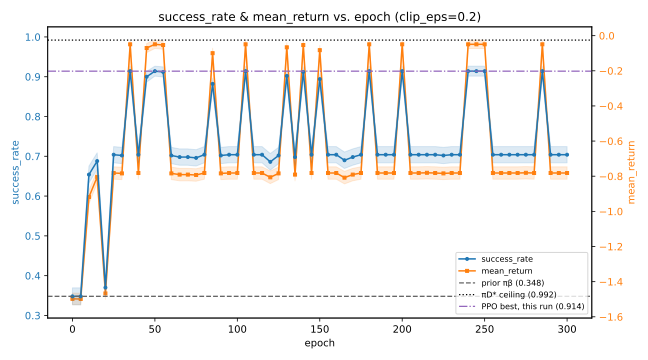<br><em>success_rate &amp; mean_return vs. epoch, clip_eps=0.2. Dashed/dotted/dash-dot lines mark the prior, the exact π_D* ceiling, and this run's best observed success_rate.</em></td>
<td width="50%">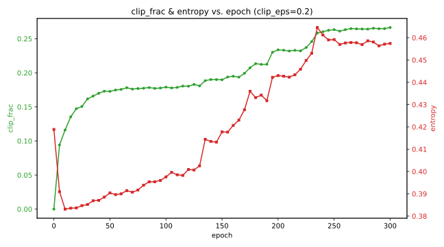<br><em>clip_frac &amp; entropy vs. epoch, clip_eps=0.2. clip_frac never approaches saturation; entropy falls then climbs again well after the oscillation begins.</em></td>
</tr>
</table>

### Clip range sweep (H3, clip_eps ∈ {0.1, 0.2, 0.3, 0.4})

Since epochs alone doesn't explain the ceiling, the same 300-epoch sweep
was re-run at `clip_eps=0.1`, `0.3`, and `0.4` (in addition to `0.2`
above), everything else identical, to see how much of the ceiling
`clip_eps` itself is responsible for:

<table width="100%">
<tr>
<td width="50%">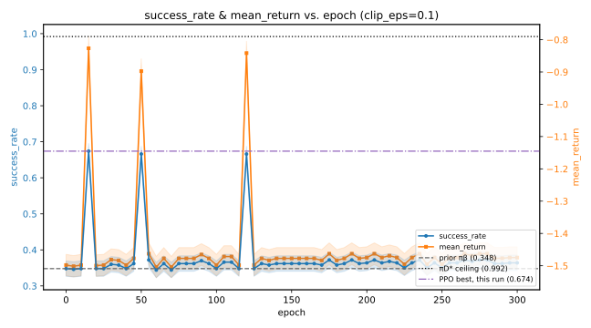<br><em>clip_eps=0.1 — best observed: 0.674 (epoch 15), mean over the run: 0.376</em></td>
<td width="50%"><br><em>clip_eps=0.2 — best observed: 0.914 (epoch 35), mean over the run: 0.735</em></td>
</tr>
<tr>
<td width="50%">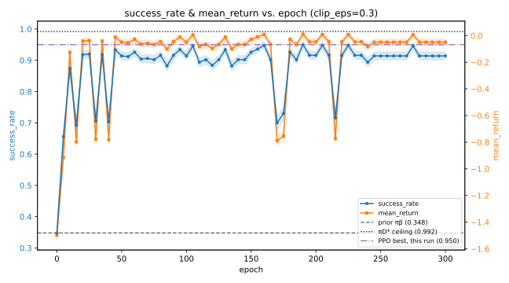<br><em>clip_eps=0.3 — best observed: 0.950 (epoch 190), mean over the run: 0.881</em></td>
<td width="50%">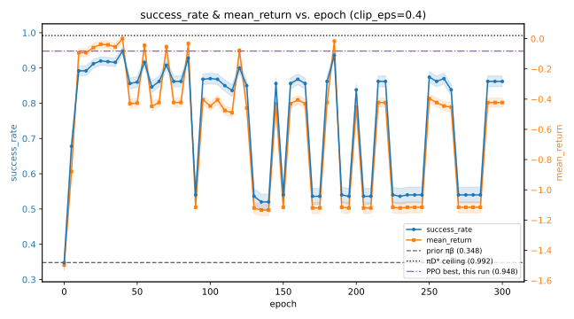<br><em>clip_eps=0.4 — best observed: 0.948 (epoch 40), mean over the run: 0.753</em></td>
</tr>
</table>

The oscillation between (at least) two recurring policies persists at
every clip_eps value tested — this is not specific to `0.2`. But the
*range* of that oscillation, and the best point it ever reaches, both
depend heavily on `clip_eps`:

- **Tighter (`0.1`) clearly limits the ceiling.** The best observed
  success_rate drops to 0.674 — well below every other setting, reached
  only once (epoch 15) — and the run spends nearly all of its time
  hovering near the prior (0.348; mean over the whole run: 0.376), with
  only three brief, narrow spikes escaping it. A trust region this tight
  does not give the policy enough room to move toward what `D` actually
  supports.
- **Looser (`0.4`) does not clearly help, and shows real instability.**
  Its best observed value (0.948) is close to `0.3`'s, but it is hit only
  **once**, at epoch 40, and never approached again for the remaining 260
  epochs — the run instead spends much of that time swinging as low as
  ~0.50–0.54 repeatedly (mean over the run: 0.753, well below `0.3`'s
  0.881). A wider trust region lets `θ` move further per epoch, but that
  extra freedom reads as drifting further into an imperfect fit of `D`'s
  finite, noisy sample rather than toward a better policy — consistent
  with overfitting to `D` rather than extracting more from it.
- **`0.3` is the best-behaved setting tested.** Highest best-observed
  success_rate (0.950, closest of any run to the 0.992 ceiling) *and*
  highest mean (0.881) — unlike `0.4` it keeps returning to its best
  region (6 of 61 checkpoints within 0.005 of its max, last at epoch 275)
  rather than spiking once and drifting away.

The practical reading: `clip_eps` is a real, first-order lever on how much
of `D` this mechanism can extract — worth a properly informed choice
rather than defaulting to the conventional `0.2`. It also suggests
scheduling `clip_eps` over the course of training (analogous to
learning-rate schedules) might be worth exploring, rather than treating it
as a single fixed value for an entire window — added to "Further
analyses" below.

<table width="100%">
<tr>
<td width="50%">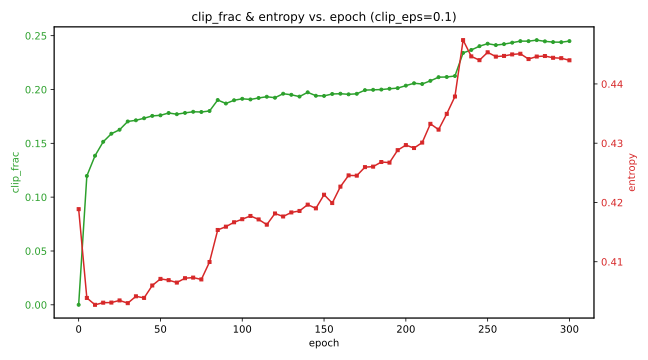<br><em>clip_frac &amp; entropy vs. epoch, clip_eps=0.1</em></td>
<td width="50%"><br><em>clip_frac &amp; entropy vs. epoch, clip_eps=0.2</em></td>
</tr>
<tr>
<td width="50%">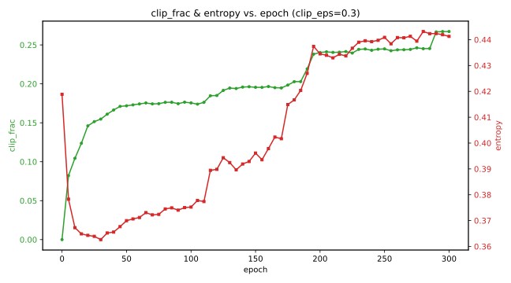<br><em>clip_frac &amp; entropy vs. epoch, clip_eps=0.3</em></td>
<td width="50%">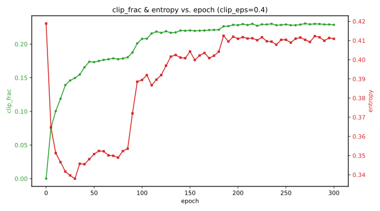<br><em>clip_frac &amp; entropy vs. epoch, clip_eps=0.4</em></td>
</tr>
</table>

These diagnostics mostly complement the success_rate story rather than
contradicting it. `clip_frac` is not directly comparable in absolute terms
across different `clip_eps` values (a narrower band is mechanically easier
to exceed, so a given amount of underlying policy drift produces a higher
`clip_frac` at `0.1` than the same drift would at `0.4` — the numbers
answer "how often was the band hit," not "how far did the policy move").
What is comparable is the *shape*: every setting shows the same
monotonically-climbing `clip_frac` and the same fall-then-rise `entropy`
pattern, and `0.4`'s `entropy` finishes lower (~0.41) than the other three
(~0.44–0.46) while its `clip_frac` plateaus earlier and at a lower level —
consistent with the wider band clipping less per step, letting `θ` settle
into a narrower, more confident (but, per the success_rate plot, less
reliable) policy rather than continuing to explore alternatives. Nothing
here points in a different direction from the success_rate/return
evidence — if anything it sharpens the "`0.4` drifts, `0.3` doesn't"
reading.

### Entropy coefficient sweep (H5, entropy_coef ∈ {0.0, 0.003, 0.01, 0.03, 0.1}, clip_eps=0.3)

Same 300-epoch protocol, `clip_eps` fixed at the best setting found above
(`0.3`), `entropy_coef` swept across two orders of magnitude:

<div align="center">

| entropy_coef | best | mean | std | final entropy | final clip_frac |
|---|---|---|---|---|---|
| 0.0 | 0.948 | 0.877 | 0.115 | 0.357 | 0.206 |
| 0.003 | 0.948 | 0.875 | 0.102 | 0.385 | 0.214 |
| **0.01 (default)** | **0.950** | **0.881** | 0.099 | 0.441 | 0.267 |
| 0.03 | 0.946 | 0.876 | 0.099 | 0.546 | 0.357 |
| 0.1 | 0.938 | 0.881 | 0.080 | 0.827 | 0.471 |

</div>

**`entropy_coef` does not shorten the gap.** Best success_rate stays within
`[0.938, 0.950]` and mean within `[0.875, 0.881]` across the whole
range — no meaningful movement toward the `0.992` ceiling. What *does*
change, monotonically, is the oscillation's amplitude: `std` falls from
`0.115` (`ent=0.0`) to `0.080` (`ent=0.1`) as `entropy_coef` increases, and
at `ent=0.1` the run visibly stabilizes after ~epoch 50 (one early dip,
then a smooth plateau) rather than continuing to swing sharply —
`clip_frac`/`entropy` genuinely saturate there, unlike every lower-value
run. `entropy_coef` acts as a damper on the oscillation, not a fix for
whatever causes it.

<table width="100%">
<tr>
<td width="50%">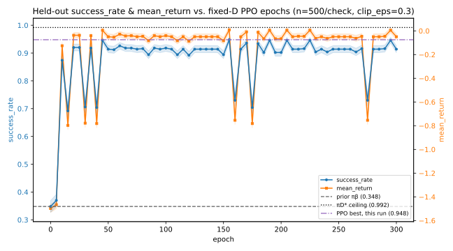<br><em>entropy_coef=0.0 — repeated deep dives persist through epoch 300</em></td>
<td width="50%">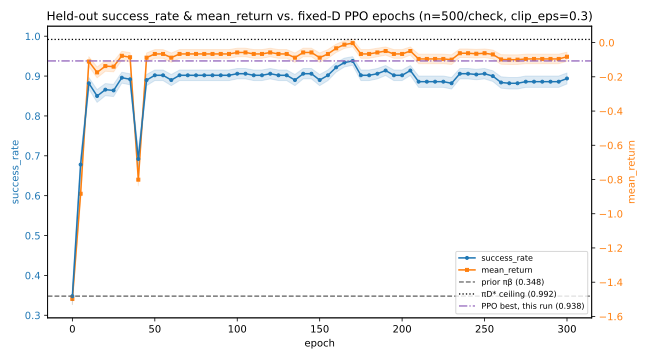<br><em>entropy_coef=0.1 — one early dip, then a stable plateau from ~epoch 50 on</em></td>
</tr>
</table>

**Best configuration to date: `clip_eps=0.3`, `entropy_coef=0.01`** (the
default) — highest best-observed (`0.950`) and highest mean (`0.881`) of
every run tested so far.

### GAE lambda sweep (H2, gae_lambda ∈ {0.0, 0.5, 0.90, 0.95, 1.0}, clip_eps=0.3, entropy_coef=0.01)

Widening `epochs` far beyond the conventional range (H4, above) surfaces a
risk specific to this project's design: advantages/returns are computed
**once**, from `π_β`'s own critic, before any of up to 300 epochs of
updates run against them (see "What fixed-D training means for PPO,
operationally") — the longer that window, the more that fixed target can
drift out of step with the policy `θ` has actually become by the time
later epochs use it. `gae_lambda` is the natural next test precisely
because it controls how much the advantage estimate leans on that
(possibly-stale) critic versus on `D`'s own directly-observed rewards —
`λ→0` bootstraps through the critic at every single step, `λ→1` uses the
real accumulated rewards along the trajectory and treats the critic as
just a baseline.

Same 300-epoch protocol, `clip_eps=0.3` and `entropy_coef=0.01` now both
held at their best settings, `gae_lambda` swept across its full valid
range:

<div align="center">

| gae_lambda | best | mean | std |
|---|---|---|---|
| 0.0 | 0.348 | 0.030 | 0.043 |
| 0.5 | 0.348 | 0.034 | 0.043 |
| **0.90** | **0.954** | **0.908** | 0.090 |
| 0.95 (previous best) | 0.950 | 0.881 | 0.099 |
| 1.0 | 0.926 | 0.757 | 0.172 |

</div>

This is the sharpest result of any sweep so far — a qualitative failure,
not just a shift in oscillation amplitude. At `gae_lambda ∈ {0.0, 0.5}`,
success_rate collapses within ~5 epochs and never exceeds the prior again
(mean `≈0.03`). GAE at low `λ` leans almost entirely on `π_β`'s own critic,
bootstrapped at every single step (`A_t ≈ r_t + γV(s_{t+1}) - V(s_t)`); that
critic was only trained up to a ~35%-success policy, and an advantage
signal built almost entirely on it transmits that inaccuracy directly,
epoch after epoch, with nothing to correct it. At `gae_lambda=1.0`
(pure Monte Carlo, minimal reliance on the critic), the collapse
disappears but a different cost shows up exactly where predicted: `std`
more than doubles the previous-best's (`0.172` vs `0.099`), the run
briefly drops *below* the prior at epoch 5, and it oscillates more sharply
than any non-collapsed run tested — the advantage estimate is now built
almost entirely from `D`'s own noisy, stochastic realized returns, computed
once and reused unchanged for all 300 epochs with nothing to average that
noise away. `gae_lambda=0.90` lands in between and is the best config
found in this project so far on both axes at once — higher ceiling *and*
lower variance than the `0.95` default.

<table width="100%">
<tr>
<td width="50%">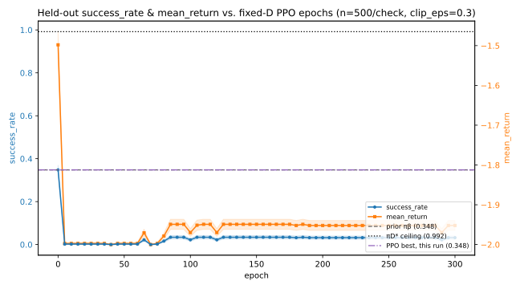<br><em>gae_lambda=0.0 — collapses within ~5 epochs, never recovers</em></td>
<td width="50%">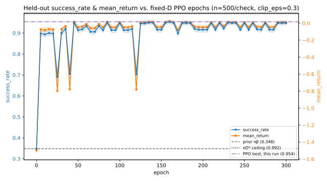<br><em>gae_lambda=0.90 — new best: highest ceiling, lowest variance yet</em></td>
</tr>
</table>

This is the strongest evidence yet for this project's leading hypothesis:
advantage/return targets computed once from `π_β`'s critic and never
refreshed across a 300-epoch window are not a minor caveat — their
quality visibly makes or breaks the entire mechanism, in a way no other
hyperparameter tested so far has.

**Best configuration to date: `clip_eps=0.3`, `entropy_coef=0.01`,
`gae_lambda=0.90`** — best-observed `0.954`, mean `0.908`.

### GAE lambda refinement (clip_eps=0.3, entropy_coef=0.01, gae_lambda ∈ {0.80, 0.85, 0.90, 0.93, 0.95, 0.97})

Narrowing around the new best point rather than trusting a single sampled
value:

<div align="center">

| gae_lambda | best | mean | std |
|---|---|---|---|
| 0.80 | 0.954 | 0.882 | 0.092 |
| 0.85 | 0.950 | 0.899 | 0.092 |
| **0.90** | 0.954 | **0.908** | 0.090 |
| 0.93 | 0.952 | 0.902 | **0.087** |
| 0.95 | 0.950 | 0.881 | 0.099 |
| 0.97 | 0.952 | 0.857 | 0.139 |

</div>

`best` is essentially flat across the whole range (`0.950`–`0.954`) — this
refinement didn't uncover a sharper peak, it confirmed the wide sweep had
already landed in the right neighborhood. `mean` and `std` are the more
informative signals here: both stay favorable across `[0.85, 0.93]`, with
`0.90` retaining the highest mean (`0.908`), and both degrade clearly by
`0.97` (mean drops to `0.857`, std rises to `0.139`) — the same variance
cost that dominates at `gae_lambda=1.0`, already visible in miniature (see
image below). One honest caveat: each point here is a single run with no
repeated seeds, so the precise ordering among `{0.85, 0.90, 0.93}` (a 1–3
percentage-point spread on mean) shouldn't be read as more than "this is
a good, fairly wide plateau" — not "`0.90` is optimal to the decimal."

<div align="center">
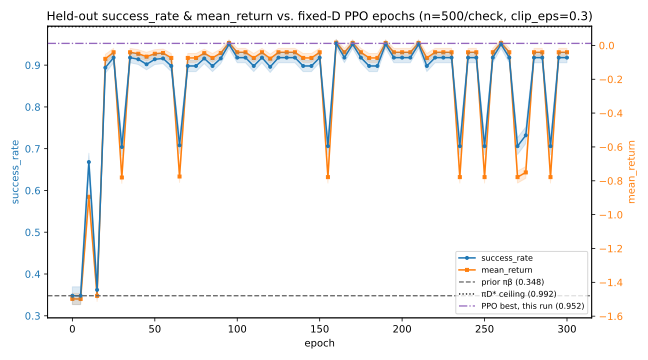<br><em>gae_lambda=0.97 — deeper, more frequent dips than 0.90, foreshadowing the collapse seen at 1.0.</em>
</div>

**Confirmed best configuration: `clip_eps=0.3`, `entropy_coef=0.01`,
`gae_lambda=0.90`** — sits inside a broad, stable plateau rather than on a
fragile isolated peak.

### Value coefficient sweep (H1, value_coef ∈ {0.0, 0.1, 0.25, 0.5, 1.0}, clip_eps=0.3, entropy_coef=0.01, gae_lambda=0.90)

`value_coef` weighs the critic's regression loss in the combined loss
backpropagated through a single optimizer with a single, global
`clip_grad_norm_` call across *both* networks' parameters together —
verified to be exactly the pattern Stable-Baselines3's reference PPO
implementation uses (itself following OpenAI Spinning Up / the original
PPO2 code), so this is a property of standard PPO, not a deviation from
it. Because `policy_net` and `value_net` are fully separate here (no
shared trunk) and advantages come from `π_β`'s frozen critic (never
recomputed from the trainable one), the only channel left for
`value_coef` to matter is that shared gradient-clipping norm — a large
`value_loss` could in principle dominate it and shrink the policy's own
gradient step:

<div align="center">

| value_coef | best | mean | std |
|---|---|---|---|
| 0.0 | 0.954 | 0.901 | 0.094 |
| 0.1 | 0.952 | 0.911 | 0.085 |
| 0.25 | 0.954 | 0.906 | 0.089 |
| 0.5 (default) | 0.954 | 0.908 | 0.090 |
| 1.0 | 0.952 | 0.907 | 0.088 |

</div>

**Flat, in every column, across the full range.** `best` varies by at most
`0.002` (checkpoint-timing noise, not signal), `mean` by one percentage
point, `std` by under one. The hypothesized interference channel exists in
principle (confirmed against real PPO reference code above) but never
actually triggers at this project's `max_grad_norm=0.5` — `value_loss`
apparently never gets large enough to dominate the combined norm,
regardless of how much weight `value_coef` gives it.

One check worth documenting because it nearly produced a wrong
conclusion: these five runs also converge noticeably faster and more
smoothly than the `clip_eps`/`entropy_coef` sweeps run earlier (e.g.
`success_rate≈0.90` already by epoch 5, versus `≈0.65` for those earlier
runs). This *looked* like a `value_coef` effect at first glance — but all
five values here share `gae_lambda=0.90`, and all five land on the *exact
same* epoch-5 value (`0.898`, matching to three decimals). Cross-checking
against every other saved run confirms this fast, smooth convergence is a
signature of `gae_lambda≈0.90` (see above), entirely independent of
`value_coef` — a useful reminder to check what else was held fixed before
attributing an effect to the one variable being swept.

**H1 is closed: `value_coef` has no measurable effect, in either
direction, anywhere in `[0.0, 1.0]`.** This is itself informative — it
confirms the trainable critic's own quality is functionally irrelevant to
this pipeline's outcome, exactly as the mechanism above predicts.

### Gradient-clipping cross sweep (H7 × H1, max_grad_norm ∈ {0.1, 0.5, 1.0} × value_coef ∈ {0.0, 0.5, 1.0}, clip_eps=0.3, entropy_coef=0.01, gae_lambda=0.90)

The single-axis `value_coef` sweep only ruled out interference at
`max_grad_norm=0.5`. This cross sweep (run via the new `scripts/analyze_h7.py`,
which accepts any `PPOHyperparams` YAML field as a list and runs the full
cartesian product automatically — see `configs/ppo_fixed_d_h7_sweep.yaml`)
tests the specific remaining possibility: does a *tighter* `max_grad_norm`
surface the interference a looser one couldn't?

<div align="center">

| value_coef ＼ max_grad_norm | 0.1 | 0.5 | 1.0 |
|---|---|---|---|
| **0.0** | 0.946 / 0.894 / 0.085 | 0.954 / 0.901 / 0.094 | 0.954 / 0.892 / 0.097 |
| **0.5** | 0.952 / 0.899 / 0.085 | 0.954 / 0.908 / 0.090 | 0.952 / 0.902 / 0.087 |
| **1.0** | 0.952 / 0.894 / 0.086 | 0.952 / 0.907 / 0.088 | 0.952 / 0.897 / 0.095 |

</div>

*(each cell: best / mean / std)*

**No interaction found — including at `max_grad_norm=0.1`, the exact
condition where interference should have been easiest to detect.** Reading
across that column: `mean` = `0.894`, `0.899`, `0.894` for
`value_coef=0.0, 0.5, 1.0` — flat, no monotonic trend, `value_coef=1.0` is
not worse than `value_coef=0.0` even with the least clipping headroom
available. The `value_coef=0.0` and `value_coef=1.0` runs at
`max_grad_norm=0.1` are visually indistinguishable — same four deep dips,
same envelope (below). This closes H1 with more confidence than the
single-axis sweep alone: not just "no effect found," but "no effect found
even where it was specifically sought."

<div align="center">
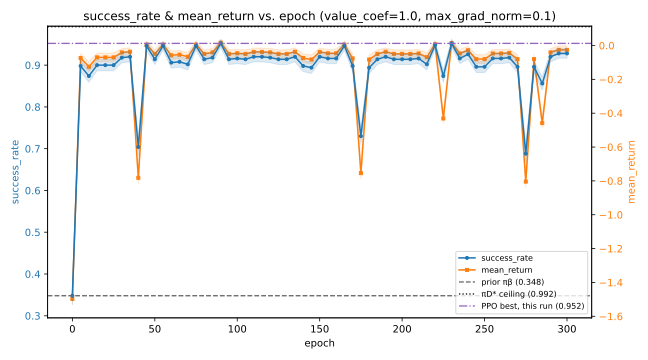<br><em>value_coef=1.0, max_grad_norm=0.1 — compare against the value_coef=0.0 run at the same max_grad_norm (README text above): same four dips, same envelope.</em>
</div>

A smaller, secondary finding sits independent of `value_coef`:
`max_grad_norm=0.5` (the current default) gives the highest `mean` in
*all three* `value_coef` rows (not just on average), and `max_grad_norm=0.1`
gives the lowest `std` in all three — a modest, consistent stability/
performance trade-off, on the order of the same effect size already
flagged as close-to-noise in the `gae_lambda` refinement (~1.5
percentage points) rather than anything resembling `gae_lambda`'s
qualitative swings.

**Best configuration remains unchanged: `clip_eps=0.3`, `entropy_coef=0.01`,
`gae_lambda=0.90`** — this sweep's own best cell
(`value_coef=0.5`, `max_grad_norm=0.5`) reproduces `best=0.954`,
`mean=0.908` exactly, matching the existing best-config run.

### Learning rate sweep (H7, lr ∈ {0.00003, 0.0001, 0.0003, 0.001, 0.003}, clip_eps=0.3, entropy_coef=0.01, gae_lambda=0.90)

The last single-field H7 test before `minibatch_size`: does moving `lr`
away from the standard `3e-4` default open up any of the remaining gap?

<div align="center">

| lr | best | mean | std | epoch-5 | dips (<0.8)/61 |
|---|---|---|---|---|---|
| `3e-05` (0.1×) | 0.920 | 0.801 | 0.198 | 0.182 | 17 |
| `0.0001` (0.33×) | 0.920 | 0.873 | 0.115 | 0.364 | 7 |
| **`0.0003` (default)** | **0.954** | **0.908** | **0.090** | 0.898 | **4** |
| `0.001` (3.3×) | 0.952 | 0.882 | 0.095 | 0.898 | 5 |
| `0.003` (10×) | 0.928 | 0.693 | 0.208 | 0.912 | 38 |

</div>

**The default wins on every metric at once.** Moving `lr` by 3× in either
direction already measurably hurts; by 10×, both directions are clearly
worse — for two *different* reasons, visible in the runs themselves, not
just the aggregate numbers.

Too low (`3e-05`, `0.0001`): a slow start, not primarily ongoing
instability. `epoch-5=0.182` for `3e-05` — still *below* the prior
(`0.348`) five epochs in — and the run doesn't reach a good plateau until
~epoch 45. Much of the 300-epoch budget is spent in this transient climb
rather than in a settled state, which is most of what drives the high
`std` here.

Too high (`0.003`): the opposite problem. It reaches a good region
immediately (`epoch-5=0.912`, as fast as the default) but cannot stay
there — 38 of 61 checkpoints fall below `0.80`, by far the most chaotic
run found in this entire project (`std=0.208`, exceeding even
`gae_lambda=1.0`'s `0.172`), including a drop back toward the prior's own
level around epoch 190.

<table width="100%">
<tr>
<td width="50%">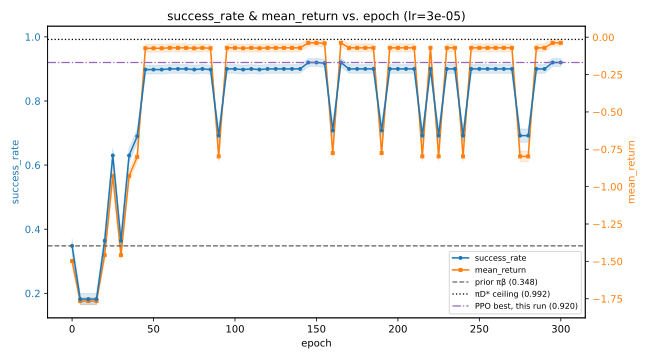<br><em>lr=3e-05 — slow to get going; much of the 300-epoch budget spent below its own eventual plateau.</em></td>
<td width="50%">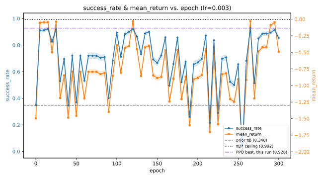<br><em>lr=0.003 — gets there fast, cannot stay; the most chaotic run found in this project.</em></td>
</tr>
</table>

**`lr` is closed: the standard `3e-4` default is already close to optimal
here, not a place with headroom.** Along with `gae_lambda`, this is the
second hyperparameter to show a real (not merely cosmetic) effect — but
with a narrow, symmetric optimum rather than `gae_lambda`'s broad plateau,
and centered almost exactly on the value the field would have shipped
with by default anyway.

**Best configuration remains unchanged: `clip_eps=0.3`, `entropy_coef=0.01`,
`gae_lambda=0.90`, `lr=0.0003`** — best `0.954`, mean `0.908`.

### Minibatch size sweep (H7, minibatch_size ∈ {64, 128, 256, 512, 1024}, clip_eps=0.3, entropy_coef=0.01, gae_lambda=0.90)

The last H7 field. `minibatch_size` controls how many gradient steps
happen per epoch (~525K transitions / `minibatch_size`), not their size —
a different mechanism from `lr`, but with a familiar-looking result on
one side of it:

<div align="center">

| minibatch_size | best | mean | std | epoch-5 | dips (<0.8)/61 |
|---|---|---|---|---|---|
| 64 (0.25×) | 0.954 | 0.907 | **0.085** | 0.900 | **3** |
| 128 (0.5×) | 0.950 | 0.907 | **0.085** | 0.898 | **3** |
| 256 (previous reference) | 0.954 | 0.908 | 0.090 | 0.898 | 4 |
| 512 (2×) | 0.952 | 0.895 | 0.094 | 0.630 | 5 |
| 1024 (4×) | 0.952 | 0.870 | 0.117 | 0.364 | 9 |

</div>

`minibatch_size=1024` shows the same slow-start signature already seen at
low `lr`: `epoch-5=0.364` versus the reference's `0.898`. The mechanism is
different but the outcome is the same — 4× fewer gradient steps per epoch
means genuinely less optimization work happens within the fixed
300-epoch budget, not a subtler form of instability. `512` shows a milder
version of the same pattern. `64` and `128` (more, individually noisier
steps) give a small but consistent stability improvement instead — lower
`std`, fewer deep dips, and visibly flatter through the second half of
training:

<table width="100%">
<tr>
<td width="50%">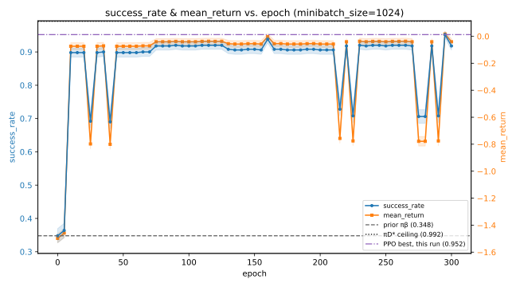<br><em>minibatch_size=1024 — slow start (epoch-5=0.364) and the widest, most frequent dips of the sweep.</em></td>
<td width="50%">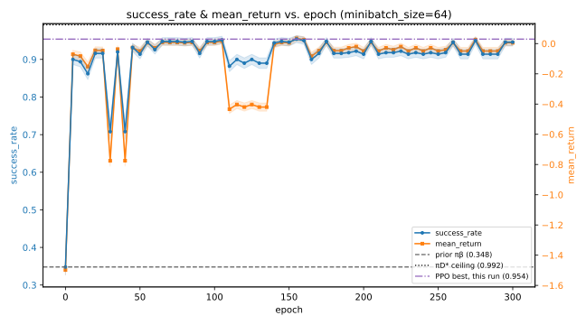<br><em>minibatch_size=64 — same fast start as the reference, but visibly flatter from ~epoch 150 onward.</em></td>
</tr>
</table>

**`minibatch_size` is a stability tool, not a ceiling tool.** Its best
observed value never exceeds what was already found elsewhere (`0.954`)
— its effect is on how consistently a near-ceiling region is *held onto*
during a run, not on reaching a higher one.

**New reference configuration: `clip_eps=0.3`, `entropy_coef=0.01`,
`gae_lambda=0.90`, `minibatch_size=64`** — best `0.954` (unchanged), mean
`0.907` (essentially unchanged from `256`'s `0.908`), `std=0.085` (down
from `0.090`). A real but minor improvement, not a breakthrough — adopted
as the new reference mainly because there's no reason not to.

**H7 is now fully closed**: `max_grad_norm` (modest main effect, no
interaction with `value_coef`), `lr` (narrow optimum at the default), and
`minibatch_size` (mild stability tool — smaller is slightly better,
larger is clearly worse).

### Critic accuracy diagnostic (informing H6)

Testing H6 (`hidden_sizes`) properly requires a new prior checkpoint —
and therefore a new `D` and a new `π_D*`, since `θ` must start exactly at
`π_β`'s weights — a much bigger, less comparable change than any other
single-field test in this project. Before paying that cost,
`scripts/analyze_critic_accuracy.py` asks a narrower, much cheaper
question: is `π_β`'s *current* critic actually inaccurate at all, and if
so, in what way? No retraining required — just one forward pass per state
plus an exact DP solve against the checkpoint already on disk.

For every non-terminal state, it compares what `π_β`'s trained critic
currently predicts against the *exact* true value of `π_β` under its own
policy — computed via exact policy evaluation
(`reference.experience_optimal.compute_true_value_of_policy`, the same
kind of true-dynamics DP solve used for `π_D*`'s true-restricted
definition, but evaluating `π_β`'s actual action probabilities at every
state instead of taking a max over actions).

<div align="center">

|  | n | mean abs error | mean signed error | correlation |
|---|---|---|---|---|
| all states | 887 | 0.470 | +0.042 | 0.591 |
| covered by `D` | 351 | 0.290 | **+0.254** | 0.846 |
| uncovered by `D` | 536 | 0.589 | −0.097 | 0.392 |

</div>

On the states that actually matter for GAE (the ones `D` covers), the
critic overestimates by `+0.25` on average — substantial on a scale where
typical returns sit around `0` to `1`.

<div align="center">
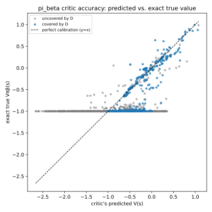
</div>

The scatter reveals a specific, interpretable failure, not generic noise:
a horizontal band at `true_value ≈ −1.0` (states from which `π_β`'s actual
policy leads almost certainly into a hazard on the next step) where the
critic's predictions range wildly — from far below to well above the true
value — while everywhere else the fit tracks the `y=x` line reasonably
well (covered-state correlation `0.846`). The critic has a specific blind
spot for near-certain-death states, not a uniformly noisy estimate
everywhere.

**This confirms the "stale/inaccurate critic" premise directly**, rather
than only inferring it from `gae_lambda`'s downstream effect — but it does
not, by itself, distinguish capacity from undertraining as the cause,
since either could produce this pattern. Our reading leans toward
undertraining: `π_β` only reached ~35% success before being frozen, and
states this close to near-certain death are plausibly rare in its own
collected experience, giving the critic little signal to learn from
regardless of how much capacity it has. **H6 is deprioritized on this
basis** — not because capacity is proven sufficient, but because the more
directly implicated explanation (sparse exposure to specific dangerous
states during `π_β`'s own training) points at training exposure, not
network size.

### Next steps

**H6 (`hidden_sizes`) is deprioritized**, on the basis of the critic
accuracy diagnostic above: the critic's inaccuracy looks more like an
undertraining pattern (sparse exposure to rare, dangerous states) than a
capacity ceiling, and confirming that properly would cost a full new
prior/`D`/`π_D*` cycle. Not proven closed — just no longer the natural
next step.

## Where we are at

A synthesis, not a new result — worth stating plainly before deciding
what comes next.

**Hyperparameter tuning alone has closed most of the exploitation gap.**
Standard PPO with the field's own textbook defaults reached
`success_rate=65.0%` against this same `D` and `π_D*` ceiling (see
"Baseline run" above; that number was evaluated under a different seed
than the sweeps below — see "A note on eval seeds" — but the swing here
is roughly 30 percentage points, far larger than the ~2pp noise seen
between seeds anywhere else in this document, so the comparison is robust
regardless). After systematically testing six of the seven native PPO
hyperparameter groups — `clip_eps` (H3), `entropy_coef` (H5), `gae_lambda`
(H2, by far the strongest single effect), `value_coef` (H1, no effect),
and all of H7 (`max_grad_norm`, `lr`, `minibatch_size`) — the best
configuration found (`clip_eps=0.3`, `entropy_coef=0.01`, `gae_lambda=0.90`,
`minibatch_size=64`, everything else at its default) reaches
`success_rate=95.4%`. That's roughly 30 percentage points of the
exploitation gap closed by hyperparameter selection alone.

None of this is a new empirical finding — it is the expected consequence
of doing a careful, systematic hyperparameter search, applied here more
thoroughly than this step usually gets in practice. That is precisely the
point of documenting it this plainly: a properly-tuned baseline is not
optional context for judging what is left to explain — it changes the
number that needs explaining by a large amount.

**The residual gap is now small: `95.4%` vs. `π_D*`'s `99.2%` — about
`4% (0.04)`.** Every hyperparameter tested, `gae_lambda` aside, has shown
either no effect or a modest one; nothing found so far explains this
remaining gap. Whether it is worth pursuing further is a judgment call —
our working speculation is that for an environment this small and this
uncomplicated, closing a gap this size here may matter more than the raw
number suggests: if this same fixed-D mechanism is later applied to
environments where the ceiling itself is harder to reach, a residual
inefficiency this well-isolated could be the difference between a
mechanism that scales cleanly and one that does not — in a way a
30-point gap never would have revealed.

### Digression : Is "fix the critic" actually the right next step? We talked ourselves out of it.

The first instinct — recalibrate or periodically refresh `π_β`'s critic,
using the errors just found — turns out to fall outside this project's
own research question on closer inspection. `π_D*` itself never touches
any critic: it is computed by exact value iteration on `D`'s raw
transition counts, no function approximation anywhere. That it succeeds
without ever needing an accurate *learned* value function is itself the
point — a neural critic's inaccuracy is not an external nuisance PPO
happens to suffer from, it is intrinsic to *how* PPO extracts information
(a bootstrapped, generalizing approximation) versus how `π_D*` does
(exact counting). Feeding PPO a deliberately-improved critic — whether
recalibrated once before the fixed-D window or refreshed periodically
during it — would mostly test "does PPO do better with a better critic,"
which is close to tautological for any advantage-based method, and would
not explain *why PPO's own mechanism* fails to extract the maximum from
`D` as it actually receives it. That question was set aside for exactly
this reason.

**Next: changes that go beyond hyperparameter selection** — to PPO's
mechanism itself, not just its dials.
Before picking one, the natural first step is understanding precisely
*where* the remaining `~0.04` comes from: what specifically differs
between `π_D*`'s policy and the best configuration's policy, state by
state, rather than only knowing the aggregate gap exists — the same kind
of diagnostic the critic-accuracy check above did for `π_β`'s critic, now
aimed at the policy gap itself.

## Policy agreement: where do `π_D*` and our best config actually disagree?

`scripts/analyze_policy_agreement.py` retrains the best configuration
(`clip_eps=0.3`, `entropy_coef=0.01`, `gae_lambda=0.90`,
`minibatch_size=64`), tracking the best live-eval checkpoint seen during
training. For every non-terminal state (887 of the maze's 900 cells), it
resets directly into that exact state via `env.set_state` and rolls out
80 independent episodes with the resulting checkpoint's deterministic
policy. During those rollouts, the environment essentially stays the same. The goal position,
the walls positions, the hazards positions don't change. The only thing that varies
is the **slip probability** (probability that a random action is chosen instead of
the one selected by the agent).  A **discounted** return is accumulated (`γ=0.99`, matching `π_D*`'s
own discounted value from value iteration — comparing an undiscounted
rollout return against a discounted `V(s)` was exactly the trap this
project has avoided since its "discounted vs. undiscounted" note near the
start).

A state counts as a genuine disagreement only when BOTH hold: the argmax
action differs from `π_D*`'s, AND the resulting value gap
(`V_π_D*(s) - V_PPO(s)`) is positive — not when the gap merely clears a
statistical-significance bar. An earlier version of this script required
`value_gap > z_threshold * stderr` for a state to count at all; that
conflated "detectable with 80 rollouts" with "actually costly," and
silently dropped real but small-magnitude disagreements. Statistical
significance (`z_threshold=2.0` by default) is now a separate diagnostic
column (`statistically_significant`) that does not gate the map. Severity
itself is normalized by the 95th percentile of positive gaps and clipped
to `[0, 1]`, so a handful of extreme states don't wash out the rest of
the scale.

<div align="center">

| | empirical | true-restricted |
|---|---|---|
| states (covered by D / total) | 351 / 887 | 351 / 887 |
| argmax action difference | 462 | 464 |
| **strict disagreement** (argmax differs AND value_gap > 0) | **54** | **47** |
| of which covered by D | 54 (100%) | 47 (100%) |
| of which statistically significant (z > 2.0) | 51 | 45 |
| mean severity, covered states | 0.066 | 0.056 |
| mean severity, disagreement states only | 0.430 | 0.417 |

</div>

Both `π_D*` definitions agree closely on the size and severity of the
disagreement: this is not an artifact of `D`'s own transition-probability
estimation noise. Every disagreement state is, in both definitions, a
state `D` actually covers — the phenomenon lives entirely inside the
region where `D` has some information, not in the total blind spots.

<div align="center">
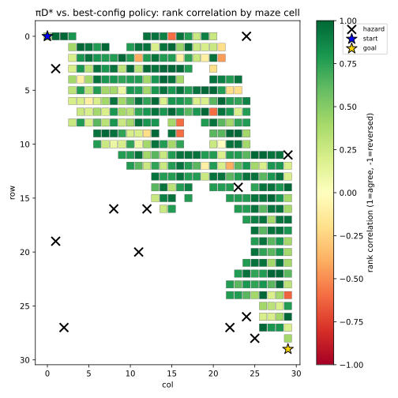<br><em>Disagreement severity by maze cell (empirical π_D*). Green = agreement / no cost; red = a larger PPO value loss at that state. Blank cells are states D never visited at all — no severity signal exists there, so they're left empty rather than colored. Square size scales with how many of the 4 actions D actually sampled at that state (never below a visible floor).</em>
</div>

<br/>

`scripts/analyze_disagreement_factors.py` then tests, across the covered
states, which of several candidate quantities actually track this
severity — three purely structural properties of the maze (distance to goal, distance to the nearest hazard, local
connectivity), one raw exposure measure (`D`'s own coverage, log-scaled),
and two measures of *how* `D` and `π_β` treated the two competing actions
at that specific state, rather than the state as a whole:

- `action_sample_gap`: `log1p(n(s, best-config's action)) - log1p(n(s, π_D*'s action))`,
  from `D`'s raw `(state, action)` sample counts — realized, finite-sample
  reinforcement. In plain terms: at a
  disagreement state, this compares how many times `D` actually contains
  an experience of taking the *best-config's* action from `s` versus
  taking `π_D*`'s action from `s` — i.e. how much direct training signal
  PPO received for each of the two competing actions specifically, not
  for the state overall. A positive value means `D` happened to
  demonstrate the action PPO ends up preferring *more often* than the
  action that's actually better, regardless of which one truly maximizes
  value.
- `pi_beta_prob_gap`: `π_β(best-config's action | s) - π_β(π_D*'s action | s)`,
  from `π_β`'s own actor — the underlying
  behavior-policy probability that sets the scale of PPO's clipped
  importance ratio for that action, independent of how many samples
  happened to land in `D`.

`π_β`'s critic accuracy is deliberately not tested as a factor here: that
the critic is imperfect is already this project's accepted premise 
(see the "Critic accuracy diagnostic" section and the Digression above), 
not something a weak correlation needs to re-confirm.

<div align="center">

| factor | empirical (raw / partial\*) | true-restricted (raw / partial\*) |
|---|---|---|
| coverage (log, raw only) | +0.012 | −0.042 |
| distance to goal | −0.058 / −0.059 | **−0.177 / −0.175** |
| distance to nearest hazard | −0.080 / −0.088 | −0.067 / −0.057 |
| local connectivity | −0.028 / −0.028 | −0.060 / −0.060 |
| **action_sample_gap** | **+0.108 / +0.108** | **+0.180 / +0.189** |
| **pi_beta_prob_gap** | **+0.216 / +0.218** | **+0.285 / +0.298** |

\*partial = taking coverage into account.

</div>

<div align="center">
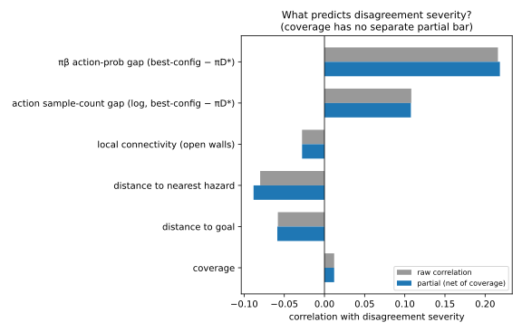<br><em>Raw (gray) vs. partial (blue) correlation of each factor with disagreement severity, empirical π_D*. pi_beta_prob_gap and action_sample_gap are the only two factors that clear 0.1 in either π_D* definition; every purely geometric factor stays under 0.09.</em>
</div>

<br/>

**What this points to.** `pi_beta_prob_gap` is the clearest and most
robust signal under both `π_D*` definitions — notably stronger than any
geometric factor, and stronger than raw coverage (close to 0 in both). It
is also strongly collinear with `action_sample_gap` (`r=0.862` empirical,
`r=0.851` true-restricted): the two are not independent evidence, they
are two measurements of the same underlying quantity.
`action_sample_gap` is the noisy, finite-sample proxy (how many times an
action actually landed across `D`'s 4000 episodes); `pi_beta_prob_gap` is
the smooth population parameter it's a proxy for (`π_β`'s actual action
probability) — which is why the latter correlates more cleanly in both
definitions.

Put together: state by state, what differs between `π_D*` and the best
configuration is not primarily geometric (hazard/goal distance are, at
best, secondary, and inconsistent in size across the two `π_D*`
definitions), and not primarily "how much data exists" in aggregate
(`coverage` alone is close to 0 in both). It's **the skew `π_β` itself
already had between the two competing actions at that state** — inherited
unchanged into PPO's clipped update, since `π_old = π_β` stays frozen for
the entire fixed-D training window. This is the most concrete answer so
far to "where does the `~0.04` come from": not the critic, not the
maze's geometry, but an asymmetry already present in the *behavior
policy's own action distribution*, one that fixed-D PPO's single
trust-region window has no mechanism to correct.

One state pushes back against this story and is worth keeping on record
rather than averaging away: state 320 (row 10, col 20, empirical) has
`pi_beta_prob_gap = -0.956` and `action_sample_gap = -3.95` — `π_β`
strongly preferred `π_D*`'s action, by a wide margin, and `D` sampled it
far more often — yet the best configuration still ends up choosing the
other action, at high severity (`0.845`). Low total coverage there (51
samples) makes this plausibly a case where optimization noise overrides a
strong prior rather than a genuine counterexample to the mechanism above,
but that hasn't been checked, and the mechanism above does not explain it
as it stands.


## Next Steps: Testing Whether the Imperfect Behavior Policy Limits PPO's Correction

The current analysis suggests that the remaining disagreement between `π_D*` and the best configuration is primarily associated with an asymmetry already present in the behavior policy `π_β`. This motivates a more specific hypothesis:

> **Hypothesis:** because the behavior policy `π_β` achieves only ~35% success, its action distribution contains substantial state-dependent errors. When `π_old = π_β` is frozen throughout the fixed-D PPO training window, these errors become the reference point for the policy update. Consequently, PPO may be unable to fully extract the information contained in `D` when the behavior policy initially assigns too little probability to the action preferred by `π_D*`. The resulting prior-induced asymmetry can therefore produce persistent disagreement between the learned policy and `π_D*`.

Importantly, this hypothesis is **not equivalent to a clipping hypothesis**. PPO clipping limits how far the new policy can move relative to `π_old`; it does not remove or correct the asymmetry already encoded in `π_β`.

In our setting,

$$
r(a|s)=\frac{\pi_\theta(a|s)}{\pi_\beta(a|s)}
$$

so `π_β` defines the reference scale against which policy changes are measured. If `π_β` assigns substantially less probability to the action preferred by `π_D*`, then moving toward that action requires a larger *relative* change in the ratio than it would if the prior already favored that action. Thus, the prior's own errors can constrain the effective learning dynamics even when sufficient information about the correct action is present in `D`.

### Why Increasing `clip_eps` Does Not Necessarily Solve the Problem

We have already tested larger values of `clip_eps`, and increasing the clipping range did not systematically eliminate the performance gap. This is consistent with the hypothesis above.

A larger `clip_eps` only enlarges the allowable relative movement around the frozen reference policy `π_β`. It does **not** change the reference itself:

$$
\pi_{\mathrm{old}}=\pi_\beta.
$$

Therefore, increasing `clip_eps` does not remove the initial action-probability asymmetry in `π_β`. If the prior strongly prefers the wrong action at a state, a larger clipping range may give PPO more room to move, but it does not make the correct action more likely initially, nor does it remove the dependence of the ratio on `π_β`.

Moreover, the effect of `clip_eps` should not necessarily be monotonic. A larger clipping range can allow larger updates, but it can also allow the policy to move further in directions supported by the existing prior distribution. Therefore, simply observing that a larger `clip_eps` does not close the gap is not sufficient to identify the mechanism.

The next experiment should instead test whether the **magnitude of the initial `π_β` asymmetry predicts how difficult it is for PPO to move toward `π_D*`**.

### Experiment: Prior Asymmetry → Learning Bias

For every state where `π_D*` identifies a preferred action $a^*$, measure:

$$
p_{\beta}{^*}(s)=\pi_{\beta}(a{^*}|s)
$$

and the corresponding final probability under the learned policy:

$$
p_{\theta}{^*}(s)=\pi_{\theta,\mathrm{final}}(a{^*}|s).
$$

The absolute correction made by PPO is:

$$
\Delta p{^*}(s) = p_\theta{^*}(s)-p_\beta{^*}(s).
$$

More importantly, measure this correction relative to the correction that would be required to reach `π_D*`:

$$ 
C(s)=
\frac{
p_\theta{^*}(s)-p_\beta{^*}(s)
}{
p_D{^*}(s)-p_\beta{^*}(s)
}.
$$

This defines the fraction of the prior's initial error that PPO successfully corrects.

The key prediction is:

$$
\boxed{
\text{larger initial } \pi_\beta \text{ error}
\quad\Longrightarrow\quad
\text{smaller correction fraction } C
}
$$

In other words, states where `π_β` initially strongly disagrees with `π_D*` should be precisely the states where PPO is least able to recover the target action.

The analysis should therefore test the relationship between the initial prior error and $C(s)$, while controlling for `coverage`. The same analysis should be performed under both definitions of `π_D*`.

A useful secondary analysis is to examine the **training trajectory across checkpoints saved at different epochs of the fixed $D$ PPO training**, rather than only the final policy. For each state, track

$$
\pi_\theta(a{^*}|s)-\pi_\beta(a{^*}|s)
$$

throughout the fixed $D$ training. This reveals whether states with a strong prior error:

* correct rapidly toward `π_D*`,
* improve but plateau early,
* barely move from `π_β`, or
* move in the wrong direction.


### Statistical Test

The primary statistical test should evaluate whether the initial prior error predicts the amount of correction achieved by PPO.

For example:

$$
C(s)
\sim
\text{prior-error}(s)
+
\text{coverage}(s).
$$

Report the effect size, confidence interval, and significance of the prior-error coefficient.

A strong result would be a statistically significant negative relationship: as the behavior policy's initial disagreement with `π_D*` increases, the fraction of the required correction recovered by PPO decreases, even after accounting for coverage.

This would provide evidence for the proposed mechanism:

$$
\boxed{
\text{imperfect } \pi_\beta
\rightarrow
\text{initial action-selection error}
\rightarrow
\text{incomplete PPO correction}
\rightarrow
\text{persistent disagreement}
}
$$

### Controlled Prior Experiment

If the observational analysis supports this prediction, the strongest follow-up would be a controlled experiment in which the initial action preference is deliberately varied while keeping the dataset `D`, target policy, environment, PPO objective, and training budget fixed.

The goal is not simply to change `clip_eps`, but to test whether **the same learning problem becomes systematically harder when the initial policy is farther from the target policy**.

If policies initialized with progressively stronger disagreement from `π_D*` recover progressively smaller fractions of the required correction, this would provide substantially stronger evidence that the behavior-policy prior itself is limiting PPO's ability to extract the optimal behavior from `D`.

The existing state 320 counterexample should be particularly informative for this analysis. Because `π_β` strongly favors the `π_D*` action there (`pi_beta_prob_gap = -0.956`) while the final policy nevertheless strongly disagrees (`severity = 0.845`), the correction trajectory should reveal whether this is an optimization-noise/outlier case or evidence that prior asymmetry alone cannot explain the phenomenon.


## Project structure

```
configs/                        # every experimental knob lives here, not in code
  env_maze.yaml                  # maze layout, stochasticity, reward
  prior_training.yaml            # online PPO config for the checkpoint that generates D
  ppo_fixed_d_standard.yaml      # baseline fixed-D PPO hyperparameters
  ppo_fixed_d_modified.yaml      # example H4 ablation (edit/copy for other hypotheses)
  reference.yaml                 # pi_D* solver settings (gamma, unseen_penalty, VI tolerance)

src/ppo_exploitation/
  envs/stochastic_maze.py        # the custom discrete stochastic maze
  ppo/
    networks.py                  # actor-critic MLP
    buffer.py                    # Trajectory container + GAE
    online_agent.py              # standard online PPO (trains the prior only)
    fixed_d_trainer.py           # THE research instrument: one rigorous PPO
                                  # trust-region window on D, pi_old = pi_beta
  data/collect.py                # roll out the frozen prior to build D; save/load
  reference/experience_optimal.py# exact value iteration -> both pi_D* definitions
  eval/evaluate.py                # unified live-rollout scoring + gap-report table
  utils/config.py                 # YAML <-> dataclass config layer
  utils/seeding.py                # reproducibility

scripts/
  01_train_prior.py               # train the online PPO checkpoint to target success rate
  02_collect_dataset.py           # collect D from the frozen checkpoint
  03_compute_pi_d_star.py         # solve both pi_D* definitions exactly
  04_train_fixed_d_ppo.py         # standard OR modified PPO on D (same code, different YAML)
  05_evaluate_all.py              # evaluate everything, print/save the gap report
  run_pipeline.sh                 # runs 01-05 end to end

tests/
  test_env.py                     # Tier-1: maze connectivity, transition-kernel correctness
  test_reference.py               # Tier-1: value iteration vs. hand-derived closed forms
  test_fixed_d_trainer.py         # Tier-1: trainer smoke test (runs, stays finite, pi_old == pi_beta)
  tier0/
    frozen_lake_env.py             # gymnasium FrozenLake-v1 adapter (validation-only, not a src/ module)
    test_tier0_pipeline.py         # Tier-0: full pipeline exercised on FrozenLake instead of the maze

.github/workflows/
  tests.yml                       # runs `pytest tests/` (Tier-0 + Tier-1) on push and pull_request
```

## Setup

```bash
python -m venv .venv && source .venv/bin/activate
pip install -r requirements.txt
pip install -e .          # makes `ppo_exploitation` importable everywhere
```

## Running the tests

```bash
pytest tests/ -v
```

See "Two kinds of tests, kept deliberately separate" above.
`tests/test_reference.py` is the one worth reading closely if you want to
trust the ceiling numbers: it hand-derives the closed-form fixed point of a
tiny stochastic self-loop MDP (`V(0) = 0.45/0.55` for a specific
reward/gamma setup) and checks the value-iteration solver matches it to
`1e-4`. `tests/tier0/` is the one worth running first if you want to trust
the *pipeline as a whole* before spending time reading through the maze-
specific code — it validates the same D → π_D* → fixed-D-PPO → evaluate
chain against an environment neither of us built.

## Running the full pipeline

```bash
bash scripts/run_pipeline.sh
```

or step by step:

```bash
# 1. Train the online PPO prior to ~35% success rate (live environment)
python scripts/01_train_prior.py \
    --env-config configs/env_maze.yaml \
    --prior-config configs/prior_training.yaml \
    --out results/prior_checkpoint.pt

# 2. Freeze that checkpoint, collect the fixed dataset D from it
python scripts/02_collect_dataset.py \
    --env-config configs/env_maze.yaml \
    --checkpoint results/prior_checkpoint.pt \
    --n-episodes 4000 --seed 1 \
    --out results/dataset_D.pkl

# 3. Solve pi_D* exactly (both empirical and true-restricted definitions)
python scripts/03_compute_pi_d_star.py \
    --env-config configs/env_maze.yaml \
    --reference-config configs/reference.yaml \
    --dataset results/dataset_D.pkl \
    --out-empirical results/pi_d_star_empirical.pkl \
    --out-true-restricted results/pi_d_star_true_restricted.pkl

# 4. Train standard PPO and modified PPO on the SAME D and the SAME prior
#    checkpoint (pi_old = pi_beta = this checkpoint throughout -- see
#    "What fixed-D training means for PPO, operationally")
python scripts/04_train_fixed_d_ppo.py \
    --dataset results/dataset_D.pkl \
    --ppo-config configs/ppo_fixed_d_standard.yaml \
    --prior-checkpoint results/prior_checkpoint.pt \
    --out results/ppo_standard_on_D.pt \
    --history-out results/ppo_standard_on_D_history.csv

python scripts/04_train_fixed_d_ppo.py \
    --dataset results/dataset_D.pkl \
    --ppo-config configs/ppo_fixed_d_modified.yaml \
    --prior-checkpoint results/prior_checkpoint.pt \
    --out results/ppo_modified_on_D.pt \
    --history-out results/ppo_modified_on_D_history.csv

# 5. Evaluate everything under the identical live-rollout protocol
python scripts/05_evaluate_all.py \
    --env-config configs/env_maze.yaml \
    --prior-checkpoint results/prior_checkpoint.pt \
    --pi-d-star-empirical results/pi_d_star_empirical.pkl \
    --pi-d-star-true-restricted results/pi_d_star_true_restricted.pkl \
    --ppo-checkpoints standard=results/ppo_standard_on_D.pt modified=results/ppo_modified_on_D.pt \
    --n-episodes 500 --eval-seed 999 \
    --out results/gap_report.csv
```

`scripts/05_evaluate_all.py` accepts any number of `name=path` pairs after
`--ppo-checkpoints`, so once you've trained additional ablation configs
(H1–H7 or otherwise) from step 4, add them all to a single step-5 call to
compare every variant against the same `π_D*` reference in one table.

### Testing a new hypothesis

1. Copy `configs/ppo_fixed_d_modified.yaml` to a new file
   (e.g. `configs/ppo_fixed_d_h3_wide_clip.yaml`).
2. Revert the field(s) already changed back to the standard value, then
   change exactly one field to test your hypothesis (e.g. `clip_eps: 0.2 →
   0.4` for H3).
3. Re-run step 4 against the *same* `results/dataset_D.pkl` and the *same*
   `results/prior_checkpoint.pt` with the new config, then add it to step
   5's `--ppo-checkpoints` list.

Never regenerate `D` or the prior checkpoint between comparison runs — the
whole point of the design is that every variant sees byte-identical
experience and starts from a byte-identical `π_old`.

## What this codebase does *not* try to answer

- **Cross-algorithm comparison.** This is not "is PPO better than SAC/DQN
  at exploitation" — see the motivating paper for that broader comparison
  across algorithms and many environments. This project fixes PPO and
  varies only its own internals.
- **A principled offline-RL solution.** The fixed-D trainer here is one
  rigorous PPO trust-region window applied to static data — not a
  Conservative Q-Learning / decision-transformer-style offline method.
  Answering "how good could a *properly designed* offline method do on
  this same `D`" would be a natural and interesting extension of this
  codebase, but a different one.
- **Wall-clock/sample-efficiency claims.** All comparisons here are about
  final exploitation quality given a fixed `D`, not about how many epochs
  or how much compute each variant needed to get there (though
  `results/*_history.csv` records `approx_kl`, `clip_frac`, and both
  losses per epoch, enough to investigate that separately if useful).

## Relationship to the motivating paper

Berseth (2025) defines the experience-optimal policy as (for deterministic
environments) the single highest-return trajectory ever replayed from a
buffer, with two "softer" estimators for stochastic settings — the best 5%
and the most-recent-best-5% of collected trajectories by return — used
because a *sampled* trajectory can't be replayed deterministically to
reproduce its score in a stochastic environment. This project takes a
different, model-based approach precisely because the environment was
purpose-built to allow it: rather than estimating `π_D*` from top-quantile
trajectory returns, we solve for it exactly via tabular value iteration on
the (MLE or true-restricted) MDP implied by `D`. This is only possible
because the ground-truth state space here is small and fully enumerable —
it would not be a tractable substitute for the paper's estimator in the
large/continuous-state Atari- and MuJoCo-scale environments the paper
studies. The two approaches are answering the same underlying question
(how much of `D`'s latent value does the learned policy actually recover)
with different tools suited to different environment scales.

## Further analyses (not run by default)

These are real, separate questions this codebase could be extended to
answer, deliberately kept out of the primary standard-vs-modified
comparison so they don't get silently blended into one number. None of
this is implemented yet.

- **The multi-window (periodic-refresh) scheme.** Reusing `D` across many
  outer iterations, refreshing `π_old ← θ` periodically, does let PPO
  extract more from `D` cumulatively than a single window can — the
  question is whether that additional extraction is real (information
  `D` actually supports) or an artifact of the ratio's denominator drifting
  away from `π_β` (see above). Before trusting any result from that
  scheme, two passive diagnostics are cheap to add and would settle it:
  `KL(π_β ‖ π_θ)` on `D`'s own states, and the effective sample size of the
  importance ratio `π_θ/π_β` over `D` — both computable from quantities the
  codebase already has (`Trajectory.log_probs` is `π_β`'s real
  log-probability and is currently unused past the single-window trainer).
  Flat curves would mean the drift stayed small and the scheme's numbers
  can be trusted; growing curves would mean the extra extraction is
  confounded with drift and shouldn't be reported as a clean exploitation-
  gap number without correction.
- **An importance-weighted correction (H8).** A version of the multi-window
  scheme where the ratio is anchored to `π_β` instead of a periodically
  refreshed `π_old` — a real off-policy correction rather than PPO's native
  (single-window-only) trust region. Comparing its `J(π)` against the
  single-window result would give the actual size of the effect, not just
  its presence.
- **A properly designed offline-RL baseline**, as noted above — a different
  question from "what does PPO's own update rule extract," but a natural
  point of comparison once that number is established.
- **Preserving the best intermediate policy during a training window.**
  The epoch-count analysis (see "Results analysis") shows fixed-D
  optimization can be non-monotonic within a single window — a better
  policy can appear at an intermediate epoch and later be lost to
  continued training, not just plateau. A fixed epoch count chosen in
  advance has no mechanism to recover that best intermediate point. Worth
  exploring: tracking the best-observed checkpoint against a held-out
  signal during training itself (analogous to early stopping) — carefully,
  since using held-out performance to pick a checkpoint mid-training is
  itself a form of selection that would need the same scrutiny already
  applied elsewhere in this project (see the prior-checkpoint confirmation
  mechanism in `scripts/01_train_prior.py`).
- **Scheduling `clip_eps` over training**, analogous to learning-rate
  schedules, rather than treating it as a single fixed value for an
  entire window. The clip_eps sweep (see "Results analysis") shows the
  ceiling is sensitive to this value and that looser settings trade a
  higher ceiling for more instability — a schedule (e.g. loosening early,
  tightening late) might capture the reach of a wide clip without its
  instability. Not known whether this is already standard practice
  elsewhere; worth checking before implementing.


## Literature

Papers this project's design or discussion draws on directly — not a
general reading list, only what's actually behind a specific decision or
claim made above.

**Motivating paper**

- Berseth, G. (2025). *Is Exploration or Optimization the Problem for Deep
  Reinforcement Learning?* arXiv:2508.01329.
  [arxiv.org/pdf/2508.01329](https://arxiv.org/pdf/2508.01329) — introduces
  the experience-optimal policy and practical sub-optimality concepts this
  project's entire decomposition is built on. See "Motivating paper" and
  "Relationship to the motivating paper" above for exactly how this
  project adapts it.

**Core algorithm and methods used directly**

- Schulman, J., Wolski, F., Dhariwal, P., Radford, A., & Klimov, O. (2017).
  *Proximal Policy Optimization Algorithms.* arXiv:1707.06347.
  [arxiv.org/abs/1707.06347](https://arxiv.org/abs/1707.06347) — the
  algorithm this whole project studies. Its Atari/MuJoCo hyperparameter
  tables (`K=3` vs. `K=10` epochs) are the reference point for how far
  this project's epoch-count analysis (H4) pushes beyond conventional
  usage.
- Schulman, J., Moritz, P., Levine, S., Jordan, M., & Abbeel, P. (2015).
  *High-Dimensional Continuous Control Using Generalized Advantage
  Estimation.* arXiv:1506.02438 (ICLR 2016).
  [arxiv.org/abs/1506.02438](https://arxiv.org/abs/1506.02438) — defines
  the GAE formula (`gae_lambda`'s bias/variance trade-off) this project's
  `FixedDPPOTrainer` implements directly, and whose `λ→0` vs. `λ→1`
  behavior is the basis for the entire "GAE lambda sweep" analysis.
- Kingma, D. P., & Ba, J. (2015). *Adam: A Method for Stochastic
  Optimization.* arXiv:1412.6980 (ICLR 2015).
  [arxiv.org/abs/1412.6980](https://arxiv.org/abs/1412.6980) — the
  optimizer used throughout every trainer in this project
  (`torch.optim.Adam`); its per-parameter moment estimates were relevant
  to reasoning about the `value_coef` / shared-gradient-clipping question.

**Implementation verification reference**

- Raffin, A., Hill, A., Gleave, A., Kanervisto, A., Ernestus, M., &
  Dormann, N. (2021). *Stable-Baselines3: Reliable Reinforcement Learning
  Implementations.* Journal of Machine Learning Research, 22(268), 1–8.
  [jmlr.org/papers/v22/20-1364.html](https://jmlr.org/papers/v22/20-1364.html)
  — this project's single combined loss / single optimizer / single
  global `clip_grad_norm_` pattern (see "Value coefficient sweep") was
  checked directly against SB3's reference PPO implementation, confirming
  it matches standard practice rather than being a project-specific
  deviation.