# PPO Exploitation Gap

**Research question.** Given a fixed amount of experience `D`, what prevents
PPO from reaching the best policy that can be extracted from `D`? Can that gap be reduced by a careful selection of hyperparameters or does it require a change to the optimization mechanism of PPO itself ? 

This is a study of PPO's *optimization/exploitation* behavior in isolation
from exploration: the environment, the data-collection policy, and the
dataset itself are all held fixed, so that any performance difference
between experiments is attributable to how well each one extracts
information already present in `D` — not to differences in what was
collected.

## Motivating paper

This project is directly motivated by:

> Glen Berseth, ["Is Exploration or Optimization the Problem for Deep
> Reinforcement Learning?"](https://arxiv.org/pdf/2508.01329) (2025)

That paper introduces the **experience optimal policy** `π̂*` — the best
policy recoverable from an agent's own collected experience — and defines
**practical sub-optimality** as the gap between it and the learned policy,
`V(π̂*(s0)) − V(π_θ(s0))`. It reports that across many
environments and both PPO and DQN, the experience-optimal value is typically 
2–3× the learned policy's own value — in the paper's own words, these algorithms 
"only exploit half of the good experience they generate." — i.e. that much of 
deep RL's difficulty on hard tasks is an
*exploitation/optimization* problem, not an *exploration* problem.

This project adapts that core idea into a controlled, single-algorithm
study: instead of comparing PPO against DQN across many environments with
different data-generating processes, we fix one environment, one dataset
`D`, and study PPO against modified versions of itself, so that the
resulting exploitation-gap numbers are cleanly attributable to a single
algorithmic change at a time. See "Relationship to the motivating paper"
below for the precise correspondence and the places this project
deliberately diverges.

## The core decomposition

For a learned policy `π_alg` trained on a fixed dataset `D`, define the
**experience-optimal policy** `π_D*` as the best policy extractable from the
information in `D` (not the globally optimal policy `π*` for the
environment). Then:

```
J(π*) − J(π_alg) = [J(π*) − J(π_D*)]  +  [J(π_D*) − J(π_alg)]
                     exploration/data       exploitation/optimization
                          gap                        gap
```

This project only ever intervenes on the second term. The first term is a
property of how `D` was collected and is held fixed throughout.

**Terminology, kept strictly distinct throughout the codebase:**

<div align="center">

| Term | Means | Does NOT mean |
|---|---|---|
| Exploitation *frequency* | how often the agent acts greedily w.r.t. its current policy (e.g. deterministic/mode action at eval time) | how *good* that greedy behavior actually is |
| Exploitation *quality* | how much of the value latent in `D` the learned policy actually recovers | how deterministic the policy is |
| Optimization | the mechanical process of updating θ to improve the PPO objective | value estimation |

</div>

A policy can be 100% "exploitative" in the frequency sense (always takes
its best-known action) while still being very bad at exploitation in the
quality sense (its best-known action is wrong, because the critic/advantage
estimate or the policy update failed to extract what `D` actually supports).
This project is about the latter.

## Phase 1: the stochastic maze (complete)

The project's first phase used a stochastic 30x30 maze with redundant
paths to study the PPO exploitation gap under fixed-D training.
Systematic hyperparameter tuning across all seven native PPO
hyperparameter groups closed most of the gap (standard PPO's `65.0%` to
a best configuration's `95.4%`, against a `99.2%` ceiling). The
disagreement investigation that followed found two real, independent,
partially-explanatory mechanisms (an asymmetry inherited from `π_β`'s own
behavior, and sparse pair-level data) -- but ultimately found that this
specific maze's redundant paths made it impossible to tell whether either
mechanism costs any real, measurable performance, since the states where
PPO and `π_D*` disagree are overwhelmingly off the path a real rollout
ever takes.

**Full write-up, every experiment, every result:**
[docs/PHASE1_STOCHASTIC_MAZE.md](docs/PHASE1_STOCHASTIC_MAZE.md).

## Phase 2: a more controlled experiment

Phase 1's disagreement investigation surfaced two problems with the
original maze as a testbed, not with the findings themselves: `π_D*`
(empirical) is a purely greedy, unregularized consumer of `D`'s raw
counts, with its own known failure mode at thin-sample bottlenecks; and
the maze's redundant paths let PPO disagree with that reference almost
for free, since most disagreement states turned out to be off the path a
real rollout ever takes. Phase 2 is designed around three explicit
requirements this phase's design didn't have, each fixing a specific gap
just identified:

1. **The task must stay hard enough to require genuine training and real
   policy improvement** -- not solvable near-trivially, or the whole
   exploitation-gap question stops being meaningful.
2. **A limited, deliberately small number of good decisions**, so that
   disagreeing with the reference policy is plainly visible in
   success_rate rather than absorbed by redundant paths -- this is what
   phase 1's redundant maze could not provide.
3. **Overfitting to `D` must be directly observable, not merely assumed
   absent.** Phase 1 could not have detected overfitting even where it
   mattered: `D` and evaluation were drawn from the exact same fixed
   start and maze instance, so "PPO overfits `D`" and "PPO generalizes
   well from `D`" would have produced an identical success_rate.

**Our choice: keep the same maze, change how it's started and connected,
rather than build a new environment.**

1. **Controlled, non-zero redundancy**, via the existing
   `extra_connection_prob` parameter, tuned to a handful of good routes
   rather than one (a perfect, spanning-tree maze was considered and
   rejected for this reason -- see docs/PHASE1_STOCHASTIC_MAZE.md's
   closing section -- a single unique path makes every disagreement
   maximally severe by construction, which removes the gradation phase
   1's findings depended on). Addresses requirement 2.
2. **A start-state distribution instead of a fixed start**, sampled
   unevenly on purpose when collecting `D`: some starts oversampled, some
   undersampled, a few withheld from `D` entirely. Evaluation then
   reports success_rate separately for well-covered vs. rarely- or
   never-seen starts -- a policy that excels on the former and collapses
   on the latter is the direct, previously unobtainable signature of
   overfitting. Addresses requirement 3.
3. **Reuse of the existing environment, solver, and training pipeline.**
   Value iteration already computes `V`/`Q` for every state regardless of
   start, so `π_D*` needs no changes at all; only the reset logic, `D`
   collection, and evaluation protocol need to change. This keeps the
   task exactly as hard as phase 1's maze (same size, hazards, and
   stochastic slip), addressing requirement 1 by construction rather than
   by redesigning the task from scratch.

This is a genuine second phase, not a continuation of the first: a new
prior, a new `D`, a new `π_D*`, and likely a fresh hyperparameter pass.

### Final environment parameters

<div align="center">

| parameter | phase 1 | phase 2 | why it changed |
|---|---|---|---|
| `extra_connection_prob` | 0.08 | 0.08 | see below -- lowering this alone broke online training |
| `num_hazards` | 12 | 4 | see below -- this, not connectivity, was the real obstacle to exploration |
| `step_penalty` | -0.01 | -0.03 | needed so value differences between actions exceed slip-induced noise (see requirement 2 below) |
| `num_start_states` | 1 | 12 | the overfitting-detection axis (requirement 3) |

</div>

Getting here took a real detour. Lowering `extra_connection_prob` alone
(to 0.015, keeping phase 1's `num_hazards=12`) satisfied requirement 2's
redundancy target on paper, but made online PPO training's own
exploration collapse completely: 300 iterations produced exactly 0%
success, every time, regardless of `entropy_coef`. Diagnosed directly: a
pure uniform-random walk from a close start reached the goal in 9/10
trials at `num_hazards=4`, but died to *one of twelve* hazards in 5/5
trials at `num_hazards=12`, from the identical start -- undirected
exploration finds any one of many hazards far more easily than the one
specific goal. A separate check ruled out bad network initialization
luck: five different random seeds all showed the exact same
stuck-in-place behavior (an untrained network's action distribution is
correlated across similar states, unlike true independent-per-step
random sampling, so even a mild bias repeatedly walks into the same
wall). Restoring `extra_connection_prob` to 0.08 and lowering
`num_hazards` to 4 together fixed this -- real training curves emerged
without touching `entropy_coef` at all (see requirement 1 below).

A separate, structural bug surfaced along the way and is fixed rather
than worked around: at low redundancy, excluding only each start's
single BFS-shortest path from candidate hazard cells was not enough --
the value-optimal policy does not always follow that exact path, so a
hazard could still end up adjacent to the route actually taken. Four of
twelve starts had a real 0% success rate under the exact optimal policy
(not a gradient of risk -- a genuine trap) before this was caught.
Fixed via rejection sampling in `envs/stochastic_maze.py`
(`_verify_and_redraw_hazards`): every candidate hazard placement is
checked against the exact optimal policy's actual success rate from
every start, and redrawn from scratch if any start falls below 70% --
never by shaping hazard placement around a known solution, which would
make the property true by construction instead of testing it.

### Verifying requirement 1: task difficulty

<div align="center">
<br><em>Left: a uniformly random policy (2.0% success) against the full-information exact optimal policy (100%). Right: a genuine 300-iteration online PPO run, success_rate climbing from 0% to 39.3%.</em>
</div>

The random-vs-optimal gap (98 points) rules out the task being solvable
by luck. The training curve is not smooth -- it dips as low as 8.3% around
iteration 30 before climbing past 39% by iteration 300 -- but the
direction is unambiguous, and no change to `entropy_coef` was needed to
get it: the fix was `num_hazards` and `extra_connection_prob` above, not
the training algorithm's own exploration incentives.

### Verifying requirement 2: redundancy

<div align="center">
 
</div>

`scripts/verify_redundancy_level.py` reports on-path states averaging
1.09 near-optimal actions (tolerance calibrated to roughly the value cost
of a one-step detour) -- the script's own built-in heuristic flags this
as possibly *too* low (near a perfect maze). That heuristic was
deliberately overridden by a direct behavioral check instead: starting
from the exact optimal policy, a controlled fraction of on-path states'
actions were corrupted (replaced with the worst available action) and
success_rate was measured live.

<div align="center">

| states corrupted | aggregate success_rate |
|---|---|
| 0% | 100.0% |
| 10% | 36.7% |
| 25% | 11.3% |
| 50% | 0.0% |

</div>

A graceful, monotonic decline -- not a perfect maze's instant collapse at
any disagreement, but nowhere near phase 1's redundancy either. Checked
per-start too: most individual starts are already at 0% success by 25%
corruption, with only two or three more resilient outliers keeping the
aggregate above zero -- the aggregate number is not hiding a uniformly
tolerant reality.

### Verifying requirement 3: overfitting detectability

The first attempt at this used a deliberately "overfit-prone" fixed-D PPO
config (many more epochs than a baseline run, `entropy_coef=0`) and
compared its covered-vs-held-out gap against `π_β`'s own. It failed in an
instructive way: that config's gap (+0.238) came out *smaller* than
`π_β`'s own baseline gap (+0.268), because comparing it against a
10-epoch baseline confounded "trained for far longer" with "overfit" --
more gradient steps improved both tiers, masking whatever overfitting
signal existed. Adjusting epochs and entropy to isolate the effect
properly would have meant doing the actual hyperparameter analysis this
check is only supposed to prepare for -- so instead of tuning PPO
further, the check itself was redesigned.

`scripts/verify_overfitting_detectable.py` now builds a policy that is
overfit **by construction**: for every state, memorize whichever action
`D` shows most often there -- pure behavioral-cloning-style memorization,
no value estimation, no PPO training at all.

<div align="center">
<br><em>The memorization policy matches π_β on covered starts but collapses to zero on held-out; π_β itself (uniform starts during its own training) keeps a much smaller gap.</em>
</div>

<div align="center">

| policy | covered | held-out | gap |
|---|---|---|---|
| `π_β` (baseline) | 46.2% | 19.4% | +0.268 |
| D-mode memorization | 46.4% | 0.0% | **+0.464** |

</div>

The memorization policy matches `π_β`'s covered performance almost
exactly (it deterministically replays `π_β`'s single most common local
choice there) while collapsing completely on held-out starts, where it
has no information at all -- roughly double `π_β`'s own gap. The
covered/held-out infrastructure does detect overfitting when a genuinely
overfit policy exists; the issue was never the infrastructure, only the
earlier PPO-specific definition of "overfit."

## Our new starting point: a three-way, weighted evaluation

Running the actual H4 baseline (the first real result after the three
requirements above) surfaced a gap in how this project was measuring
"better." Two things exposed it. First, `analyze_epochs.py`'s own
epoch-0 evaluation showed `success_rate=0.000` for `π_β` -- a network
that scores ~40% everywhere else -- because that script (like seven
other `analyze_*.py` scripts inherited from phase 1) had never been
updated to pass `num_start_states`, silently constructing a *different*
one-start maze instead of phase 2's twelve-start one. Second, and more
fundamentally: once that was fixed, it became clear that the
covered/held-out distinction requirement 3 introduced was only being
applied at the very end (`scripts/05_evaluate_all.py`'s final report) --
every intermediate decision along the way (which epoch counts as "best"
during a sweep, which checkpoint gets saved, which hyperparameter looks
better) was still being made on a plain, unweighted `success_rate` that
could just as easily reward memorization as the original PPO-vs-`π_D*`
comparison this project started from could.

**Every evaluation everywhere in this project now reports three numbers,
combined into one weighted score:**

<div align="center">

| population | weight | what it measures |
|---|---|---|
| overall | 25% | the env's own default reset, uniform across all 12 starts |
| covered | 25% | the 8 well-/moderately-covered tier starts |
| held-out | 50% | the 4 starts never seen during `D` collection |

</div>

`weighted_success_rate = 0.25·overall + 0.25·covered + 0.50·held_out`.
Held-out is weighted most heavily **on purpose** -- not because it is the
single most representative population, but because it is the only one of
the three memorization cannot cheat: a policy that has simply memorized
`D`'s coverage looks identical to a genuinely good one on `overall` and
`covered`, and only reveals itself on `held_out`. Weighting it heaviest
means the number used to pick "the best epoch," "the best checkpoint," or
"the best hyperparameter" is itself protected against the same failure
mode requirement 3 was built to catch in individual policies -- the
selection *process*, not just the policies it selects between, is now
guarded against overfitting.

This is not a cosmetic addition. `scripts/eval/evaluate.py`'s
`evaluate_policy_weighted` is now the single shared implementation behind
every check in this project: `scripts/05_evaluate_all.py`'s final report,
the epoch/hyperparameter sweeps (`scripts/analyze_epochs.py`,
`scripts/analyze_sweep.py` -- checkpoint *selection* during training now
uses the weighted number, not raw `success_rate`), and both remaining
verification scripts (`scripts/verify_task_difficulty.py`'s training
curve, `scripts/verify_overfitting_detectable.py`'s comparison, and
`scripts/verify_redundancy_level.py`'s corruption-sensitivity check,
which had never actually been wired into that script as a re-runnable
feature before now).

**The three baseline policies, under this new protocol** (500 episodes,
seed 999):

<div align="center">

| policy | overall | covered | held-out | **weighted** |
|---|---|---|---|---|
| `π_β` (prior) | 40.0% | 46.2% | 19.4% | **31.3%** |
| `π_D*` (empirical) | 56.4% | 74.2% | 29.2% | **47.3%** |
| `π_D*` (true-restricted) | 59.6% | 75.2% | 39.4% | **53.4%** |

</div>

Every one of these already shows the same pattern the whole design was
meant to expose: covered performance is well above overall, held-out is
well below -- even for `π_D*` itself, whose own ceiling depends on `D`'s
coverage exactly as any learned policy's would. The weighted column, not
any single one of the three raw numbers, is what "better" means from here
on -- this is the number the upcoming H1-H7 sweep is measured against,
replacing phase 1's plain `success_rate` gap entirely.

## Results analysis

### H4: epoch-count ceiling analysis

Same question as phase 1's H4: does the `epochs` hyperparameter alone,
pushed far beyond any realistic range (300, 30x the 10-epoch baseline),
keep helping, plateau, or eventually hurt? Config: `clip_eps=0.2`,
`gae_lambda=0.95`, `entropy_coef=0.01`, `minibatch_size=256`,
`lr=0.0003`, `hidden_sizes=[64,64]` -- otherwise identical to
`ppo_fixed_d_standard.yaml`, checkpointed every 5 epochs.

<div align="center">
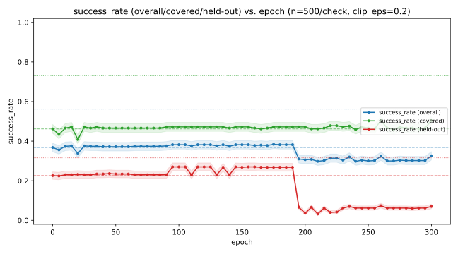<br><em>The three raw success_rate curves. covered is essentially flat from epoch 0 to 300; held-out collapses sharply around epoch 190-195.</em>
</div>

This is the clearest demonstration yet of exactly what phase 1 had no way
to see. Between epoch 190 and 195:

<div align="center">

| epoch | overall | covered | held-out | weighted |
|---|---|---|---|---|
| 190 | 38.2% | 47.2% | 26.8% | 34.75% |
| 195 | 31.0% | 47.2% | 6.6% | 22.85% |

</div>

`covered` does not move at all (47.2% both epochs, to three significant
figures). `held-out` collapses by 20 points in a single 5-epoch step.
`overall` -- the only number phase 1's version of this analysis could
have reported -- shows a 7-point drop, small enough to plausibly read as
noise on its own. Phase 1's single-population evaluation could not have
distinguished "the policy got slightly worse" from "the policy stopped
generalizing to anything it hadn't memorized" -- this split can, and does.

<div align="center">
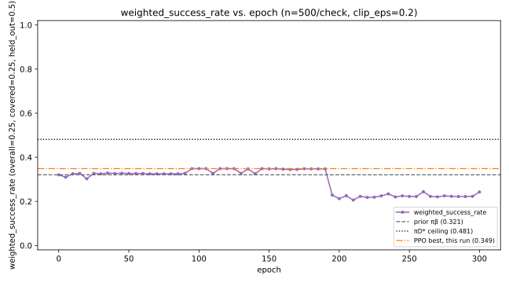<br><em>weighted_success_rate alone -- the same collapse, in the number actually used to pick a checkpoint.</em>
</div>

**Checkpoint selection itself was checked against this, not assumed
safe.** The epoch that would have been picked under phase 1's old,
unweighted criterion (`success_rate_overall`, best at epoch 175: overall
38.4%, covered 47.2%, held-out 26.8%) and the epoch picked under the new
weighted criterion (best at epoch 95) both land inside the safe,
pre-collapse region -- in this particular run, the two selection rules
happen to agree, not because the weighted criterion made no difference,
but because neither one was fooled into reaching past epoch 190. The
value of the split here is in what the *curve* reveals, not in a
near-miss the new metric had to rescue this checkpoint from.

**Going forward with epoch 95** -- the weighted-best checkpoint:

<div align="center">

| | value |
|---|---|
| hyperparameters | same as above (`clip_eps=0.2`, `gae_lambda=0.95`, `entropy_coef=0.01`, `minibatch_size=256`, `lr=0.0003`, `hidden_sizes=[64,64]`), stopped at epoch 95 |
| `success_rate` (overall) | 38.2% |
| `success_rate` (covered) | 47.2% |
| `success_rate` (held-out) | 27.0% |
| **`weighted_success_rate`** | **34.85%** |

</div>

### H3: clip range, an unplanned detour into a narrow failure band

Sweeping `clip_eps` (otherwise identical to H4's config, 300 epochs) at
0.1, 0.3, and 0.4 -- `0.2` already covered by H4 -- produced an odd,
non-monotonic pattern that took a real investigation to resolve.

<div align="center">
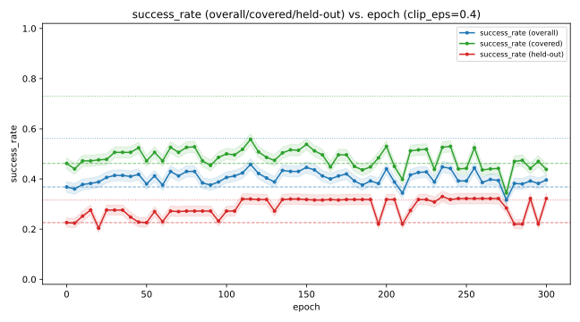<br><em>clip_eps=0.4: noisier throughout, but no sustained held-out-specific collapse -- unlike 0.2's clean cliff (see H4 above).</em>
</div>

`0.1` stayed perfectly flat for the full 300 epochs. `0.3` showed only
brief, simultaneous dips across all three populations together (not
`held-out` alone), always recovering. `0.4` was noisier throughout but
never collapsed the way `0.2` had -- and scored the best of the four.
This raised an immediate objection: if `0.2`'s collapse really is
`theta` drifting cumulatively away from the fixed `pi_old = pi_beta`
anchor, a *wider* trust region should let that drift happen faster, not
slower or not at all. Extending `0.3` and `0.4` to 600 epochs, and
re-running `0.2` with a different training seed (same `D`, same
`pi_beta`, only the training randomness changed) to rule out a one-off
fluke, gave a clear answer: the seed change reproduced the same
collapse almost exactly (epoch ~200-205 instead of ~190-195); `0.3`
still showed nothing at 600 epochs; `0.4` eventually showed a real, but
much noisier and more gradual, held-out-specific degradation only after
epoch ~300.

Since `clip_frac` and `entropy` are computed *over `D`* -- which contains
zero held-out transitions -- they cannot see whatever is actually
happening at held-out states by construction, and showed nothing unusual
at the collapse epoch. Probing the network's own output distribution
*directly at the held-out states* (cheap forward passes, no rollout, no
gradient ever touches these states) told a different story:

<div align="center">
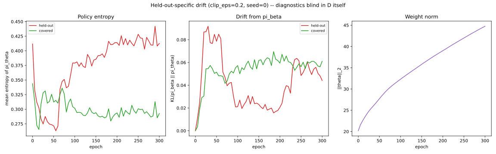<br><em>KL(π_β‖π_θ) and entropy at held-out states drift smoothly and continuously throughout -- rising, falling to a minimum around epoch 150-185, then rising again -- with no discontinuity at the collapse epoch. Weight norm grows smoothly throughout, also uninformative about timing.</em>
</div>

Tracking each held-out state's action probabilities *individually*
(rather than aggregated) found the mechanism directly: of the four
held-out states, exactly one had two competing actions slowly trading
probability over ~200 epochs, crossing at epoch 210.

<div align="center">
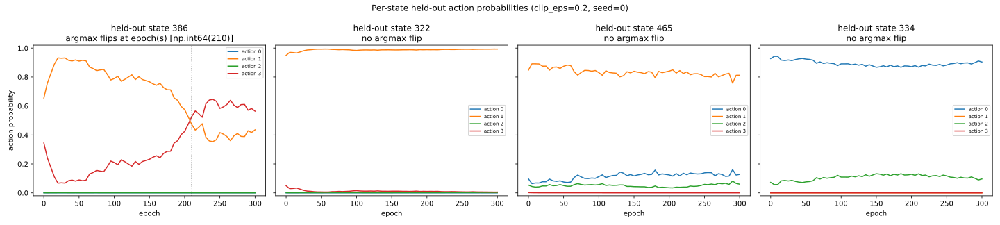<br><em>Three of four held-out states never come close to an argmax flip. The fourth (state 386) has two actions drift smoothly toward each other for 200 epochs and cross -- a continuous probability drift producing a discontinuous, deterministic-argmax behavioral change.</em>
</div>

This explains *how* a smooth drift produces a sudden cliff, but not why
`clip_eps=0.2` specifically. Testing `0.15` and `0.25` found that `0.25`
collapses in the *identical* epoch-190-to-195 window as `0.2`, while
`0.15` stays completely flat through the same window:

<div align="center">
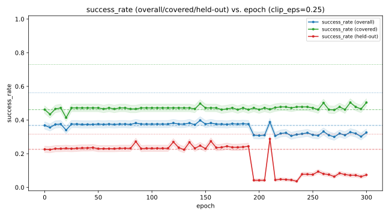<br><em>clip_eps=0.25 collapses in the same epoch window as 0.2 (see H4), including a brief partial recovery around epoch 210 -- the same epoch state 386's argmax flip occurred at under clip_eps=0.2.</em>
</div>

Narrowing further (`0.175`, `0.275`) confirmed a real, narrow band with
both edges clean:

<div align="center">

| `clip_eps` | 0.1 | 0.15 | 0.175 | **0.2** | **0.25** | 0.275 | 0.3 | 0.4 |
|---|---|---|---|---|---|---|---|---|
| sustained held-out collapse? | no | no | no | **yes** | **yes** | no* | no | no (later, gradual) |
| best `weighted_success_rate` | 34.7% | 36.6% | 36.9% | 34.9% | 35.7% | 38.6% | 36.8% | **41.4%** |

</div>

\* `0.275` showed one brief dip (epoch 215-220) in the same epoch region
as `0.2`/`0.25`'s collapse, but recovered fully by epoch 225 -- a
flutter, not a lock-in.

**Conclusion: this is an artifact of this specific `D`/optimization
trajectory landing a close two-action decision boundary at one
particular state, not a property of PPO's mechanism the exploitation-gap
question needs to account for.** The band is narrow (0.2-0.25 out of the
0.1-0.4 range tested), both neighbors are clean, and nothing about it
generalizes into a claim like "moderate clip ranges are dangerous" --
`0.4`, further from `0.2` than `0.25` is, remains the best-performing
value tested. This thread is closed without a deeper mechanistic
explanation of why this exact band; chasing that further would be
investigating a curiosity of this one dataset's optimization landscape,
not the exploitation gap itself.

What *is* worth keeping: this entire detour started because the
covered/held-out split caught something a plain `success_rate` would
have shown only as a mild, easy-to-dismiss wobble. Every diagnostic tool
already in this project (`clip_frac`, `entropy`, both computed over `D`)
was blind to it by construction; only evaluating held-out states directly
-- the whole point of requirement 3 -- made it visible at all. Whatever
this specific band turns out to be, the evaluation redesign it surfaced
is doing exactly the job it was built for.

**Resolving "which clip_eps is best."** The initial 0.1→0.4 sweep looked
like performance kept rising with no peak in sight -- but that used the
single best epoch observed per run, which non-monotonic fixed-D training
(see "Epoch-count ceiling analysis" in the phase-1 doc) makes an
unreliable ranking criterion: an unstable config can post a high one-off
peak right before collapsing. Extending the sweep out to `clip_eps=0.7`
and switching the ranking criterion to the **mean** `weighted_success_rate`
over the full run -- which a short-lived peak cannot inflate -- recovers
a clean picture:

<div align="center">
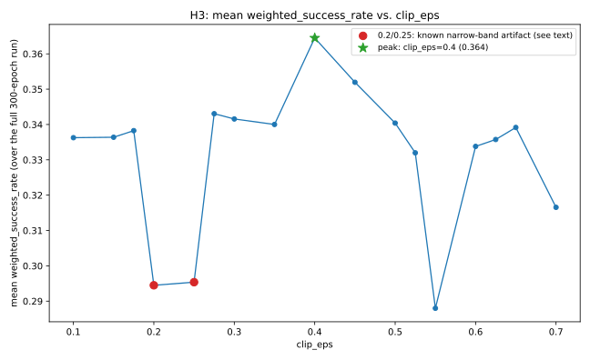<br><em>Mean weighted_success_rate vs. clip_eps, full run average. The two red points are the already-characterized 0.2/0.25 artifact, not a real dip in the underlying trend.</em>
</div>

A genuine peak at **`clip_eps=0.4`**, rising from 0.1 and falling away
past 0.45 (0.55's dip is the same general instability described above,
arriving earlier as `clip_eps` grows further; 0.6-0.7's partial recovery
is noise from testing only one seed per value, not a second real peak).
**`clip_eps=0.4` is adopted going forward** as this project's H3 answer:

<div align="center">
<br><em>clip_eps=0.4's own training curve -- the configuration this sweep confirms as best.</em>
</div>

### H5: entropy coefficient

Same design as phase 1's H5 -- `entropy_coef ∈ {0.0, 0.003, 0.01, 0.03, 0.1}`,
`clip_eps` now fixed at this project's H3 answer (0.4), 300 epochs,
ranked by mean `weighted_success_rate` from the start this time:

<div align="center">

| `entropy_coef` | **0.0** | 0.003 | 0.01 | 0.03 | 0.1 |
|---|---|---|---|---|---|
| mean `weighted_success_rate` | **0.377** | 0.372 | 0.364 | 0.336 | 0.224 |
| std | **0.024** | 0.027 | 0.028 | 0.042 | 0.053 |

</div>

Monotonic, not a U-shape: less entropy pressure is consistently better
and more stable here, all the way down to `entropy_coef=0.0`. No further
sweeping needed on this side -- `0.0` is a hard floor, not an interior
point with room to keep searching past it.

<div align="center">
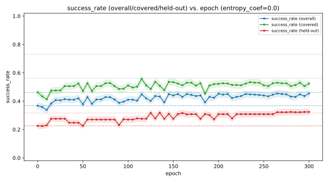<br><em>entropy_coef=0.0: steady improvement across all three populations for the full 300 epochs, no instability.</em>
</div>

**`entropy_coef=0.0` is adopted going forward.** Current configuration:
`clip_eps=0.4`, `entropy_coef=0.0`, otherwise identical to
`ppo_fixed_d_standard.yaml`.

### H2: GAE lambda

`gae_lambda ∈ {0.0, 0.5, 0.90, 0.95, 1.0}`, `clip_eps=0.4` and
`entropy_coef=0.0` now both fixed. A genuine interior peak this time, no
mirage to resolve: mean `weighted_success_rate` rises from 0.227 (λ=0)
to 0.293 (λ=0.5) to 0.318 (λ=0.90) to **0.377 (λ=0.95)**, then falls to
0.324 (λ=1.0). `λ=0.95` was already this project's default -- H2
confirms the existing setting rather than improving on it (its numbers
match H5's own `entropy_coef=0.0` row exactly, since that row already
was `clip_eps=0.4, entropy_coef=0.0, gae_lambda=0.95`). **`gae_lambda=0.95`
stays.** Current best mean `weighted_success_rate`: 0.377.

### H1: value coefficient

`value_coef ∈ {0.0, 0.1, 0.25, 0.5, 1.0}`, `clip_eps=0.4`,
`entropy_coef=0.0`, `gae_lambda=0.95` all now fixed. Same null result as
phase 1: mean `weighted_success_rate` ranges from 0.3748 to 0.3767 across
the whole swept range -- a spread of 0.002, well inside noise. **H1 is
closed with no effect, exactly as in phase 1.** This is the intended
setup for the `value_coef × max_grad_norm` cross-sweep next: a null
result in isolation is precisely what that cross-sweep exists to
double-check, not a coincidence to move past.

### Cross-sweep 1/3: clip_eps x gae_lambda

Motivated by a direct methodological concern raised mid-project: H3-H1's
sequential, one-hyperparameter-at-a-time search finds each dimension's
best value while holding the others at whatever was previously chosen --
which is exactly right if hyperparameters don't interact, and can settle
into a local optimum if they do. `clip_eps` and `gae_lambda` were the
first pair checked, since the mechanism already documented for both
(README, H3's clip-width-dependent drift; GAE's reliance on the critic's
own possibly-stale estimate) plausibly compound: how far `theta` can
drift per update, and how trustworthy the signal driving that drift is,
are not obviously separable questions. Grid: `clip_eps ∈ {0.3, 0.4, 0.5,
0.55, 0.6}` x `gae_lambda ∈ {0.85, 0.90, 0.95, 1.0}` (not every cell
filled -- widened twice, first past 0.4's sequential optimum, then again
once 0.5 turned out to beat it), `entropy_coef=0.0` fixed (H5), ranked by
mean `weighted_success_rate` as usual:

<div align="center">

| `clip_eps` ＼ `gae_lambda` | 0.85 | 0.90 | 0.95 | 1.00 |
|---|---|---|---|---|
| 0.30 | -- | 0.338 | 0.350 | 0.320 |
| 0.40 | -- | 0.318 | **0.377** (sequential choice) | 0.324 |
| 0.50 | 0.377 | 0.407 | 0.394 | 0.305 |
| 0.55 | 0.360 | **0.410** | 0.392 | -- |
| 0.60 | 0.374 | 0.399 | 0.369 | -- |

</div>

A genuine interior peak, not another edge mirage: every direction away
from `(0.55, 0.90)` decreases. **The sequential search's answer
(`clip_eps=0.4, gae_lambda=0.95`, 0.377) was a real local optimum, not
the joint one** -- `(0.55, 0.90)` reaches 0.410, ~9% higher, confirming
the interaction-blindness concern was not merely theoretical here.

<div align="center">
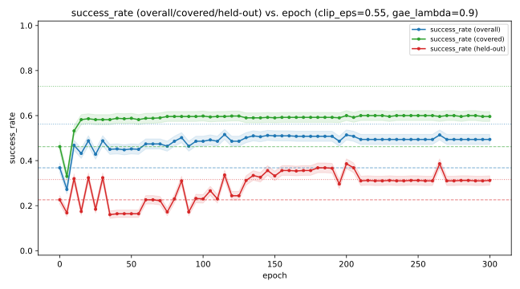<br><em>clip_eps=0.55, gae_lambda=0.90: covered reaches ~0.59-0.60, held-out settles at a stable ~0.30-0.31 from epoch ~210 on -- no collapse, a genuine sustained improvement.</em>
</div>

**`clip_eps=0.55, gae_lambda=0.90` replaces the sequential choice going
forward.** Current configuration: `clip_eps=0.55`, `gae_lambda=0.90`,
`entropy_coef=0.0`, otherwise identical to `ppo_fixed_d_standard.yaml`.

### Cross-sweep 2/3: value_coef x max_grad_norm

Same design as phase 1's H7 x H1 cross-sweep, checking whether H1's null
result (README, H1: 0.375-0.377 across `value_coef ∈ [0.0, 1.0]`, all
`max_grad_norm=0.5`) was `max_grad_norm` clipping the gradient before
`value_coef`'s weight could matter, masking a real effect. Grid:
`value_coef ∈ {0.0, 0.5, 1.0}` x `max_grad_norm ∈ {0.05, 0.1, 0.5, 1.0,
2.0, 5.0}` (widened well past phase 1's `{0.1, 0.5, 1.0}` on both sides,
since `max_grad_norm` had never been individually swept in phase 2 at
all), `clip_eps=0.55`, `gae_lambda=0.90`, `entropy_coef=0.0` all fixed:

<div align="center">

| `value_coef` ＼ `max_grad_norm` | 0.05 | 0.10 | 0.50 | 1.00 | 2.00 | 5.00 |
|---|---|---|---|---|---|---|
| 0.0 | 0.359 | 0.359 | 0.404 | 0.377 | 0.372 | 0.389 |
| 0.5 | 0.389 | 0.400 | **0.410** (previous best) | 0.386 | 0.381 | 0.390 |
| 1.0 | 0.414 | **0.415** | 0.395 | 0.391 | 0.375 | 0.390 |

</div>

The same interaction phase 1 found, reproduced here: at this project's
own `max_grad_norm=0.5`, `value_coef` barely moves the number (0.404 to
0.410 to 0.395 -- consistent with H1's null result). Only once the
gradient is clipped hard (`max_grad_norm ≤ 0.1`) does `value_coef` matter
at all, and there it matters a lot: 0.359 at `value_coef=0.0` vs. 0.415
at `value_coef=1.0`. `0.05` and `0.1` give near-identical results
(0.414 vs. 0.415, well inside noise of each other), so this looks like a
real plateau, not another still-rising edge.

<div align="center">
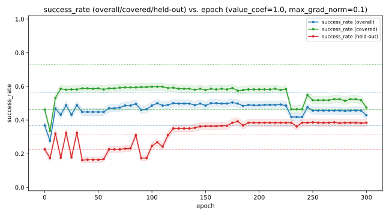<br><em>value_coef=1.0, max_grad_norm=0.1: covered/overall ease off somewhat after epoch ~225 (0.58->0.52, 0.49->0.45) while held-out stays flat-to-improving throughout (0.37->0.38) -- the opposite of the overfitting signature documented under H4, not a reason to distrust this run.</em>
</div>

The late-training softening in `covered`/`overall` here is worth naming
explicitly, since it makes this run look less clean at a glance than
`clip_eps=0.55, gae_lambda=0.90` alone (previous section) was.
`held_out` does not degrade alongside them -- it holds steady through the
same window and ends slightly above its own mid-training level -- which
is the opposite of what an overfitting explanation would predict (README,
H4: overfitting collapses `held_out` while `covered` stays put; here
`covered` moves and `held_out` doesn't). It reads as ordinary
fixed-D training noise rather than the mechanism this project has been
tracking. Separately: none of the sweep scripts persist a checkpoint
mid-run (`save_best_checkpoint_path` is only wired into
`scripts/analyze_policy_agreement.py`), so once a final configuration is
settled, retraining it through that script -- which tracks and keeps the
single best-observed checkpoint rather than whatever epoch training
happens to end on -- is how this kind of late-run softening gets handled
in practice, not by re-picking hyperparameters over it.

**`value_coef=1.0, max_grad_norm=0.1` replaces the previous defaults
going forward.** Current configuration: `clip_eps=0.55`, `gae_lambda=0.90`,
`entropy_coef=0.0`, `value_coef=1.0`, `max_grad_norm=0.1`. Mean
`weighted_success_rate`: 0.415, up from 0.377 after the sequential pass
alone.

### Cross-sweep 3/3: clip_eps x gae_lambda x entropy_coef

`gae_lambda` reappearing here raised the same concern that motivated the
first cross-sweep in the first place: `entropy_coef` (H5) was found with
`clip_eps=0.4` still fixed -- the sequential value, not the
`clip_eps=0.55` the first cross-sweep later settled on. Re-running
`entropy_coef x gae_lambda` alone, at `clip_eps=0.55` held fixed, would
just move the same coordinate-search blind spot up one level instead of
closing it: gae_lambda would once again be optimized conditional on a
clip_eps value not itself re-checked at the same time. So this one
includes `clip_eps` as a third swept dimension rather than a fixed
input.

A full grid across every value each of the three has ever been tested at
would be 5x4x5 = 100 runs -- the first cross-sweep's own result is what
keeps this tractable instead: it already located the joint optimum's
neighborhood in `(clip_eps, gae_lambda)` and showed performance falling
away in every direction from it (see the grid two sections up), so
nothing is lost by searching only that neighborhood here rather than
the full range each dimension was originally swept across. Grid:
`clip_eps ∈ {0.5, 0.55, 0.6}` x `gae_lambda ∈ {0.85, 0.90, 0.95}` x
`entropy_coef ∈ {0.0, 0.003, 0.01}` (H5's own sweep showed a steep,
monotonic decline past `0.01`, so `0.03`/`0.1` are not worth re-including
here) -- 27 combinations, `value_coef=1.0`, `max_grad_norm=0.1` fixed
(this project's cross-sweep-2 answer).

<div align="center">

| `clip_eps` | `gae_lambda` | `entropy_coef` | mean |
|---|---|---|---|
| 0.55 | 0.90 | **0.000** | **0.4152** |
| 0.50 | 0.90 | 0.010 | 0.4116 |
| 0.55 | 0.90 | 0.003 | 0.4085 |
| 0.55 | 0.95 | 0.000 | 0.3923 |

</div>

Decisive, and reassuring rather than surprising: the exact point already
in hand (`clip_eps=0.55, gae_lambda=0.90, entropy_coef=0.0`) tops the
full 27-combination grid. `entropy_coef=0.0` was NOT conditional on the
stale `clip_eps=0.4` after all -- letting all three vary jointly changed
nothing. The concern that motivated this cross-sweep was legitimate
methodology (a real risk, not a hypothetical one -- cross-sweep 1 had
already shown the sequential search failing exactly this way once), it
simply didn't fire again here.

**No change to the current configuration.** All three planned
cross-sweeps are now complete:

<div align="center">

| | value |
|---|---|
| `clip_eps` | 0.55 |
| `gae_lambda` | 0.90 |
| `entropy_coef` | 0.0 |
| `value_coef` | 1.0 |
| `max_grad_norm` | 0.1 |
| mean `weighted_success_rate` | 0.415 |

</div>

## Best checkpoint, re-evaluated under the seed 999

A transparency note before the numbers: every hyperparameter sweep in
this project (H1-H5, all three cross-sweeps) used `eval_seed=24680` --
correct, since that seed exists precisely to keep checkpoint/config
*selection* uncontaminated by the episodes later used to report a
number. Now it's important to re evaluate the best checkpoint chosen from those sweeps under
`eval_seed=999` -- this project's reserved
final-report seed, the same one `π_D*`'s own ceiling was computed under. Since fixed-D training here is fully
deterministic (CPU only, fixed training seed, same `D` and `π_β` every
time), there is no retraining needed.

<div align="center">
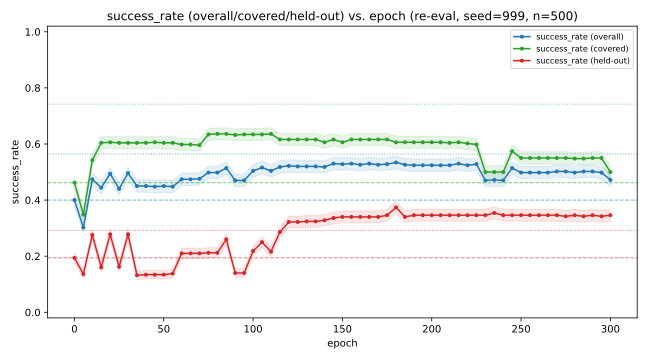<br><em>Best configuration, re-evaluated under seed=999: the three raw success_rate populations per checkpoint, epoch 0 through 300.</em>
</div>

<br />

<div align="center">
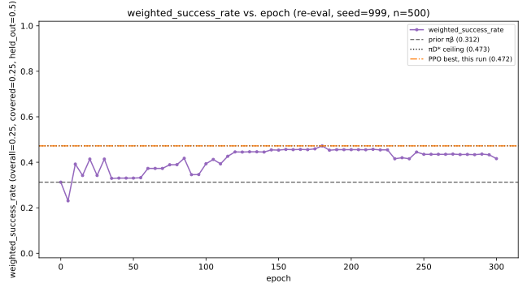<br><em>The same run's weighted_success_rate curve. Best: epoch 180.</em>
</div>

<br/>

<div align="center">

| | overall | covered | held-out | weighted |
|---|---|---|---|---|
| `π_β` (prior) | 40.0% | 46.2% | 19.4% | 31.3% |
| **best checkpoint (epoch 180)** | **53.4%** | **60.6%** | **37.4%** | **47.2%** |
| `π_D*` (empirical) | 56.2% | 73.0% | 31.6% | 47.3% |
| `π_D*` (true-restricted) | 59.6% | 75.2% | 39.4% | 53.4% |

</div>

The evaluation has three different components. The results show that our best checkpoint is 
clearly closer to the references than the prior. So the hyperparameters analyses provided a 
real improvement to the policy training. What we can notice is that there is still a gap in overall
evaluation and also on evaluation episodes focused on states covered by `D`. But on held-out episodes, the 
empirical reference is surpassed. It's still valid and it clearly shows that the held-out dimension is really useful.
From what we know empirical `π_D*` uses the info in `D` to build its transition model estimate. Its prone to a bit
of overfitting. Which is why PPO's best checkpoint is doing better than it on situations that are not represented by `D`.
It's still reassuring that the true-restricted version isn't surpassed by our best checkpoint in any component of our evaluation.


## Digression : What it really means to have the best policy extractable from `D`

It's a question that is raised from the latest results. If we only focus on optimizing the success rate on covered states by greedily
using what `D` provides, we are at a risk of overfitting. And that's not the goal of any training. So it's really important during our
study of the question that we make sure it's not happening.


## What other improvements we can make

### Policy agreement and disagreement factors

Now the best checkpoint is still **12.4 points behind `π_D*` (empirical)** and **14.6 points behind `π_D*`
(true-restricted)**. The natural next step is to see where it disagrees with the references and performs worse. It will 
help us identify where and possibly how improvement can happen. We define disagreement on an action to take at a particular state 
as the combination of three conditions : 
1. Both the empirical and the true-restricted versions of `π_D*` agree on the same action to take.
2. The evaluated checkpoint disagrees and chooses another action.
3. During evaluation, the PPO checkpoint performs worse than both references.

The best checkpoint (epoch 180) was rolled out from every non-terminal
state to compare against both `π_D*` definitions, under the same
`eval_seed=999`.

<div align="center">
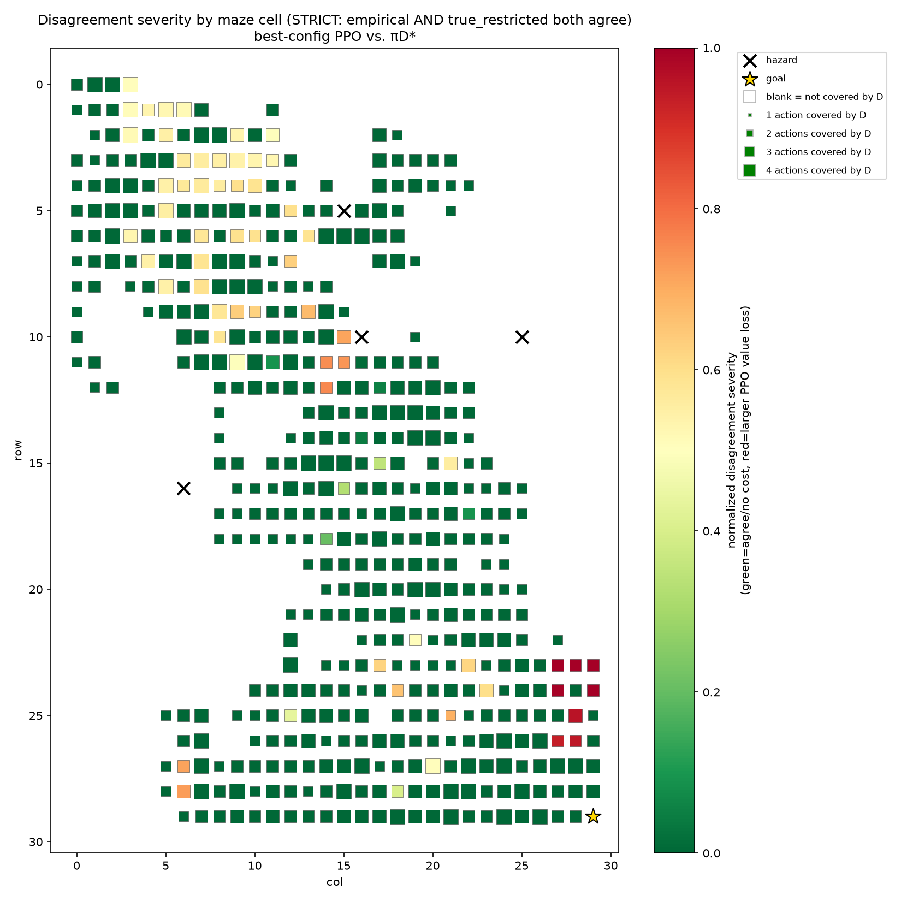<br><em>Strict disagreement severity by cell (green = agrees with π_D* or no cost; red = large value loss). Concentrated in the upper-left region and near the goal, both areas D covers densely.</em>
</div>

Of 895 non-terminal states, 484 (54.1%) are covered by `D`. Raw argmax
disagreement with `π_D*` (empirical) is large -- 471 states, 52.6% --
but nearly all of it is noise: filtering to statistically significant
disagreement drops this to 97 states (10.8%), and requiring BOTH `π_D*`
definitions to agree on the SAME action, with the checkpoint choosing a
different one and performing worse than both (`is_disagreement_strict`)
drops it further to 66 states (7.4%). **Every one of those 66 is a
covered state -- zero are in the uncovered set.** This is the expected
shape, not a surprise: an uncovered state is exactly where `π_D*` itself
has no real information (its own tie-break there is as uninformed as
anything PPO could produce), so "disagreement" isn't a meaningful
category there to begin with.

#### What predicts disagreement severity, among the 66

<div align="center">
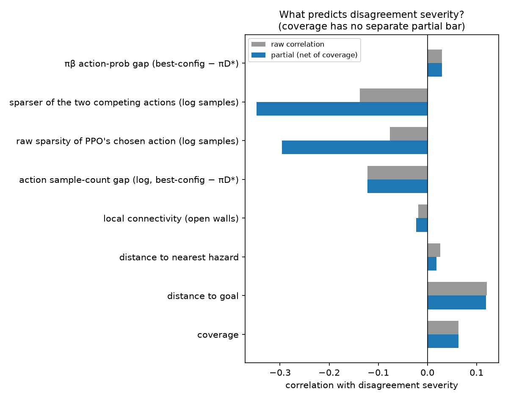<br><em>Raw vs. partial (net of coverage) correlation with severity, across every tested factor.</em>
</div>

By far the strongest predictor, once overall coverage is controlled for,
is `log_pair_min_samples` -- the SMALLER of the two competing actions'
sample counts, whichever one that is (partial r = -0.35, vs. -0.14 raw).
`action_sample_gap` -- the signed difference, `best-config action's
samples − π_D*'s action's samples` -- correlates more modestly (partial
r = -0.12); most of that is inherited from its overlap with `log_n_best_
config_action` below rather than an independent directional signal (see
next section).

The nuance worth being precise about: this is not "PPO disagrees where
π_D*'s action was sampled less than PPO's own." Two states with the
exact same *positive* sample gap (PPO's action seen more than π_D*'s) can
land on opposite sides of the severity distribution depending only on
the smaller count -- gap +47 with counts (3, 50) behaves like a
high-severity state, gap +50 with counts (500, 550) does not, even
though both favor PPO's action by a similar or larger margin. A state
with the *opposite*-signed gap (counts (40, 4), π_D*'s action seen far
more) is just as much at risk as the first, because its minimum (4) is
just as low. Direction of the imbalance doesn't predict severity; the
absolute rarity of whichever action is the sparser one does. With too
few samples for either action, the value estimate each side is built
on -- π_D*'s empirical MDP as much as PPO's own critic -- is dominated
by noise rather than signal, and which action ends up looking better is
no longer reliably tracking which one actually is. `log_n_best_config_
action` (PPO's own chosen action's raw sparsity, not compared to π_D*'s)
shows the same pattern on its own (partial r = -0.30): PPO tends to be
confidently wrong specifically where its own preferred action had little
direct reinforcement, independent of how that compares to the
alternative. `distance to goal` has a modest positive effect (partial r
= +0.12); `hazard distance`, `local connectivity`, and `π_β`'s own
action-probability gap show essentially none.

#### Does PPO at least skew toward the more-sampled action?

A direct, cheap follow-up on the nuance above, using
`policy_agreement.csv`'s own `n_best_config_action` vs.
`n_pi_d_star_action` columns -- no retraining, no new rollouts. Among
the 66 strict-disagreement states, PPO picks the more-sampled of the two
competing actions 57.8% of the time (37/64, ties excluded) -- not
significant (binomial test vs. 50/50, p=0.260). Restricted to the
states where the imbalance should matter most, the ones with the lowest
`pair_min_samples`, the skew doesn't just weaken, it reverses: 46.9%
(15/32, p=0.860) -- indistinguishable from a coin flip.

That the effect fades exactly where the earlier factor analysis says
noise dominates most is itself informative: it rules out a residual
"popularity bias" hiding inside the low-sample regime (PPO simply
favoring whichever action happened to have marginally more
reinforcement, even when both are rare) as an alternative to the noise
account. The finding stays narrow, and is worth stating precisely rather
than in either stronger or weaker form: a large sampling imbalance
between the two competing actions predicts that PPO's preference between
them becomes unreliable -- but not which direction that unreliable
preference lands in. Direction is not recoverable from the sample counts
at all; only the fact that the comparison has become untrustworthy is.

#### A quick test to make sure agreement equals real better performance

Now that we know possibly where the best checkpoint fails and before trying to 
solve that in regard to the factor concerned, a useful check is to see if agreeing 
with the references systematically improves the best checkpoints performance. For that 
I designed a simple masked evaluation script. The script evaluates the best checkpoint on 
the same evaluation seed. The difference is that I apply a mask where there is disagreement with 
`π_D*` and instead of the checkpoint's action, I use `π_D*`'s suggested action. A better success 
rate on the components would be a good sign to try and close the disagreement gap between PPO 
and the references.

<div align="center">
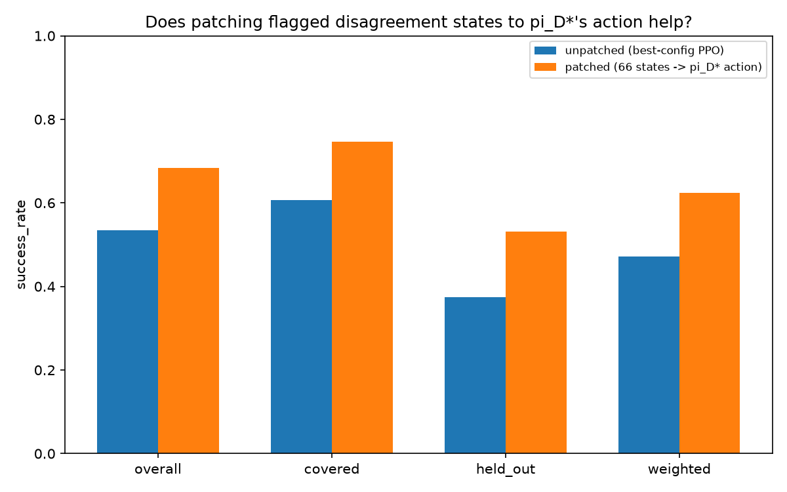<br><em>Unpatched best checkpoint vs. the same checkpoint with π_D*'s action substituted at exactly the 66 strict-disagreement states (38 of which were actually visited under this seed/episode count).</em>
</div>

<div align="center">

| | overall | covered | held-out | weighted |
|---|---|---|---|---|
| unpatched (best checkpoint) | 53.4% | 60.6% | 37.4% | 47.2% |
| patched (66 states → `π_D*`) | 68.4% | 74.6% | 53.2% | 62.4% |
| delta | +15.0 | +14.0 | +15.8 | +15.2 |

</div>

Clear, substantial gains across every population, from patching a tiny
fraction of the state space (66 of 895 states, most never even visited
under this start distribution). This validates the disagreement metric
directly: it isn't flagging noise, it's flagging real, exploitable
mistakes. The `covered` result is the most telling one to compare
against the ceilings, since that's the population `π_D*` actually has
information about -- patched `covered` (74.6%) lands almost exactly on
`π_D*` (true-restricted)'s own ceiling (75.2%, a 0.6-point gap) and
slightly above `π_D*` (empirical)'s (73.0%). In other words: fixing
these 66 states alone closes essentially the entire remaining `covered`
gap this project has been tracking since "Best checkpoint, re-evaluated
under the seed 999" -- there is very little room left to close beyond
what disagreement already identifies, on the population where closing it
means what it's supposed to mean.

### An attempt to close the gap


## Project structure

```
configs/                        # every experimental knob lives here, not in code
  phase1/                        # stochastic maze study (see docs/PHASE1_STOCHASTIC_MAZE.md)
    env_maze.yaml                  # maze layout, stochasticity, reward
    prior_training.yaml            # online PPO config for the checkpoint that generates D
    ppo_fixed_d_standard.yaml      # baseline fixed-D PPO hyperparameters
    ppo_fixed_d_modified.yaml      # example H4 ablation (edit/copy for other hypotheses)
    reference.yaml                 # pi_D* solver settings (gamma, unseen_penalty, VI tolerance)
    ...                            # (the rest of phase 1's sweep configs)
  phase2/                        # controlled-redundancy / variable-start study (see "Phase 2" above)

src/ppo_exploitation/
  envs/stochastic_maze.py        # the custom discrete stochastic maze
  ppo/
    networks.py                  # actor-critic MLP
    buffer.py                    # Trajectory container + GAE
    online_agent.py              # standard online PPO (trains the prior only)
    fixed_d_trainer.py           # THE research instrument: one rigorous PPO
                                  # trust-region window on D, pi_old = pi_beta
  data/collect.py                # roll out the frozen prior to build D; save/load
  reference/experience_optimal.py# exact value iteration -> both pi_D* definitions
  eval/evaluate.py                # unified live-rollout scoring + gap-report table
  utils/config.py                 # YAML <-> dataclass config layer
  utils/seeding.py                # reproducibility

scripts/
  01_train_prior.py               # train the online PPO checkpoint to target success rate
  02_collect_dataset.py           # collect D from the frozen checkpoint
  03_compute_pi_d_star.py         # solve both pi_D* definitions exactly
  04_train_fixed_d_ppo.py         # standard OR modified PPO on D (same code, different YAML)
  05_evaluate_all.py              # evaluate everything, print/save the gap report
  run_pipeline.sh                 # runs 01-05 end to end

tests/
  test_env.py                     # Tier-1: maze connectivity, transition-kernel correctness
  test_reference.py               # Tier-1: value iteration vs. hand-derived closed forms
  test_fixed_d_trainer.py         # Tier-1: trainer smoke test (runs, stays finite, pi_old == pi_beta)
  tier0/
    frozen_lake_env.py             # gymnasium FrozenLake-v1 adapter (validation-only, not a src/ module)
    test_tier0_pipeline.py         # Tier-0: full pipeline exercised on FrozenLake instead of the maze

.github/workflows/
  tests.yml                       # runs `pytest tests/` (Tier-0 + Tier-1) on push and pull_request
```

## Setup

```bash
python -m venv .venv && source .venv/bin/activate
pip install -r requirements.txt
pip install -e .          # makes `ppo_exploitation` importable everywhere
```

## Running the tests

```bash
pytest tests/ -v
```

See "Two kinds of tests, kept deliberately separate" above.
`tests/test_reference.py` is the one worth reading closely if you want to
trust the ceiling numbers: it hand-derives the closed-form fixed point of a
tiny stochastic self-loop MDP (`V(0) = 0.45/0.55` for a specific
reward/gamma setup) and checks the value-iteration solver matches it to
`1e-4`. `tests/tier0/` is the one worth running first if you want to trust
the *pipeline as a whole* before spending time reading through the maze-
specific code — it validates the same D → π_D* → fixed-D-PPO → evaluate
chain against an environment neither of us built.

## Running the full pipeline

```bash
bash scripts/run_pipeline.sh
```

or step by step:

```bash
# 1. Train the online PPO prior to ~35% success rate (live environment)
python scripts/01_train_prior.py \
    --env-config configs/phase1/env_maze.yaml \
    --prior-config configs/phase1/prior_training.yaml \
    --out results/phase1/prior_checkpoint.pt

# 2. Freeze that checkpoint, collect the fixed dataset D from it
python scripts/02_collect_dataset.py \
    --env-config configs/phase1/env_maze.yaml \
    --checkpoint results/phase1/prior_checkpoint.pt \
    --n-episodes 4000 --seed 1 \
    --out results/phase1/dataset_D.pkl

# 3. Solve pi_D* exactly (both empirical and true-restricted definitions)
python scripts/03_compute_pi_d_star.py \
    --env-config configs/phase1/env_maze.yaml \
    --reference-config configs/phase1/reference.yaml \
    --dataset results/phase1/dataset_D.pkl \
    --out-empirical results/phase1/pi_d_star_empirical.pkl \
    --out-true-restricted results/phase1/pi_d_star_true_restricted.pkl

# 4. Train standard PPO and modified PPO on the SAME D and the SAME prior
#    checkpoint (pi_old = pi_beta = this checkpoint throughout -- see
#    "What fixed-D training means for PPO, operationally")
python scripts/04_train_fixed_d_ppo.py \
    --dataset results/phase1/dataset_D.pkl \
    --ppo-config configs/phase1/ppo_fixed_d_standard.yaml \
    --prior-checkpoint results/phase1/prior_checkpoint.pt \
    --out results/phase1/ppo_standard_on_D.pt \
    --history-out results/phase1/ppo_standard_on_D_history.csv

python scripts/04_train_fixed_d_ppo.py \
    --dataset results/phase1/dataset_D.pkl \
    --ppo-config configs/phase1/ppo_fixed_d_modified.yaml \
    --prior-checkpoint results/phase1/prior_checkpoint.pt \
    --out results/phase1/ppo_modified_on_D.pt \
    --history-out results/phase1/ppo_modified_on_D_history.csv

# 5. Evaluate everything under the identical live-rollout protocol
python scripts/05_evaluate_all.py \
    --env-config configs/phase1/env_maze.yaml \
    --prior-checkpoint results/phase1/prior_checkpoint.pt \
    --pi-d-star-empirical results/phase1/pi_d_star_empirical.pkl \
    --pi-d-star-true-restricted results/phase1/pi_d_star_true_restricted.pkl \
    --ppo-checkpoints standard=results/phase1/ppo_standard_on_D.pt modified=results/phase1/ppo_modified_on_D.pt \
    --n-episodes 500 --eval-seed 999 \
    --out results/phase1/gap_report.csv
```

`scripts/05_evaluate_all.py` accepts any number of `name=path` pairs after
`--ppo-checkpoints`, so once you've trained additional ablation configs
(H1–H7 or otherwise) from step 4, add them all to a single step-5 call to
compare every variant against the same `π_D*` reference in one table.

### Testing a new hypothesis

1. Copy `configs/phase1/ppo_fixed_d_modified.yaml` to a new file
   (e.g. `configs/phase1/ppo_fixed_d_h3_wide_clip.yaml`).
2. Revert the field(s) already changed back to the standard value, then
   change exactly one field to test your hypothesis (e.g. `clip_eps: 0.2 →
   0.4` for H3).
3. Re-run step 4 against the *same* `results/phase1/dataset_D.pkl` and the *same*
   `results/phase1/prior_checkpoint.pt` with the new config, then add it to step
   5's `--ppo-checkpoints` list.

Never regenerate `D` or the prior checkpoint between comparison runs — the
whole point of the design is that every variant sees byte-identical
experience and starts from a byte-identical `π_old`.

## What this codebase does *not* try to answer

- **Cross-algorithm comparison.** This is not "is PPO better than SAC/DQN
  at exploitation" — see the motivating paper for that broader comparison
  across algorithms and many environments. This project fixes PPO and
  varies only its own internals.
- **A principled offline-RL solution.** The fixed-D trainer here is one
  rigorous PPO trust-region window applied to static data — not a
  Conservative Q-Learning / decision-transformer-style offline method.
  Answering "how good could a *properly designed* offline method do on
  this same `D`" would be a natural and interesting extension of this
  codebase, but a different one.
- **Wall-clock/sample-efficiency claims.** All comparisons here are about
  final exploitation quality given a fixed `D`, not about how many epochs
  or how much compute each variant needed to get there (though
  `results/*_history.csv` records `approx_kl`, `clip_frac`, and both
  losses per epoch, enough to investigate that separately if useful).

## Relationship to the motivating paper

Berseth (2025) defines the experience-optimal policy as (for deterministic
environments) the single highest-return trajectory ever replayed from a
buffer, with two "softer" estimators for stochastic settings — the best 5%
and the most-recent-best-5% of collected trajectories by return — used
because a *sampled* trajectory can't be replayed deterministically to
reproduce its score in a stochastic environment. This project takes a
different, model-based approach precisely because the environment was
purpose-built to allow it: rather than estimating `π_D*` from top-quantile
trajectory returns, we solve for it exactly via tabular value iteration on
the (MLE or true-restricted) MDP implied by `D`. This is only possible
because the ground-truth state space here is small and fully enumerable —
it would not be a tractable substitute for the paper's estimator in the
large/continuous-state Atari- and MuJoCo-scale environments the paper
studies. The two approaches are answering the same underlying question
(how much of `D`'s latent value does the learned policy actually recover)
with different tools suited to different environment scales.

## Further analyses (not run by default)

These are real, separate questions this codebase could be extended to
answer, deliberately kept out of the primary standard-vs-modified
comparison so they don't get silently blended into one number. None of
this is implemented yet.

- **The multi-window (periodic-refresh) scheme.** Reusing `D` across many
  outer iterations, refreshing `π_old ← θ` periodically, does let PPO
  extract more from `D` cumulatively than a single window can — the
  question is whether that additional extraction is real (information
  `D` actually supports) or an artifact of the ratio's denominator drifting
  away from `π_β` (see docs/PHASE1_STOCHASTIC_MAZE.md, "What 'fixed-D
training' means for PPO, operationally"). Before trusting any result from that
  scheme, two passive diagnostics are cheap to add and would settle it:
  `KL(π_β ‖ π_θ)` on `D`'s own states, and the effective sample size of the
  importance ratio `π_θ/π_β` over `D` — both computable from quantities the
  codebase already has (`Trajectory.log_probs` is `π_β`'s real
  log-probability and is currently unused past the single-window trainer).
  Flat curves would mean the drift stayed small and the scheme's numbers
  can be trusted; growing curves would mean the extra extraction is
  confounded with drift and shouldn't be reported as a clean exploitation-
  gap number without correction.
- **An importance-weighted correction (H8).** A version of the multi-window
  scheme where the ratio is anchored to `π_β` instead of a periodically
  refreshed `π_old` — a real off-policy correction rather than PPO's native
  (single-window-only) trust region. Comparing its `J(π)` against the
  single-window result would give the actual size of the effect, not just
  its presence.
- **A properly designed offline-RL baseline** — a different
  question from "what does PPO's own update rule extract," but a natural
  point of comparison once that number is established.
- **Preserving the best intermediate policy during a training window.**
  The epoch-count analysis (see docs/PHASE1_STOCHASTIC_MAZE.md, "Results
  analysis") shows fixed-D
  optimization can be non-monotonic within a single window — a better
  policy can appear at an intermediate epoch and later be lost to
  continued training, not just plateau. A fixed epoch count chosen in
  advance has no mechanism to recover that best intermediate point. Worth
  exploring: tracking the best-observed checkpoint against a held-out
  signal during training itself (analogous to early stopping) — carefully,
  since using held-out performance to pick a checkpoint mid-training is
  itself a form of selection that would need the same scrutiny already
  applied elsewhere in this project (see the prior-checkpoint confirmation
  mechanism in `scripts/01_train_prior.py`).
- **Scheduling `clip_eps` over training**, analogous to learning-rate
  schedules, rather than treating it as a single fixed value for an
  entire window. The clip_eps sweep (see docs/PHASE1_STOCHASTIC_MAZE.md,
  "Results analysis") shows the
  ceiling is sensitive to this value and that looser settings trade a
  higher ceiling for more instability — a schedule (e.g. loosening early,
  tightening late) might capture the reach of a wide clip without its
  instability. Not known whether this is already standard practice
  elsewhere; worth checking before implementing.


## Literature

Papers this project's design or discussion draws on directly — not a
general reading list, only what's actually behind a specific decision or
claim made above.

**Motivating paper**

- Berseth, G. (2025). *Is Exploration or Optimization the Problem for Deep
  Reinforcement Learning?* arXiv:2508.01329.
  [arxiv.org/pdf/2508.01329](https://arxiv.org/pdf/2508.01329) — introduces
  the experience-optimal policy and practical sub-optimality concepts this
  project's entire decomposition is built on. See "Motivating paper" and
  "Relationship to the motivating paper" above for exactly how this
  project adapts it.

**Core algorithm and methods used directly**

- Schulman, J., Wolski, F., Dhariwal, P., Radford, A., & Klimov, O. (2017).
  *Proximal Policy Optimization Algorithms.* arXiv:1707.06347.
  [arxiv.org/abs/1707.06347](https://arxiv.org/abs/1707.06347) — the
  algorithm this whole project studies. Its Atari/MuJoCo hyperparameter
  tables (`K=3` vs. `K=10` epochs) are the reference point for how far
  this project's epoch-count analysis (H4) pushes beyond conventional
  usage.
- Schulman, J., Moritz, P., Levine, S., Jordan, M., & Abbeel, P. (2015).
  *High-Dimensional Continuous Control Using Generalized Advantage
  Estimation.* arXiv:1506.02438 (ICLR 2016).
  [arxiv.org/abs/1506.02438](https://arxiv.org/abs/1506.02438) — defines
  the GAE formula (`gae_lambda`'s bias/variance trade-off) this project's
  `FixedDPPOTrainer` implements directly, and whose `λ→0` vs. `λ→1`
  behavior is the basis for the entire "GAE lambda sweep" analysis.
- Kingma, D. P., & Ba, J. (2015). *Adam: A Method for Stochastic
  Optimization.* arXiv:1412.6980 (ICLR 2015).
  [arxiv.org/abs/1412.6980](https://arxiv.org/abs/1412.6980) — the
  optimizer used throughout every trainer in this project
  (`torch.optim.Adam`); its per-parameter moment estimates were relevant
  to reasoning about the `value_coef` / shared-gradient-clipping question.
  - Cui, Y., Jia, M., Lin, T.-Y., Song, Y., & Belongie, S. (2019). *Class-Balanced 
  Loss Based on Effective Number of Samples.* arXiv:1901.05555 (CVPR 2019).
  [arxiv.org/abs/1901.05555](https://arxiv.org/abs/1901.05555) — the class-balancing 
  method used to account for imbalanced training data by re-weighting the loss 
  according to the effective number of samples in each class.

**Implementation verification reference**

- Raffin, A., Hill, A., Gleave, A., Kanervisto, A., Ernestus, M., &
  Dormann, N. (2021). *Stable-Baselines3: Reliable Reinforcement Learning
  Implementations.* Journal of Machine Learning Research, 22(268), 1–8.
  [jmlr.org/papers/v22/20-1364.html](https://jmlr.org/papers/v22/20-1364.html)
  — this project's single combined loss / single optimizer / single
  global `clip_grad_norm_` pattern (see "Value coefficient sweep") was
  checked directly against SB3's reference PPO implementation, confirming
  it matches standard practice rather than being a project-specific
  deviation.