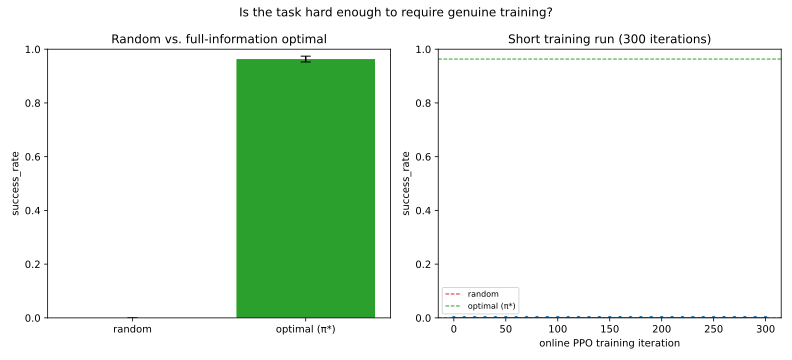
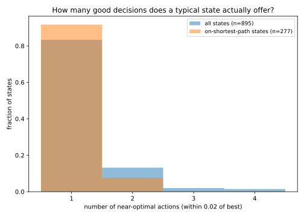
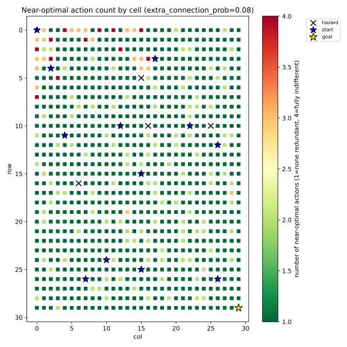
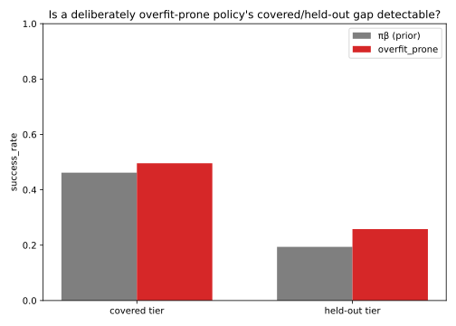

# PPO Exploitation Gap

**Research question.** Given a fixed amount of experience `D`, what prevents
PPO from reaching the best policy that can be extracted from `D`? Can that gap be reduced by a careful selection of hyperparameters or does it require a change to the optimization mechanism of PPO itself ? 

This is a study of PPO's *optimization/exploitation* behavior in isolation
from exploration: the environment, the data-collection policy, and the
dataset itself are all held fixed, so that any performance difference
between experiments is attributable to how well each one extracts
information already present in `D` — not to differences in what was
collected.

## Motivating paper

This project is directly motivated by:

> Glen Berseth, ["Is Exploration or Optimization the Problem for Deep
> Reinforcement Learning?"](https://arxiv.org/pdf/2508.01329) (2025)

That paper introduces the **experience optimal policy** `π̂*` — the best
policy recoverable from an agent's own collected experience — and defines
**practical sub-optimality** as the gap between it and the learned policy,
`V(π̂*(s0)) − V(π_θ(s0))`. It reports that across many
environments and both PPO and DQN, the experience-optimal value is typically 
2–3× the learned policy's own value — in the paper's own words, these algorithms 
"only exploit half of the good experience they generate." — i.e. that much of 
deep RL's difficulty on hard tasks is an
*exploitation/optimization* problem, not an *exploration* problem.

This project adapts that core idea into a controlled, single-algorithm
study: instead of comparing PPO against DQN across many environments with
different data-generating processes, we fix one environment, one dataset
`D`, and study PPO against modified versions of itself, so that the
resulting exploitation-gap numbers are cleanly attributable to a single
algorithmic change at a time. See "Relationship to the motivating paper"
below for the precise correspondence and the places this project
deliberately diverges.

## The core decomposition

For a learned policy `π_alg` trained on a fixed dataset `D`, define the
**experience-optimal policy** `π_D*` as the best policy extractable from the
information in `D` (not the globally optimal policy `π*` for the
environment). Then:

```
J(π*) − J(π_alg) = [J(π*) − J(π_D*)]  +  [J(π_D*) − J(π_alg)]
                     exploration/data       exploitation/optimization
                          gap                        gap
```

This project only ever intervenes on the second term. The first term is a
property of how `D` was collected and is held fixed throughout.

**Terminology, kept strictly distinct throughout the codebase:**

<div align="center">

| Term | Means | Does NOT mean |
|---|---|---|
| Exploitation *frequency* | how often the agent acts greedily w.r.t. its current policy (e.g. deterministic/mode action at eval time) | how *good* that greedy behavior actually is |
| Exploitation *quality* | how much of the value latent in `D` the learned policy actually recovers | how deterministic the policy is |
| Optimization | the mechanical process of updating θ to improve the PPO objective | value estimation |

</div>

A policy can be 100% "exploitative" in the frequency sense (always takes
its best-known action) while still being very bad at exploitation in the
quality sense (its best-known action is wrong, because the critic/advantage
estimate or the policy update failed to extract what `D` actually supports).
This project is about the latter.

## Phase 1: the stochastic maze (complete)

The project's first phase used a stochastic 30x30 maze with redundant
paths to study the PPO exploitation gap under fixed-D training.
Systematic hyperparameter tuning across all seven native PPO
hyperparameter groups closed most of the gap (standard PPO's `65.0%` to
a best configuration's `95.4%`, against a `99.2%` ceiling). The
disagreement investigation that followed found two real, independent,
partially-explanatory mechanisms (an asymmetry inherited from `π_β`'s own
behavior, and sparse pair-level data) -- but ultimately found that this
specific maze's redundant paths made it impossible to tell whether either
mechanism costs any real, measurable performance, since the states where
PPO and `π_D*` disagree are overwhelmingly off the path a real rollout
ever takes.

**Full write-up, every experiment, every result:**
[docs/PHASE1_STOCHASTIC_MAZE.md](docs/PHASE1_STOCHASTIC_MAZE.md).

## Phase 2: a more controlled experiment

Phase 1's disagreement investigation surfaced two problems with the
original maze as a testbed, not with the findings themselves: `π_D*`
(empirical) is a purely greedy, unregularized consumer of `D`'s raw
counts, with its own known failure mode at thin-sample bottlenecks; and
the maze's redundant paths let PPO disagree with that reference almost
for free, since most disagreement states turned out to be off the path a
real rollout ever takes. Phase 2 is designed around three explicit
requirements this phase's design didn't have, each fixing a specific gap
just identified:

1. **The task must stay hard enough to require genuine training and real
   policy improvement** -- not solvable near-trivially, or the whole
   exploitation-gap question stops being meaningful.
2. **A limited, deliberately small number of good decisions**, so that
   disagreeing with the reference policy is plainly visible in
   success_rate rather than absorbed by redundant paths -- this is what
   phase 1's redundant maze could not provide.
3. **Overfitting to `D` must be directly observable, not merely assumed
   absent.** Phase 1 could not have detected overfitting even where it
   mattered: `D` and evaluation were drawn from the exact same fixed
   start and maze instance, so "PPO overfits `D`" and "PPO generalizes
   well from `D`" would have produced an identical success_rate.

**Our choice: keep the same maze, change how it's started and connected,
rather than build a new environment.**

1. **Controlled, non-zero redundancy**, via the existing
   `extra_connection_prob` parameter, tuned to a handful of good routes
   rather than one (a perfect, spanning-tree maze was considered and
   rejected for this reason -- see docs/PHASE1_STOCHASTIC_MAZE.md's
   closing section -- a single unique path makes every disagreement
   maximally severe by construction, which removes the gradation phase
   1's findings depended on). Addresses requirement 2.
2. **A start-state distribution instead of a fixed start**, sampled
   unevenly on purpose when collecting `D`: some starts oversampled, some
   undersampled, a few withheld from `D` entirely. Evaluation then
   reports success_rate separately for well-covered vs. rarely- or
   never-seen starts -- a policy that excels on the former and collapses
   on the latter is the direct, previously unobtainable signature of
   overfitting. Addresses requirement 3.
3. **Reuse of the existing environment, solver, and training pipeline.**
   Value iteration already computes `V`/`Q` for every state regardless of
   start, so `π_D*` needs no changes at all; only the reset logic, `D`
   collection, and evaluation protocol need to change. This keeps the
   task exactly as hard as phase 1's maze (same size, hazards, and
   stochastic slip), addressing requirement 1 by construction rather than
   by redesigning the task from scratch.

This is a genuine second phase, not a continuation of the first: a new
prior, a new `D`, a new `π_D*`, and likely a fresh hyperparameter pass.

### Final environment parameters

<div align="center">

| parameter | phase 1 | phase 2 | why it changed |
|---|---|---|---|
| `extra_connection_prob` | 0.08 | 0.08 | see below -- lowering this alone broke online training |
| `num_hazards` | 12 | 4 | see below -- this, not connectivity, was the real obstacle to exploration |
| `step_penalty` | -0.01 | -0.03 | needed so value differences between actions exceed slip-induced noise (see requirement 2 below) |
| `num_start_states` | 1 | 12 | the overfitting-detection axis (requirement 3) |

</div>

Getting here took a real detour. Lowering `extra_connection_prob` alone
(to 0.015, keeping phase 1's `num_hazards=12`) satisfied requirement 2's
redundancy target on paper, but made online PPO training's own
exploration collapse completely: 300 iterations produced exactly 0%
success, every time, regardless of `entropy_coef`. Diagnosed directly: a
pure uniform-random walk from a close start reached the goal in 9/10
trials at `num_hazards=4`, but died to *one of twelve* hazards in 5/5
trials at `num_hazards=12`, from the identical start -- undirected
exploration finds any one of many hazards far more easily than the one
specific goal. A separate check ruled out bad network initialization
luck: five different random seeds all showed the exact same
stuck-in-place behavior (an untrained network's action distribution is
correlated across similar states, unlike true independent-per-step
random sampling, so even a mild bias repeatedly walks into the same
wall). Restoring `extra_connection_prob` to 0.08 and lowering
`num_hazards` to 4 together fixed this -- real training curves emerged
without touching `entropy_coef` at all (see requirement 1 below).

A separate, structural bug surfaced along the way and is fixed rather
than worked around: at low redundancy, excluding only each start's
single BFS-shortest path from candidate hazard cells was not enough --
the value-optimal policy does not always follow that exact path, so a
hazard could still end up adjacent to the route actually taken. Four of
twelve starts had a real 0% success rate under the exact optimal policy
(not a gradient of risk -- a genuine trap) before this was caught.
Fixed via rejection sampling in `envs/stochastic_maze.py`
(`_verify_and_redraw_hazards`): every candidate hazard placement is
checked against the exact optimal policy's actual success rate from
every start, and redrawn from scratch if any start falls below 70% --
never by shaping hazard placement around a known solution, which would
make the property true by construction instead of testing it.

### Verifying requirement 1: task difficulty

<div align="center">
<br><em>Left: a uniformly random policy (2.0% success) against the full-information exact optimal policy (100%). Right: a genuine 300-iteration online PPO run, success_rate climbing from 0% to 39.3%.</em>
</div>

The random-vs-optimal gap (98 points) rules out the task being solvable
by luck. The training curve is not smooth -- it dips as low as 8.3% around
iteration 30 before climbing past 39% by iteration 300 -- but the
direction is unambiguous, and no change to `entropy_coef` was needed to
get it: the fix was `num_hazards` and `extra_connection_prob` above, not
the training algorithm's own exploration incentives.

### Verifying requirement 2: redundancy

<div align="center">
 
</div>

`scripts/verify_redundancy_level.py` reports on-path states averaging
1.09 near-optimal actions (tolerance calibrated to roughly the value cost
of a one-step detour) -- the script's own built-in heuristic flags this
as possibly *too* low (near a perfect maze). That heuristic was
deliberately overridden by a direct behavioral check instead: starting
from the exact optimal policy, a controlled fraction of on-path states'
actions were corrupted (replaced with the worst available action) and
success_rate was measured live.

<div align="center">

| states corrupted | aggregate success_rate |
|---|---|
| 0% | 100.0% |
| 10% | 36.7% |
| 25% | 11.3% |
| 50% | 0.0% |

</div>

A graceful, monotonic decline -- not a perfect maze's instant collapse at
any disagreement, but nowhere near phase 1's redundancy either. Checked
per-start too: most individual starts are already at 0% success by 25%
corruption, with only two or three more resilient outliers keeping the
aggregate above zero -- the aggregate number is not hiding a uniformly
tolerant reality.

### Verifying requirement 3: overfitting detectability

The first attempt at this used a deliberately "overfit-prone" fixed-D PPO
config (many more epochs than a baseline run, `entropy_coef=0`) and
compared its covered-vs-held-out gap against `π_β`'s own. It failed in an
instructive way: that config's gap (+0.238) came out *smaller* than
`π_β`'s own baseline gap (+0.268), because comparing it against a
10-epoch baseline confounded "trained for far longer" with "overfit" --
more gradient steps improved both tiers, masking whatever overfitting
signal existed. Adjusting epochs and entropy to isolate the effect
properly would have meant doing the actual hyperparameter analysis this
check is only supposed to prepare for -- so instead of tuning PPO
further, the check itself was redesigned.

`scripts/verify_overfitting_detectable.py` now builds a policy that is
overfit **by construction**: for every state, memorize whichever action
`D` shows most often there -- pure behavioral-cloning-style memorization,
no value estimation, no PPO training at all.

<div align="center">
<br><em>The memorization policy matches π_β on covered starts but collapses to zero on held-out; π_β itself (uniform starts during its own training) keeps a much smaller gap.</em>
</div>

<div align="center">

| policy | covered | held-out | gap |
|---|---|---|---|
| `π_β` (baseline) | 46.2% | 19.4% | +0.268 |
| D-mode memorization | 46.4% | 0.0% | **+0.464** |

</div>

The memorization policy matches `π_β`'s covered performance almost
exactly (it deterministically replays `π_β`'s single most common local
choice there) while collapsing completely on held-out starts, where it
has no information at all -- roughly double `π_β`'s own gap. The
covered/held-out infrastructure does detect overfitting when a genuinely
overfit policy exists; the issue was never the infrastructure, only the
earlier PPO-specific definition of "overfit."

## Our new starting point: a three-way, weighted evaluation

Running the actual H4 baseline (the first real result after the three
requirements above) surfaced a gap in how this project was measuring
"better." Two things exposed it. First, `analyze_epochs.py`'s own
epoch-0 evaluation showed `success_rate=0.000` for `π_β` -- a network
that scores ~40% everywhere else -- because that script (like seven
other `analyze_*.py` scripts inherited from phase 1) had never been
updated to pass `num_start_states`, silently constructing a *different*
one-start maze instead of phase 2's twelve-start one. Second, and more
fundamentally: once that was fixed, it became clear that the
covered/held-out distinction requirement 3 introduced was only being
applied at the very end (`scripts/05_evaluate_all.py`'s final report) --
every intermediate decision along the way (which epoch counts as "best"
during a sweep, which checkpoint gets saved, which hyperparameter looks
better) was still being made on a plain, unweighted `success_rate` that
could just as easily reward memorization as the original PPO-vs-`π_D*`
comparison this project started from could.

**Every evaluation everywhere in this project now reports three numbers,
combined into one weighted score:**

<div align="center">

| population | weight | what it measures |
|---|---|---|
| overall | 25% | the env's own default reset, uniform across all 12 starts |
| covered | 25% | the 8 well-/moderately-covered tier starts |
| held-out | 50% | the 4 starts never seen during `D` collection |

</div>

`weighted_success_rate = 0.25·overall + 0.25·covered + 0.50·held_out`.
Held-out is weighted most heavily **on purpose** -- not because it is the
single most representative population, but because it is the only one of
the three memorization cannot cheat: a policy that has simply memorized
`D`'s coverage looks identical to a genuinely good one on `overall` and
`covered`, and only reveals itself on `held_out`. Weighting it heaviest
means the number used to pick "the best epoch," "the best checkpoint," or
"the best hyperparameter" is itself protected against the same failure
mode requirement 3 was built to catch in individual policies -- the
selection *process*, not just the policies it selects between, is now
guarded against overfitting.

This is not a cosmetic addition. `scripts/eval/evaluate.py`'s
`evaluate_policy_weighted` is now the single shared implementation behind
every check in this project: `scripts/05_evaluate_all.py`'s final report,
the epoch/hyperparameter sweeps (`scripts/analyze_epochs.py`,
`scripts/analyze_h7.py` -- checkpoint *selection* during training now
uses the weighted number, not raw `success_rate`), and both remaining
verification scripts (`scripts/verify_task_difficulty.py`'s training
curve, `scripts/verify_overfitting_detectable.py`'s comparison, and
`scripts/verify_redundancy_level.py`'s corruption-sensitivity check,
which had never actually been wired into that script as a re-runnable
feature before now).

**The three baseline policies, under this new protocol** (500 episodes,
seed 999):

<div align="center">

| policy | overall | covered | held-out | **weighted** |
|---|---|---|---|---|
| `π_β` (prior) | 40.0% | 46.2% | 19.4% | **31.3%** |
| `π_D*` (empirical) | 56.4% | 74.2% | 29.2% | **47.3%** |
| `π_D*` (true-restricted) | 59.6% | 75.2% | 39.4% | **53.4%** |

</div>

Every one of these already shows the same pattern the whole design was
meant to expose: covered performance is well above overall, held-out is
well below -- even for `π_D*` itself, whose own ceiling depends on `D`'s
coverage exactly as any learned policy's would. The weighted column, not
any single one of the three raw numbers, is what "better" means from here
on -- this is the number the upcoming H1-H7 sweep is measured against,
replacing phase 1's plain `success_rate` gap entirely.

## Project structure

```
configs/                        # every experimental knob lives here, not in code
  phase1/                        # stochastic maze study (see docs/PHASE1_STOCHASTIC_MAZE.md)
    env_maze.yaml                  # maze layout, stochasticity, reward
    prior_training.yaml            # online PPO config for the checkpoint that generates D
    ppo_fixed_d_standard.yaml      # baseline fixed-D PPO hyperparameters
    ppo_fixed_d_modified.yaml      # example H4 ablation (edit/copy for other hypotheses)
    reference.yaml                 # pi_D* solver settings (gamma, unseen_penalty, VI tolerance)
    ...                            # (the rest of phase 1's sweep configs)
  phase2/                        # controlled-redundancy / variable-start study (see "Phase 2" above)

src/ppo_exploitation/
  envs/stochastic_maze.py        # the custom discrete stochastic maze
  ppo/
    networks.py                  # actor-critic MLP
    buffer.py                    # Trajectory container + GAE
    online_agent.py              # standard online PPO (trains the prior only)
    fixed_d_trainer.py           # THE research instrument: one rigorous PPO
                                  # trust-region window on D, pi_old = pi_beta
  data/collect.py                # roll out the frozen prior to build D; save/load
  reference/experience_optimal.py# exact value iteration -> both pi_D* definitions
  eval/evaluate.py                # unified live-rollout scoring + gap-report table
  utils/config.py                 # YAML <-> dataclass config layer
  utils/seeding.py                # reproducibility

scripts/
  01_train_prior.py               # train the online PPO checkpoint to target success rate
  02_collect_dataset.py           # collect D from the frozen checkpoint
  03_compute_pi_d_star.py         # solve both pi_D* definitions exactly
  04_train_fixed_d_ppo.py         # standard OR modified PPO on D (same code, different YAML)
  05_evaluate_all.py              # evaluate everything, print/save the gap report
  run_pipeline.sh                 # runs 01-05 end to end

tests/
  test_env.py                     # Tier-1: maze connectivity, transition-kernel correctness
  test_reference.py               # Tier-1: value iteration vs. hand-derived closed forms
  test_fixed_d_trainer.py         # Tier-1: trainer smoke test (runs, stays finite, pi_old == pi_beta)
  tier0/
    frozen_lake_env.py             # gymnasium FrozenLake-v1 adapter (validation-only, not a src/ module)
    test_tier0_pipeline.py         # Tier-0: full pipeline exercised on FrozenLake instead of the maze

.github/workflows/
  tests.yml                       # runs `pytest tests/` (Tier-0 + Tier-1) on push and pull_request
```

## Setup

```bash
python -m venv .venv && source .venv/bin/activate
pip install -r requirements.txt
pip install -e .          # makes `ppo_exploitation` importable everywhere
```

## Running the tests

```bash
pytest tests/ -v
```

See "Two kinds of tests, kept deliberately separate" above.
`tests/test_reference.py` is the one worth reading closely if you want to
trust the ceiling numbers: it hand-derives the closed-form fixed point of a
tiny stochastic self-loop MDP (`V(0) = 0.45/0.55` for a specific
reward/gamma setup) and checks the value-iteration solver matches it to
`1e-4`. `tests/tier0/` is the one worth running first if you want to trust
the *pipeline as a whole* before spending time reading through the maze-
specific code — it validates the same D → π_D* → fixed-D-PPO → evaluate
chain against an environment neither of us built.

## Running the full pipeline

```bash
bash scripts/run_pipeline.sh
```

or step by step:

```bash
# 1. Train the online PPO prior to ~35% success rate (live environment)
python scripts/01_train_prior.py \
    --env-config configs/phase1/env_maze.yaml \
    --prior-config configs/phase1/prior_training.yaml \
    --out results/phase1/prior_checkpoint.pt

# 2. Freeze that checkpoint, collect the fixed dataset D from it
python scripts/02_collect_dataset.py \
    --env-config configs/phase1/env_maze.yaml \
    --checkpoint results/phase1/prior_checkpoint.pt \
    --n-episodes 4000 --seed 1 \
    --out results/phase1/dataset_D.pkl

# 3. Solve pi_D* exactly (both empirical and true-restricted definitions)
python scripts/03_compute_pi_d_star.py \
    --env-config configs/phase1/env_maze.yaml \
    --reference-config configs/phase1/reference.yaml \
    --dataset results/phase1/dataset_D.pkl \
    --out-empirical results/phase1/pi_d_star_empirical.pkl \
    --out-true-restricted results/phase1/pi_d_star_true_restricted.pkl

# 4. Train standard PPO and modified PPO on the SAME D and the SAME prior
#    checkpoint (pi_old = pi_beta = this checkpoint throughout -- see
#    "What fixed-D training means for PPO, operationally")
python scripts/04_train_fixed_d_ppo.py \
    --dataset results/phase1/dataset_D.pkl \
    --ppo-config configs/phase1/ppo_fixed_d_standard.yaml \
    --prior-checkpoint results/phase1/prior_checkpoint.pt \
    --out results/phase1/ppo_standard_on_D.pt \
    --history-out results/phase1/ppo_standard_on_D_history.csv

python scripts/04_train_fixed_d_ppo.py \
    --dataset results/phase1/dataset_D.pkl \
    --ppo-config configs/phase1/ppo_fixed_d_modified.yaml \
    --prior-checkpoint results/phase1/prior_checkpoint.pt \
    --out results/phase1/ppo_modified_on_D.pt \
    --history-out results/phase1/ppo_modified_on_D_history.csv

# 5. Evaluate everything under the identical live-rollout protocol
python scripts/05_evaluate_all.py \
    --env-config configs/phase1/env_maze.yaml \
    --prior-checkpoint results/phase1/prior_checkpoint.pt \
    --pi-d-star-empirical results/phase1/pi_d_star_empirical.pkl \
    --pi-d-star-true-restricted results/phase1/pi_d_star_true_restricted.pkl \
    --ppo-checkpoints standard=results/phase1/ppo_standard_on_D.pt modified=results/phase1/ppo_modified_on_D.pt \
    --n-episodes 500 --eval-seed 999 \
    --out results/phase1/gap_report.csv
```

`scripts/05_evaluate_all.py` accepts any number of `name=path` pairs after
`--ppo-checkpoints`, so once you've trained additional ablation configs
(H1–H7 or otherwise) from step 4, add them all to a single step-5 call to
compare every variant against the same `π_D*` reference in one table.

### Testing a new hypothesis

1. Copy `configs/phase1/ppo_fixed_d_modified.yaml` to a new file
   (e.g. `configs/phase1/ppo_fixed_d_h3_wide_clip.yaml`).
2. Revert the field(s) already changed back to the standard value, then
   change exactly one field to test your hypothesis (e.g. `clip_eps: 0.2 →
   0.4` for H3).
3. Re-run step 4 against the *same* `results/phase1/dataset_D.pkl` and the *same*
   `results/phase1/prior_checkpoint.pt` with the new config, then add it to step
   5's `--ppo-checkpoints` list.

Never regenerate `D` or the prior checkpoint between comparison runs — the
whole point of the design is that every variant sees byte-identical
experience and starts from a byte-identical `π_old`.

## What this codebase does *not* try to answer

- **Cross-algorithm comparison.** This is not "is PPO better than SAC/DQN
  at exploitation" — see the motivating paper for that broader comparison
  across algorithms and many environments. This project fixes PPO and
  varies only its own internals.
- **A principled offline-RL solution.** The fixed-D trainer here is one
  rigorous PPO trust-region window applied to static data — not a
  Conservative Q-Learning / decision-transformer-style offline method.
  Answering "how good could a *properly designed* offline method do on
  this same `D`" would be a natural and interesting extension of this
  codebase, but a different one.
- **Wall-clock/sample-efficiency claims.** All comparisons here are about
  final exploitation quality given a fixed `D`, not about how many epochs
  or how much compute each variant needed to get there (though
  `results/*_history.csv` records `approx_kl`, `clip_frac`, and both
  losses per epoch, enough to investigate that separately if useful).

## Relationship to the motivating paper

Berseth (2025) defines the experience-optimal policy as (for deterministic
environments) the single highest-return trajectory ever replayed from a
buffer, with two "softer" estimators for stochastic settings — the best 5%
and the most-recent-best-5% of collected trajectories by return — used
because a *sampled* trajectory can't be replayed deterministically to
reproduce its score in a stochastic environment. This project takes a
different, model-based approach precisely because the environment was
purpose-built to allow it: rather than estimating `π_D*` from top-quantile
trajectory returns, we solve for it exactly via tabular value iteration on
the (MLE or true-restricted) MDP implied by `D`. This is only possible
because the ground-truth state space here is small and fully enumerable —
it would not be a tractable substitute for the paper's estimator in the
large/continuous-state Atari- and MuJoCo-scale environments the paper
studies. The two approaches are answering the same underlying question
(how much of `D`'s latent value does the learned policy actually recover)
with different tools suited to different environment scales.

## Further analyses (not run by default)

These are real, separate questions this codebase could be extended to
answer, deliberately kept out of the primary standard-vs-modified
comparison so they don't get silently blended into one number. None of
this is implemented yet.

- **The multi-window (periodic-refresh) scheme.** Reusing `D` across many
  outer iterations, refreshing `π_old ← θ` periodically, does let PPO
  extract more from `D` cumulatively than a single window can — the
  question is whether that additional extraction is real (information
  `D` actually supports) or an artifact of the ratio's denominator drifting
  away from `π_β` (see docs/PHASE1_STOCHASTIC_MAZE.md, "What 'fixed-D
training' means for PPO, operationally"). Before trusting any result from that
  scheme, two passive diagnostics are cheap to add and would settle it:
  `KL(π_β ‖ π_θ)` on `D`'s own states, and the effective sample size of the
  importance ratio `π_θ/π_β` over `D` — both computable from quantities the
  codebase already has (`Trajectory.log_probs` is `π_β`'s real
  log-probability and is currently unused past the single-window trainer).
  Flat curves would mean the drift stayed small and the scheme's numbers
  can be trusted; growing curves would mean the extra extraction is
  confounded with drift and shouldn't be reported as a clean exploitation-
  gap number without correction.
- **An importance-weighted correction (H8).** A version of the multi-window
  scheme where the ratio is anchored to `π_β` instead of a periodically
  refreshed `π_old` — a real off-policy correction rather than PPO's native
  (single-window-only) trust region. Comparing its `J(π)` against the
  single-window result would give the actual size of the effect, not just
  its presence.
- **A properly designed offline-RL baseline** — a different
  question from "what does PPO's own update rule extract," but a natural
  point of comparison once that number is established.
- **Preserving the best intermediate policy during a training window.**
  The epoch-count analysis (see docs/PHASE1_STOCHASTIC_MAZE.md, "Results
  analysis") shows fixed-D
  optimization can be non-monotonic within a single window — a better
  policy can appear at an intermediate epoch and later be lost to
  continued training, not just plateau. A fixed epoch count chosen in
  advance has no mechanism to recover that best intermediate point. Worth
  exploring: tracking the best-observed checkpoint against a held-out
  signal during training itself (analogous to early stopping) — carefully,
  since using held-out performance to pick a checkpoint mid-training is
  itself a form of selection that would need the same scrutiny already
  applied elsewhere in this project (see the prior-checkpoint confirmation
  mechanism in `scripts/01_train_prior.py`).
- **Scheduling `clip_eps` over training**, analogous to learning-rate
  schedules, rather than treating it as a single fixed value for an
  entire window. The clip_eps sweep (see docs/PHASE1_STOCHASTIC_MAZE.md,
  "Results analysis") shows the
  ceiling is sensitive to this value and that looser settings trade a
  higher ceiling for more instability — a schedule (e.g. loosening early,
  tightening late) might capture the reach of a wide clip without its
  instability. Not known whether this is already standard practice
  elsewhere; worth checking before implementing.


## Literature

Papers this project's design or discussion draws on directly — not a
general reading list, only what's actually behind a specific decision or
claim made above.

**Motivating paper**

- Berseth, G. (2025). *Is Exploration or Optimization the Problem for Deep
  Reinforcement Learning?* arXiv:2508.01329.
  [arxiv.org/pdf/2508.01329](https://arxiv.org/pdf/2508.01329) — introduces
  the experience-optimal policy and practical sub-optimality concepts this
  project's entire decomposition is built on. See "Motivating paper" and
  "Relationship to the motivating paper" above for exactly how this
  project adapts it.

**Core algorithm and methods used directly**

- Schulman, J., Wolski, F., Dhariwal, P., Radford, A., & Klimov, O. (2017).
  *Proximal Policy Optimization Algorithms.* arXiv:1707.06347.
  [arxiv.org/abs/1707.06347](https://arxiv.org/abs/1707.06347) — the
  algorithm this whole project studies. Its Atari/MuJoCo hyperparameter
  tables (`K=3` vs. `K=10` epochs) are the reference point for how far
  this project's epoch-count analysis (H4) pushes beyond conventional
  usage.
- Schulman, J., Moritz, P., Levine, S., Jordan, M., & Abbeel, P. (2015).
  *High-Dimensional Continuous Control Using Generalized Advantage
  Estimation.* arXiv:1506.02438 (ICLR 2016).
  [arxiv.org/abs/1506.02438](https://arxiv.org/abs/1506.02438) — defines
  the GAE formula (`gae_lambda`'s bias/variance trade-off) this project's
  `FixedDPPOTrainer` implements directly, and whose `λ→0` vs. `λ→1`
  behavior is the basis for the entire "GAE lambda sweep" analysis.
- Kingma, D. P., & Ba, J. (2015). *Adam: A Method for Stochastic
  Optimization.* arXiv:1412.6980 (ICLR 2015).
  [arxiv.org/abs/1412.6980](https://arxiv.org/abs/1412.6980) — the
  optimizer used throughout every trainer in this project
  (`torch.optim.Adam`); its per-parameter moment estimates were relevant
  to reasoning about the `value_coef` / shared-gradient-clipping question.

**Implementation verification reference**

- Raffin, A., Hill, A., Gleave, A., Kanervisto, A., Ernestus, M., &
  Dormann, N. (2021). *Stable-Baselines3: Reliable Reinforcement Learning
  Implementations.* Journal of Machine Learning Research, 22(268), 1–8.
  [jmlr.org/papers/v22/20-1364.html](https://jmlr.org/papers/v22/20-1364.html)
  — this project's single combined loss / single optimizer / single
  global `clip_grad_norm_` pattern (see "Value coefficient sweep") was
  checked directly against SB3's reference PPO implementation, confirming
  it matches standard practice rather than being a project-specific
  deviation.