# PPO Exploitation Gap

**Research question.** Given a fixed amount of experience `D`, what prevents
PPO from reaching the best policy that can be extracted from `D`? Can that gap be reduced by a careful selection of hyperparameters or does it require a change to the optimization mechanism of PPO itself ? 

This is a study of PPO's *optimization/exploitation* behavior in isolation
from exploration: the environment, the data-collection policy, and the
dataset itself are all held fixed, so that any performance difference
between experiments is attributable to how well each one extracts
information already present in `D` — not to differences in what was
collected.

## Motivating paper

This project is directly motivated by:

> Glen Berseth, ["Is Exploration or Optimization the Problem for Deep
> Reinforcement Learning?"](https://arxiv.org/pdf/2508.01329) (2025)

That paper introduces the **experience optimal policy** `π̂*` — the best
policy recoverable from an agent's own collected experience — and defines
**practical sub-optimality** as the gap between it and the learned policy,
`V(π̂*(s0)) − V(π_θ(s0))`. It reports that across many
environments and both PPO and DQN, the experience-optimal value is typically 
2–3× the learned policy's own value — in the paper's own words, these algorithms 
"only exploit half of the good experience they generate." — i.e. that much of 
deep RL's difficulty on hard tasks is an
*exploitation/optimization* problem, not an *exploration* problem.

This project adapts that core idea into a controlled, single-algorithm
study: instead of comparing PPO against DQN across many environments with
different data-generating processes, we fix one environment, one dataset
`D`, and study PPO against modified versions of itself, so that the
resulting exploitation-gap numbers are cleanly attributable to a single
algorithmic change at a time. See "Relationship to the motivating paper"
below for the precise correspondence and the places this project
deliberately diverges.

## The core decomposition

For a learned policy `π_alg` trained on a fixed dataset `D`, define the
**experience-optimal policy** `π_D*` as the best policy extractable from the
information in `D` (not the globally optimal policy `π*` for the
environment). Then:

```
J(π*) − J(π_alg) = [J(π*) − J(π_D*)]  +  [J(π_D*) − J(π_alg)]
                     exploration/data       exploitation/optimization
                          gap                        gap
```

This project only ever intervenes on the second term. The first term is a
property of how `D` was collected and is held fixed throughout.

**Terminology, kept strictly distinct throughout the codebase:**

<div align="center">

| Term | Means | Does NOT mean |
|---|---|---|
| Exploitation *frequency* | how often the agent acts greedily w.r.t. its current policy (e.g. deterministic/mode action at eval time) | how *good* that greedy behavior actually is |
| Exploitation *quality* | how much of the value latent in `D` the learned policy actually recovers | how deterministic the policy is |
| Optimization | the mechanical process of updating θ to improve the PPO objective | value estimation |

</div>

A policy can be 100% "exploitative" in the frequency sense (always takes
its best-known action) while still being very bad at exploitation in the
quality sense (its best-known action is wrong, because the critic/advantage
estimate or the policy update failed to extract what `D` actually supports).
This project is about the latter.

## Phase 1: the stochastic maze (complete)

The project's first phase used a stochastic 30x30 maze with redundant
paths to study the PPO exploitation gap under fixed-D training.
Systematic hyperparameter tuning across all seven native PPO
hyperparameter groups closed most of the gap (standard PPO's `65.0%` to
a best configuration's `95.4%`, against a `99.2%` ceiling). The
disagreement investigation that followed found two real, independent,
partially-explanatory mechanisms (an asymmetry inherited from `π_β`'s own
behavior, and sparse pair-level data) -- but ultimately found that this
specific maze's redundant paths made it impossible to tell whether either
mechanism costs any real, measurable performance, since the states where
PPO and `π_D*` disagree are overwhelmingly off the path a real rollout
ever takes.

**Full write-up, every experiment, every result:**
[docs/PHASE1_STOCHASTIC_MAZE.md](docs/PHASE1_STOCHASTIC_MAZE.md).

## Phase 2: a more controlled experiment (complete)

Phase 1's redundant maze made it impossible to tell whether the
disagreements PPO showed with `pi_D*` cost anything real, since most of
them sat off any path a rollout ever took. Phase 2 redesigned the same
maze around three requirements phase 1's design lacked: a task hard
enough to require genuine learning, a small enough number of good
decisions that disagreement shows up in `success_rate` rather than being
absorbed by redundancy, and a start-state distribution that makes
overfitting to `D` directly observable rather than merely assumed absent
(covered vs. held-out starts, evaluated separately). This section
summarizes what that redesign found; the full write-up -- every sweep,
every figure, every number -- lives in
[docs/PHASE2_CONTROLLED_MAZE.md](docs/PHASE2_CONTROLLED_MAZE.md).

**Evaluation protocol.** Every result from here on is a single
`weighted_success_rate = 0.25*overall + 0.25*covered + 0.50*held_out`,
selected by its `mean` over the full training run (not a single best
epoch) specifically to resist peak-chasing.

**The systematic sweep.** All seven native PPO hyperparameter groups were
swept in sequence on the new task (clip range, GAE lambda, entropy
coefficient, value coefficient, max grad norm, epoch count, minibatch
size), each building on the previous winner. This alone found a
configuration (`clip_eps=0.55, gae_lambda=0.90, entropy_coef=0.0,
value_coef=1.0, max_grad_norm=0.1`) that closed most of the gap to the
`pi_D*` ceiling on this task, without touching PPO's own update rule.

**The disagreement investigation.** Comparing this best checkpoint's
greedy policy against `pi_D*` state by state, restricted to disagreements
both `pi_D*` references (empirical and true-restricted) agree with each
other on and where PPO does measurably worse, found two independent,
causally-validated mechanisms, confirmed by patching `pi_D*`'s action
into disagreement states and re-evaluating live:

1. **Genuinely close decisions** (~2/3 of disagreements): the true
   value gap between the top two actions is small enough that no amount
   of data resolves it -- a real but low-severity mechanism.
2. **A severe, topologically-isolated near-goal pocket** (a handful of
   states, 10-20 total visits despite geometric proximity to the goal):
   an exploration failure, not an exploitation one -- out of this
   project's stated scope (fixed `D`, no new data collection), and never
   resolved by any mechanism tried in this phase, regardless of
   hyperparameter or weighting strength.

**An attempt to close the gap: effective-sample weighting.** Borrowing
Cui et al. (2019)'s class-imbalance re-weighting idea (`w(n)/n`, an
"effective number of samples" correction), applied per `(state, action)`
pair using `D`'s own exact counts. A naive first sweep failed outright
(wrong scale relative to `D`'s actual count distribution); once properly
calibrated, a **KL-anchored decay** -- letting the weighting's strength
fade as the policy's cumulative KL-divergence from `pi_beta` grows, since
`pi_old` never moves in this fixed-`D` setting and `approx_kl` is
therefore already a cumulative measure, not a per-epoch one -- became the
first configuration to beat the un-weighted baseline on `mean`
(0.4289 vs. 0.4127), while cutting strict state-level disagreements from
66 to 51 (-23%), concentrated specifically in the "close decision"
mechanism above; the near-goal pocket was untouched, exactly as its
exploration-failure diagnosis predicts.

**A full `beta x k` cross-sweep** (36 combinations, resolving a gap left
by calibrating `beta` and `k` separately in sequence) confirmed
`beta=0.9995` as the right anchor -- its entire row stays in the
strongest, widest band of the whole grid, unlike isolated single-cell
spikes elsewhere -- while finding `k=0.30` edges out the previously
reported `k=0.10` on `mean` (0.4357 vs. 0.4289). Re-running the full
disagreement pipeline on `k=0.30`, however, found it fixes *zero* of
`k=0.10`'s 51 disagreements and adds 11 new ones (the tightest true
decisions in the dataset) -- its `mean` advantage comes entirely from a
smoother trajectory away from an otherwise identical peak, not from a
better policy. **`k=0.10` is what this project carries forward**: the two
peak checkpoints are functionally tied on every aggregate number, so
`k=0.30`'s only edge is bought at the cost of concrete, checkable
mistakes `k=0.10` never makes.

This phase led to real findings in terms of possible ameliorations for the PPO 
algorithm. But all of that can't be useful if not tested on an actual complete run
and if it isn't extended to the continuous space. That's what the third phase of the 
project will be investigating.

Full detail on every one of these -- exact numbers, every figure, every
rejected intermediate idea -- is in
[docs/PHASE2_CONTROLLED_MAZE.md](docs/PHASE2_CONTROLLED_MAZE.md).

## Phase 3: realistic training and continuous actions

Phase 3 picks up two threads phase 2 closed without
resolving, and neither is a minor loose end -- each is a genuine
precondition for treating phase 2's central finding (the
effective-sample-weighting fix, KL-anchored, `beta=0.9995`, `k=0.10`) as
more than a result specific to phase 2's own deliberately extreme
protocol.

**1. Test on a full, realistic training run** 
Every phase 2 result, without exception, comes from a
single trust-region window stretched to `epochs=300` against a `pi_old`
that never moves. Realistic PPO (Stable-Baselines3, CleanRL, and
effectively every published configuration) instead alternates short
windows of `E=3` to `10` epochs against a fresh rollout and a refreshed
`pi_old`, repeated many times over training. The exploitation-gap
mechanism phase 2 isolated -- an advantage estimate computed once and
then treated as equally reliable regardless of how many times a given
`(state, action)` pair was actually seen -- is structurally present in
that realistic loop too, just diluted across many small windows instead
of concentrated in a long one. Whether the KL-anchored fix transfers to
that regime, in what form, and at what strength (the `k` calibrated
against a 300-epoch window has no established relationship to whatever
would suit a 5-epoch one) is a real, unanswered empirical question. The
natural next experiment: instrument a standard multi-window training
loop, apply the same weighting mechanism at a similarly reduced strength,
and check whether the same qualitative benefit (fewer exploitable
state-level disagreements with `pi_D*`, a comparable or better `mean`
weighted_success_rate) survives the transfer.

**2. Extend the mechanism to continuous action spaces.** The exact
`(state, action)` count this fix depends on has no equivalent once
actions are continuous -- two continuous actions are essentially never
bit-identical, so "how many times was this pair observed" stops meaning
anything. The goal of phase 3 will be to search for a substitute.


I decided to start by searching a way to extend our new weighting mecanism to the
continuous action space. As said previously, we can't use the exact count when we have continuous
`(state, action)` pairs. So we will either have to find a proxy for the exact count (something that
 correlates with it in the appropriate way and is still valid in continuous space) or we will have
 to design a new method that carries the same idea as our discovered weigthing method.

### Extension to the continuous action space : Trying to find a proxy for the exact count

**A small critic ensemble's disagreement.** `K` independent, randomly-initialized
critic heads each regress the same GAE returns fixed-`D` PPO's own critic already targets, via a masked MSE
that only updates a head's output at the action actually taken -- mirroring
Bootstrapped DQN (Osband et al., 2016, arXiv:1602.04621). The
per-transition **VARIANCE** across heads, at the action taken, is then the raw
signal `n_eff` is built from.

**Validated on six deliberately independent testbeds**
(`results/phase3/analysis/n_eff_correlation/`), not just this project's own
maze, specifically to check whether the correlation is a general property of
ensemble disagreement or an artifact of this project's own environment:

<div align="center">

| testbed | transitions | pairs | Spearman(`n_eff`, true count) |
|---|---|---|---|
| current-maze | 399,490 | 1,165 | 0.666 |
| new-maze-layout (fresh layout) | 473,193 | 261 | 0.731 |
| frozen-lake | 55,791 | 44 | 0.537 |
| taxi | 100,000 | 1,256 | 0.322 |
| blackjack | 11,338 | 496 | 0.031 |
| river-swim | 160,000 | 3 | 1.000 (degenerate -- only 3 pairs ever visited, not a trustworthy number) |

</div>

The first formula tried was `n_eff = 1/sqrt(variance)`, not the more obvious
`1/variance` -- an empirical check found plain `1/variance` blows up under
overfitting (training the SAME ensemble longer inflated its mean by ~64x
between 20 and 400 epochs on a testbed with NO real uncertainty to find,
verified against the true exact count); the square root damped this to ~9x,
a real improvement but not a fix.

Given the ensemble's raw variance correlates positively with the true count
on 5 of the 6 testbeds shown above, a more principled formula was derived
from the classical estimator-variance law, 
$Var(estimate) \sim \frac{\sigma^2_\text{return}}{n}$, rather than picking `1/sqrt(variance)` ad hoc:

$$
\hat{n}_{\text{eff}}(s, a) = \frac{\sigma_0^2}{\text{Variance}(s, a)}
$$

where $\sigma_0^2$ is the pooled variance of the lowest-variance (most
confident) pairs, standing in for the intrinsic return noise $\sigma^2_\text{return}$
-- making `n_eff` come out proportional to the true count by construction,
not just monotonically related to it like the earlier ad hoc choice.

<div align="center">
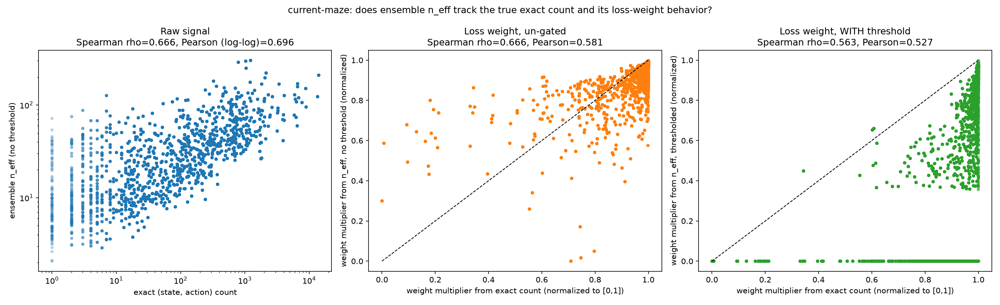
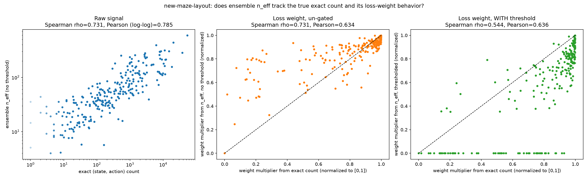
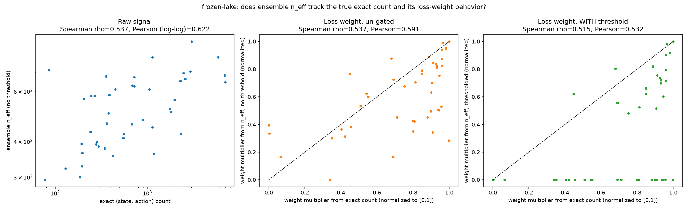
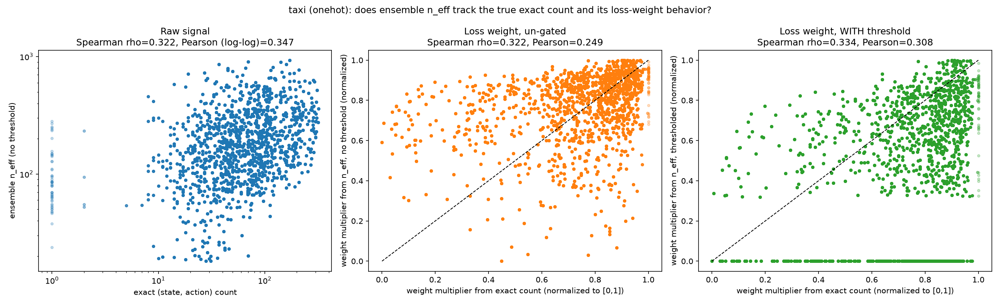
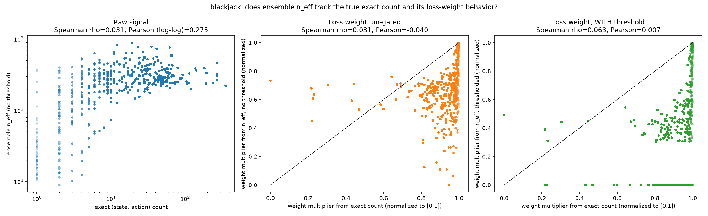
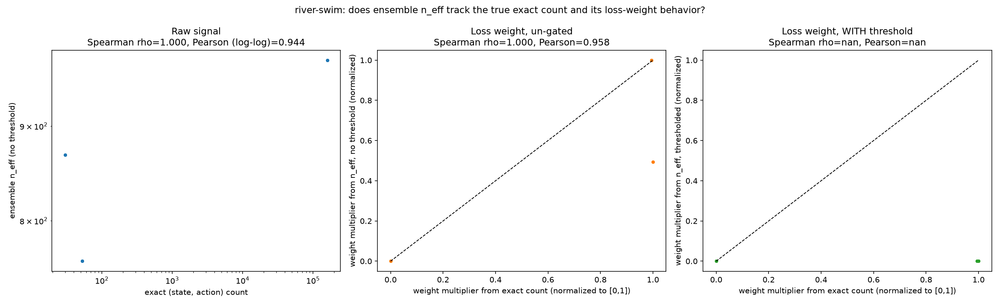
<br><em>Each panel: exact count (x-axis) vs. ensemble n_eff (y-axis), log-log. Positive on 5 of 6 testbeds -- weakest on blackjack (traced to a scale mismatch between beta and blackjack's small count range, not a flaw in the ensemble itself) and degenerate on river-swim (too few pairs visited to trust the number at all, itself a finding: naive exploration barely reaches past the first few states of a long chain).</em>
</div>

<br/>

This formula is exactly as reliable as the correlation it's built on: solid
on the same 5 testbeds, weak on the 6th (blackjack). But even restricted to
where the correlation holds, fitting the actual relationship
(`log(variance)` regressed on `log(true count)`) gave slopes of `-0.551`,
`-1.275`, and `-1.539` on three of those testbeds -- nowhere near the `-1`
the formula above assumes, and different enough from each other that no
single calibration of it transfers across tasks. 

A neural-network ensemble trained by SGD simply isn't the i.i.d. sample-mean estimator that law
describes: its convergence for a given pair depends on network capacity,
training duration, and generalization from nearby states, none of which a
fixed exponent can capture. `n_eff` is kept as a fallback signal, not
discarded, but this instability is why the project's main effort shifts next
to a method that carries the same idea without needing a count-like
substitute at all.

### Extension to the continuous action space : Shifting to an alternative method that carries the same idea

Instead of manufacturing a pseudo-count and feeding it through `w(n)/n` (a
formula built for actual counts), we try to weight the loss DIRECTLY from uncertainty:

$$
\text{weight}(s, a) = 1 - \exp(-\text{Variance}(s, a) / \tau)
$$

This keeps the exact same direction and bounds `w(n)/n` had -- low variance
(confident) -> weight -> 0; high variance (uncertain) -> weight -> 1 -- without
ever requiring variance to imitate a count. $\tau$ is calibrated directly
against the OBSERVED variance distribution (e.g. its median), not against an
assumed variance-to-count relationship, which is exactly the assumption just
shown to be untrustworthy.

**`DirectVarianceWeightedTrainer`** (frozen ensemble, constant `tau`): the
first full-run test underperformed the established baseline outright
(mean=0.3844 vs. 0.4127), with a trajectory (rises early, dips mid-run,
recovers, declines late) matching the SAME phase-dependent pattern found
earlier for constant-`beta` weighting. A KL-anchored decay for `tau` was
added on the same logic as `beta`'s own anchor -- but `tau` must SHRINK, not
grow, as drift accumulates (`weight` depends on its scale parameter in the
opposite direction `w(n)/n` depends on `beta`'s): 

$$
\tau(t) = \frac{\tau_0}{(1 +
|KL_{t-1}|/k)}
$$

A first single-seed run of this KL-anchored version looked very promising
(mean=0.4306, beating the established best of 0.4289) -- but a second run of
the EXACT SAME command with a different random initialization seed for the heads
gave a starkly different result (mean=0.3779). Given this method is meant to be 
proposed as a real contribution, its reliability must be characterized properly 
rather than trusting one seed:

- A **5-seed x {5, 10, 12, 15}-head sweep** (20 runs,
  `results/phase3/analysis/variance_weighting_seed_sweep/`) found the
  mean-of-means BELOW baseline for every head count (0.3886, 0.3612, 0.3775,
  0.3957) -- only 1-2 of 5 seeds per head count beat baseline, and more heads
  did not help monotonically (`K=10` was worse than `K=5`).

  <div align="center">
  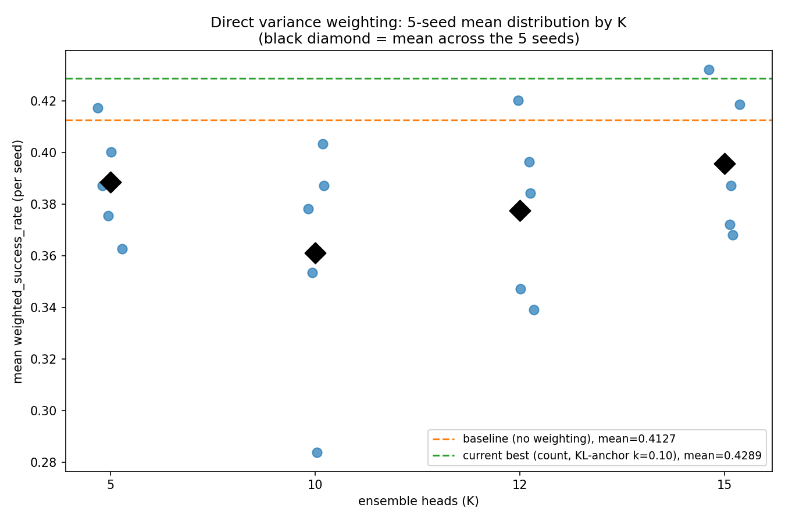<br><em>5-seed mean distribution by ensemble head count -- every black diamond (the mean across seeds) sits below the baseline line.</em>
  </div>

- A **`tau_kl_k x tau_quantile` coarse scan** (12 combinations, 1 seed,
  `results/phase3/analysis/variance_weighting_tau_sweep/`) found
  `tau_kl_k=0.5, tau_quantile=0.3` as the best cell (mean=0.4439) -- but a
  5-seed validation of that SAME combination gave a mean of 0.3818 across all
  5 seeds. The scan's own seed (seed 0) was the only one of the 5 that beat
  either reference; the 4 genuinely new, independent seeds averaged 0.3662,
  all below baseline -- a clear case of seed-selection bias, not a validated
  improvement.

- A separate **disagreement-pipeline run on an actual saved checkpoint** from this
  mechanism (epoch 175, `weighted_success_rate=0.454`,
  `results/phase3/analysis/direct_variance_weighted_kl_anchored/`) found 81
  strict state-level disagreements with `pi_D*` -- more than either
  count-based configuration (51 at `k=0.10`, 62 at `k=0.30`) -- though driven
  by the identical dominant factor (`log_pair_min_samples`, net of coverage
  and prior preference: `-0.41`, comparable in kind to `-0.21` at `k=0.10` and
  `-0.34` at `k=0.30`) in every case. Patch validation still confirms these
  are real, exploitable mistakes (delta +0.195, larger than either count-based
  configuration's), not noise.

  <div align="center">
  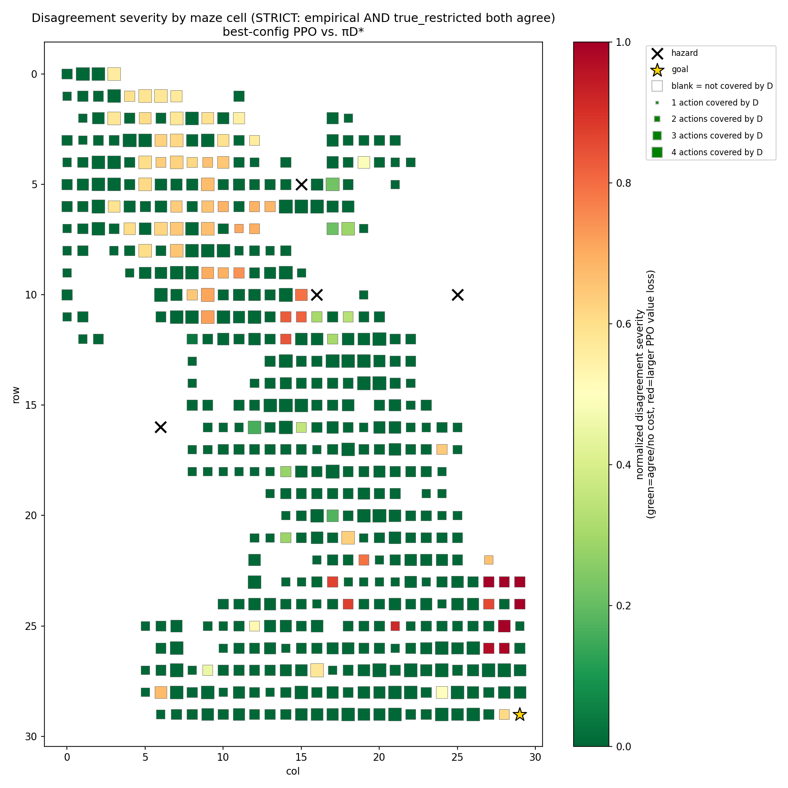
  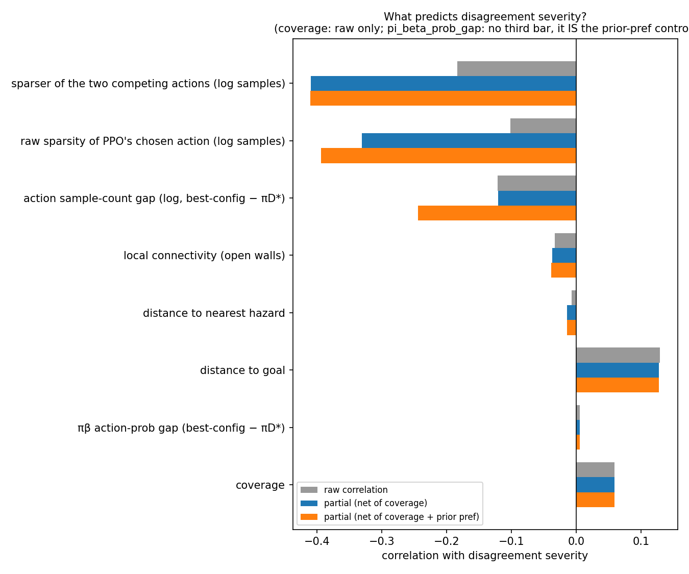<br><em>Left: disagreement severity map for this checkpoint (same layout/legend as every other disagreement map in this project). Right: the same dominant factor as every other configuration checked.</em>
  </div>

  <div align="center">
  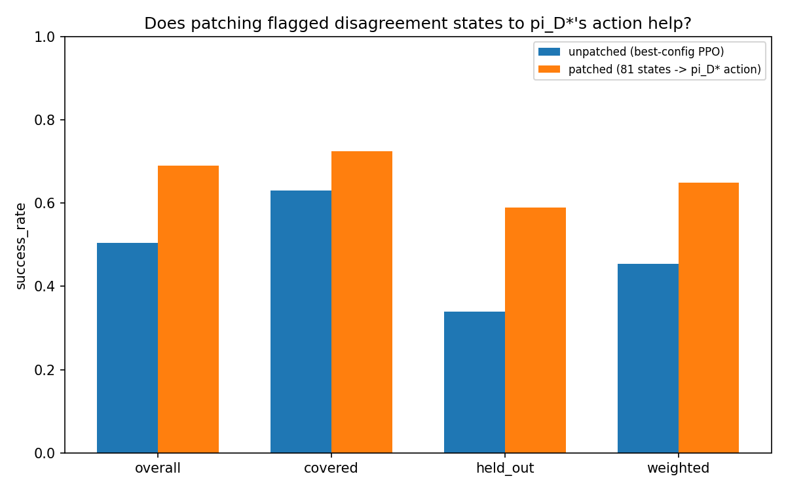<br><em>Patching pi_D*'s action into all 81 disagreement states: +0.195 weighted_success_rate -- these are still real, exploitable mistakes.</em>
  </div>

**Current direction: co-train the ensemble continuously instead of freezing
it.** A concrete hypothesis for WHY the frozen-ensemble version is unstable:
the critic ensemble trains for a short, ISOLATED burst (`ensemble_epochs=30`)
BEFORE the main 300-epoch policy loop even starts, then its variance is
FROZEN for the rest of the run (only `tau`'s KL-anchored decay changes
afterward, never the underlying variance) -- giving independently-initialized
heads far less total gradient exposure to converge past their own random-init
noise than the 300 epochs the main policy itself gets. This is a direct,
literature-grounded parallel to Randomized Ensembled Double Q-Learning (REDQ;
Chen, Wang, Zhou & Ross, 2021, arXiv:2101.05982), whose own critic ensemble is
never pre-trained-then-frozen -- it is updated every single gradient step
alongside the policy, for the entire run.

`ContinuousEnsembleVarianceWeightedTrainer` implements this: a SHORT initial
warm-up (`ensemble_warmup_epochs=10`, down from 30, since its only remaining
job is to give `tau_0` a reasonable starting calibration point, not to fully
train the ensemble) followed by CONTINUOUS co-training of the ensemble
alongside the policy for the entire run, with variance recomputed fresh every
epoch (`variance_recompute_every=1` by default) rather than fixed at a single
early snapshot.

The 5-seed sweep at the same `ensemble_n_heads=15`, `tau_kl_k=0.5`,
`tau_quantile=0.3` settings
(`results/phase3/analysis/continuous_variance_seed_sweep/`) **did not bear
fruit: on the same seeds, continuous co-training did worse than the frozen
ensemble.** The mean across the 5 seeds is 0.3496 (std 0.0415), against 0.3818
(std 0.0390) for the frozen ensemble and 0.4127 for the baseline. No seed beats
the baseline (the frozen version had exactly one: the seed its settings had
been selected on), and 4 of the 5 seeds are worse than their own frozen
counterpart (mean paired change -0.0322). The seed-to-seed spread does not
shrink either, so the hypothesis that continuous co-training would stabilize
the ensemble's signal is not supported.

<div align="center">
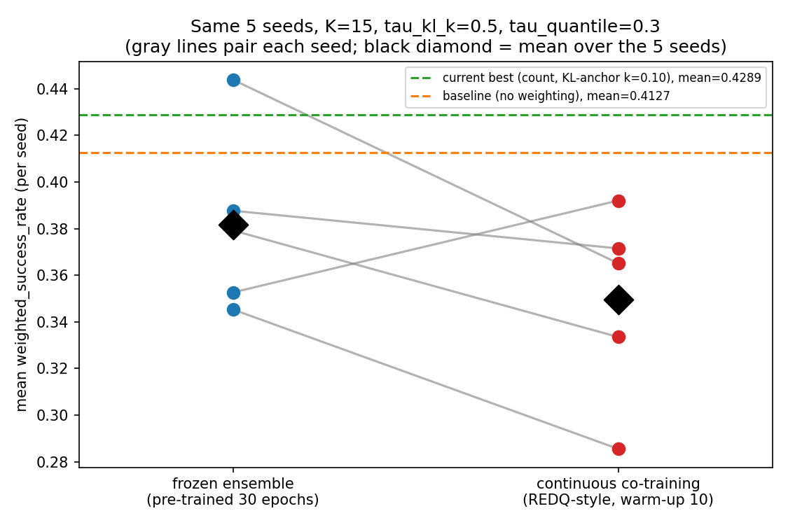<br><em>Same 5 seeds, frozen vs. continuously co-trained ensemble (gray lines pair each seed; black diamond = mean over seeds). Co-training moves 4 of the 5 seeds down and leaves the spread unchanged.</em>
</div>

The shortfall is not in the peak but in holding it: the best checkpoint of
each seed reaches 0.42-0.48 (seed 4 reaches 0.4845, level with the exact-count
mechanism's own peak), yet four of the five runs finish between 0.078 and
0.211 below their own peak (the fifth, 0.029). Final-epoch values are single evaluations and noisy, so this is
indicative only -- the 60-checkpoint means above already show the shortfall.

To check whether the mechanism behaved the way the hypothesis assumed, the
first 8 epochs of co-training (after the 10-epoch warm-up; `K=15`, seed 0) were
instrumented, tracking the rank correlation between ensemble variance and the
true count over the 1,165 distinct `(state, action)` pairs, and the shape of
the resulting weights:

- **The signal does not drift away from coverage.** The Spearman correlation
  between `-variance` and the exact count stays at 0.69-0.71 throughout
  (0.690 after warm-up, 0.710 at epoch 8). The simple explanation -- that as the
  heads converge, their remaining disagreement reflects return noise rather than
  data scarcity -- is not what happens over the horizon measured.
- **The weights concentrate only mildly.** Their effective-sample-size fraction,
  $(\sum w)^2 / (N \sum w^2)$, falls from 0.888 to 0.825 and the mean weight from
  0.755 to 0.668, because the median variance falls (2.65e-4 to 1.61e-4)
  faster than `tau` does (1.35e-4 to 1.17e-4).
- **The variance weights differ in shape from the count weights.** 35-46% of
  transitions sit above weight 0.9 (45.5% after warm-up, 35.4% at epoch 8),
  against 15.5% for the count-based weights (`beta=0.9995`), whose mean weight
  is 0.618.

Only 8 of the 300 co-training epochs were instrumented, and the cause of the
degradation remains unidentified.

Across all the variants of the direct variance weighting -- frozen ensemble with
constant `tau`, frozen with KL-anchored `tau` (4 head counts x 5 seeds), the
`tau_kl_k x tau_quantile` calibration with its 5-seed validation, and continuous
co-training -- no configuration beats the baseline reliably across seeds.

> **Convention note.** Every variance-based mean in this section averages the
> evaluation checkpoints at epochs 5-300 (60 points), while the reference
> values 0.4127 and 0.4289 also include the epoch-0 evaluation of the starting
> policy `pi_beta` (0.3125; 61 points). Putting them on the same footing would
> lower the variance-based means by at most ~0.002 -- always in the direction
> that makes these methods look slightly better than they are, and small next to
> every gap reported here.

### Extension to the continuous action space : Counting locally instead of exactly

The learned proxies above fail for a shared reason: anything built by training a
network by gradient descent inherits that network's capacity, training-duration
and seed dependence. But the underlying observation is that we always have the
`(state, action)` pairs themselves, from the dataset. The exact count is
meaningless in continuous spaces only because it demands that two pairs be
*bit-identical* to count as the same situation; nothing forces that definition.
Instead of learning anything, keep the count and change what "the same
situation" means: count the dataset points that are *near*, using a SEPARATE
kernel for the state part and the action part of the distance:

$$
n_{\text{local}}(s, a) = \sum_{(s', a') \in D} K_s\big(d(s, s')\big) \times K_a\big(d(a, a')\big),
\qquad K_s(r) = e^{-r^2 / 2h_s^2}, \quad K_a(r) = e^{-r^2 / 2h_a^2}
$$

$d$ is Euclidean distance after standardizing state and action separately, and
$h_s$, $h_a$ are each in standard deviations of their own feature. This is a
strict generalization of the exact count: as $h_s \to 0$ AND $h_a \to 0$, only
bit-identical pairs contribute and $n_{\text{local}}$ *is* the exact count. The
two bandwidths are independent, so either one alone can be driven to ~0 while
the other stays positive -- an EXACT match on one side (e.g. a discrete action,
as in this project's own maze) with a SMOOTHED match on the other (a continuous
state) is expected to reduce to the exact-count mechanism on that side, not an
approximation of it. Three plots below confirm this on synthetic data before
using it on any real environment:

<div align="center">
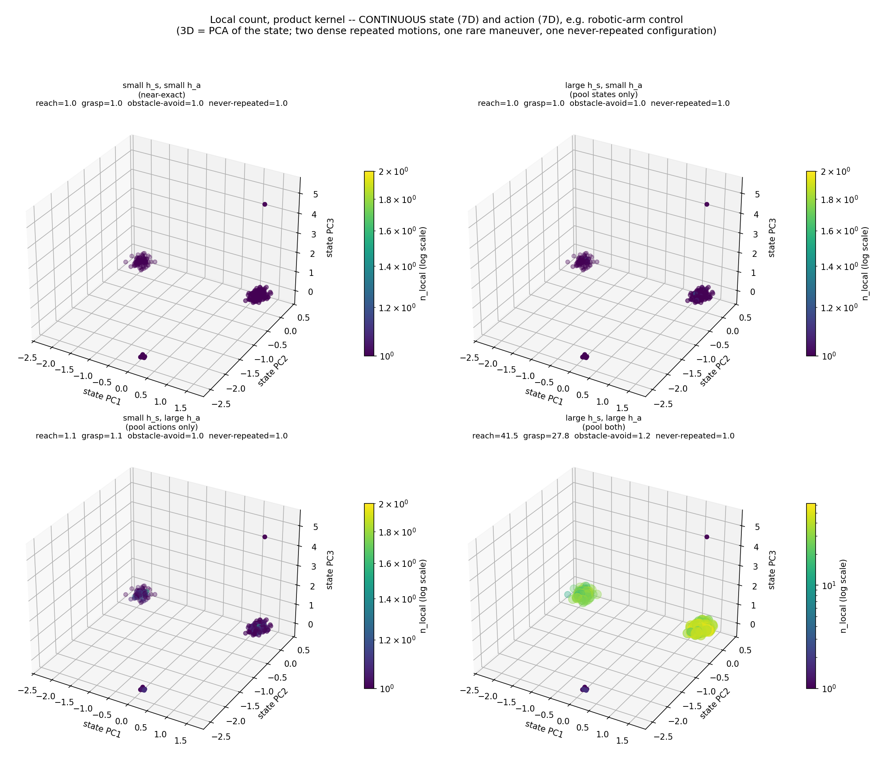<br><em>Continuous 7-D state and 7-D action (e.g. robotic-arm joint angles and torques). Two repeated motions (dense), one rare maneuver, one never-repeated configuration. Only when BOTH bandwidths are large does the count rise (bottom-right); either one alone leaves every count near 1.</em>
</div>

<div align="center">
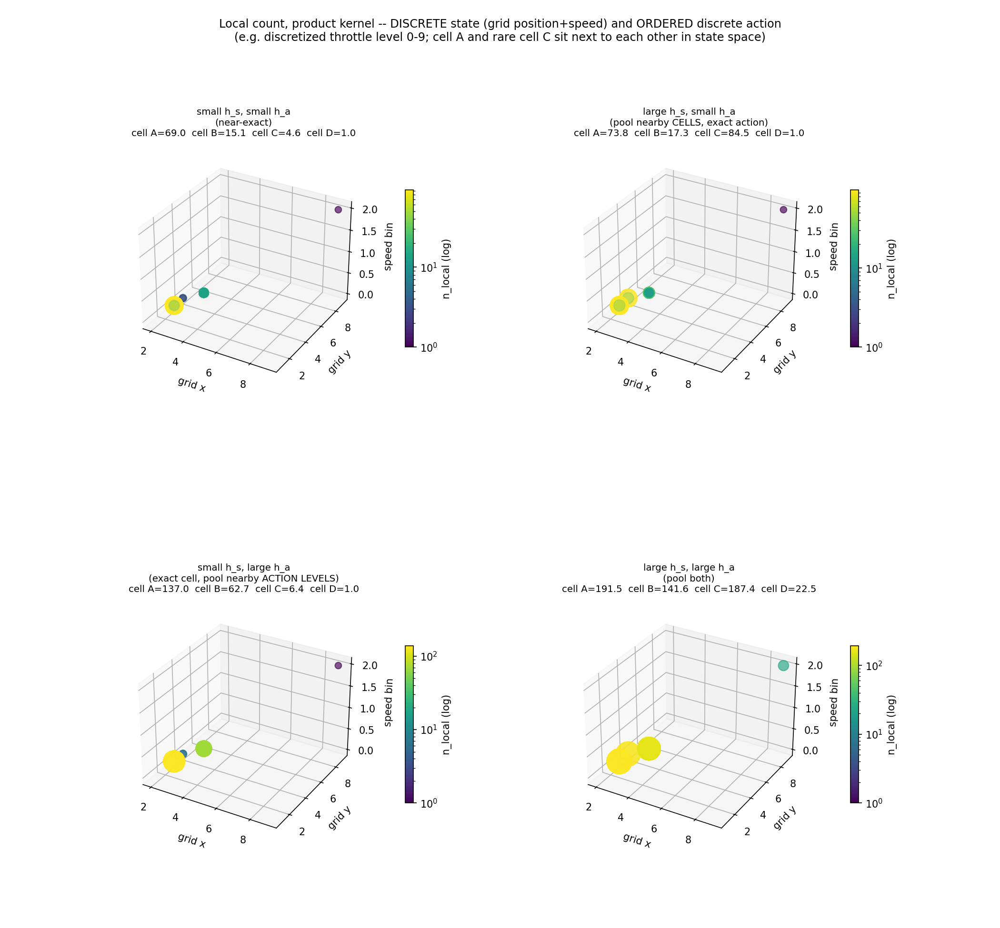<br><em>Discrete grid state and an ORDERED discrete action (a discretized throttle level). Cell C is rare but sits next to dense cell A: a large h_s alone inflates its count from 4.6 to 84.5 -- borrowing A's density, the "crossing a wall" risk this project flagged for its own maze.</em>
</div>

Being non-parametric, this is deterministic given the dataset -- no network, no
seed, no training duration, none of the instabilities documented above. Its two
hyperparameters each have a direct meaning: the scale, in standardized features,
at which two states (or two actions) count as the same. And because it reduces
exactly to the validated mechanism on either side, it can be tested on this
project's discrete testbeds, where the true count is known.

The new version changes only the
number handed to the effective-sample-weighting mechanism: `w(n)/n`,
`beta=0.9995` and the KL-anchored decay (`k=0.10`) are inherited unchanged. 
Any difference from the exact-count result is attributable to the local count
alone. 


### Testing the new weighting method on a complete run

Now that we have a representative of our new method that works for both discrete and 
continuous spaces, we can test it on a complete run. The goal is to see if we can obtain 
an improvement in a real training scenario.

The first thing I want to test concerns the number of training epochs per batch. In each of our runs
until now, we used a 300 epoch window, which was useful to study the mecanism. But in a real training situation,
we usually only do 3 to 10 epochs of gradient descent. So the first test I am doing is to see
if by increasing the learning rate I can have the same improvement on a short window (limit of 20 epochs). We can see it
as trying to displace the beneficial window a few epochs earlier.

#### Learning-rate sweep: it works, but only briefly

Local count at near-exact bandwidths (reduces to the exact-count mechanism, `k=0.10`), one seed,
`lr` in {0.0003 (current default), 0.0006, 0.001, 0.002, 0.004}, otherwise this project's practical
configuration.

<div align="center">

| lr | mean (300 ep) | best | best epoch | weighted @ epoch 25 |
|---|---|---|---|---|
| 0.0003 (control) | 0.4289 | 0.4845 | 140 | 0.340 |
| 0.0006 | 0.3951 | 0.4510 | 130 | 0.348 |
| **0.001** | 0.2556 | 0.4490 | **30** | **0.428** |
| 0.002 | 0.1655 | 0.3855 | 15 | 0.257 |
| 0.004 | 0.1183 | 0.3125 | 0 | 0.163 |

</div>

<div align="center">
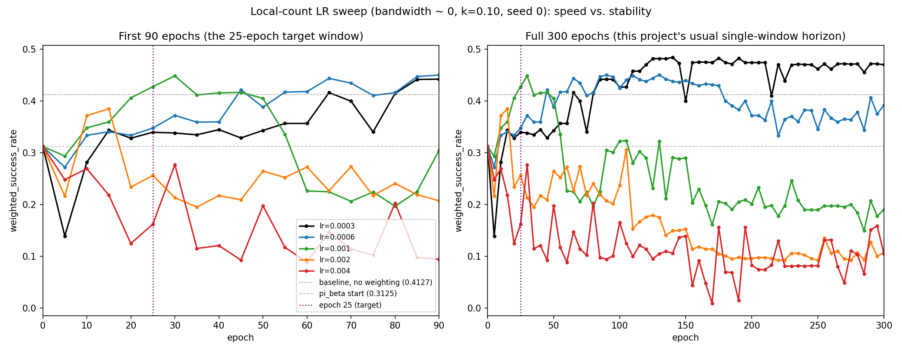<br><em>Left: first 90 epochs. lr=0.001 is the only one above baseline by epoch 25. Right: full 300 epochs -- it does not hold.</em>
</div>

`lr=0.001` is the only rate that beats the baseline by epoch 25, and its own peak
(0.449) arrives at epoch 30 -- the window really does displace earlier, exactly as
hoped. But it does not stay there: `weighted_success_rate` then drops to a noisy
plateau around 0.20-0.30 for the remaining ~270 epochs, below both the baseline and,
for long stretches, `pi_beta`'s own starting performance (0.3125). `lr=0.002` and
`lr=0.004` never reach a useful level at all. `lr=0.0006` is the steadiest of the
four faster rates -- it never collapses -- but does not clear 0.42 by epoch 25 either.

#### Confirmatory test: does the method help in realistic training from scratch?

The sweep above is exploratory: one seed, fixed-D protocol (a frozen window started from a prior).
To know whether the method helps in an actual training loop, we ran the loop itself. A first
exploratory run with 5 seeds suggested a benefit, so we then ran a separate **confirmatory** experiment
whose protocol was fixed before looking at its results (`scripts/run_confirmatory_ablation.py`,
`configs/phase3/confirmatory_ablation.yaml`).

**The training loop.** Random initialization, no prior checkpoint. At each window: collect 100 fresh
episodes with the current policy, run 30 epochs of PPO on them, carry the weights to the next window.
200 windows, evaluated every 5 windows on 500 episodes (deterministic policy, fixed evaluation seed
424242). The metric is a plain `success_rate`: the covered / held-out split of Phase 2 has no meaning
here, because there is no frozen and deliberately skewed `D` to test generalization against. For the
weighted arm, the local count (near-exact bandwidths) is recomputed from each window's own data, so
that `pi_prior` is exactly the `pi_old` of that window.

**What was fixed in advance.**
- `lr = 0.001`, chosen from the exploratory runs and not re-swept here.
- A 2x2 ablation: hyperparameters {PPO defaults, our tuned values} x method {none, `kl_anchored` with
  `beta = 0.9995`, `k = 0.10`}. Defaults are the usual PPO ones (`clip_eps=0.2`, `gae_lambda=0.95`,
  `value_coef=0.5`, `max_grad_norm=0.5`); ours are the values selected in Phase 2
  (`0.55`, `0.90`, `1.0`, `0.1`).
- 50 seeds per cell, i.e. 200 runs (545 minutes on 5 CPUs). Paired by seed: the same seed gives the
  same initialization to the four cells.
- Metrics: `best` (best evaluation of the run) and `late_mean` (mean over the last 25% of the
  evaluation points, i.e. the plateau; the mean over the whole trajectory is not used because it blends in
  the random-initialization warm-up every run starts from).
- Tests: Wilcoxon signed-rank on the paired differences, bootstrap 95% CI of their mean, win rate, and the
  interquartile mean (IQM, the mean of the values between the 25th and 75th percentiles), which is
  less sensitive than the plain mean to the occasional seed that fails to take off.

**Results** (50 seeds per cell).

<div align="center">

| hyperparameters | method | `best` mean (IQM) | `late_mean` mean (IQM) |
|---|---|---|---|
| default | none | 0.8715 (0.9193) | 0.8244 (0.8745) |
| default | `kl_anchored` | 0.8930 (0.9197) | 0.8395 (0.8709) |
| tuned | none | 0.7423 (0.8283) | 0.5302 (0.5659) |
| tuned | `kl_anchored` | 0.7457 (0.8266) | 0.5301 (0.5678) |

</div>

<div align="center">

| paired comparison | metric | mean difference | 95% CI | wins | Wilcoxon p |
|---|---|---|---|---|---|
| method effect, default HP | `best` | +0.022 | [-0.030, +0.072] | 25/50 | 0.51 |
| method effect, tuned HP | `best` | +0.003 | [-0.054, +0.061] | 26/50 | 0.93 |
| method effect, default HP | `late_mean` | +0.015 | [-0.034, +0.063] | 27/50 | 0.66 |
| method effect, tuned HP | `late_mean` | -0.000 | [-0.046, +0.044] | 24/50 | 0.75 |
| tuned vs default, no method | `best` | -0.129 | [-0.200, -0.059] | 9/50 | 0.0003 |
| tuned vs default, with method | `best` | -0.147 | [-0.212, -0.087] | 4/50 | < 0.0001 |
| tuned vs default, no method | `late_mean` | -0.294 | [-0.353, -0.235] | 3/50 | < 0.0001 |
| tuned vs default, with method | `late_mean` | -0.309 | [-0.360, -0.259] | 1/50 | < 0.0001 |

</div>

<div align="center">
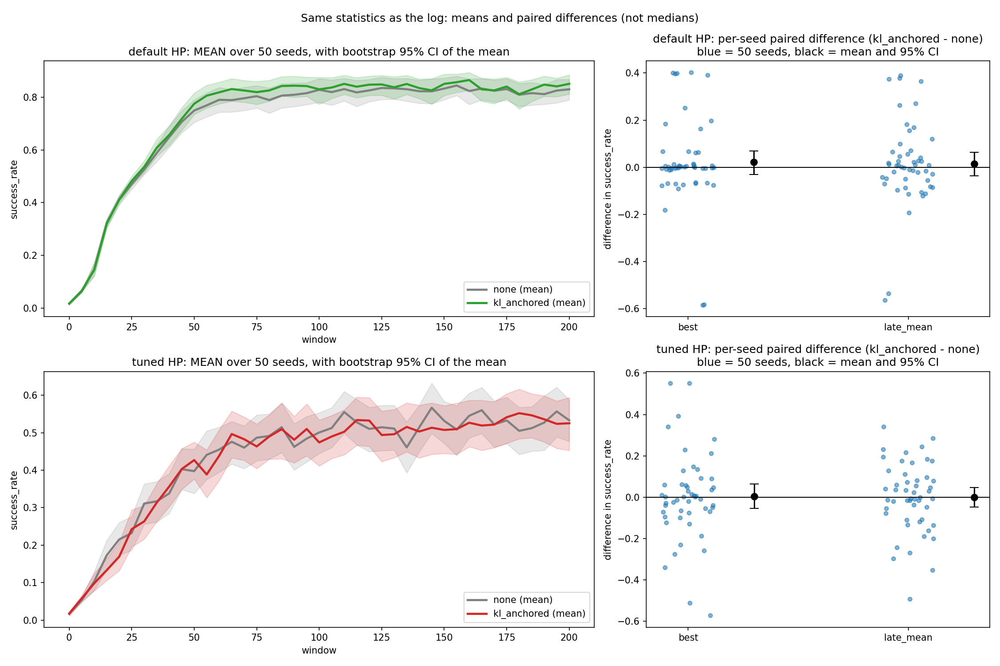<br><em>Left: mean success rate over the 50 seeds (shaded: bootstrap 95% CI of the mean). Right: per-seed paired difference (method minus no method); black: mean and 95% CI.</em>
</div>

**The method: a slight edge in the plain mean, not distinguishable from zero.** At default
hyperparameters the plain mean is slightly in favour of the method (+0.022 on `best`, +0.015 on
`late_mean`), but every confidence interval contains zero, the win rate is about 50%, and the sign of the
difference changes with the statistic used (mean, IQM or median). With 50 seeds, the smallest effect
we could detect with 80% power is about 0.07 (the standard deviation of the paired differences is
0.17 to 0.21). So an effect of several points of success rate in either direction cannot be excluded,
and we do not claim an improvement. What these runs do exclude is an effect of the size suggested by the
5-seed exploratory run.

**Why the 5-seed run was misleading.** Its five seeds are seeds 0 to 4, and they are reproduced bit for
bit in this run. On them, the method beats the baseline on all 5 seeds with a mean `late_mean`
difference of +0.120 (tuned HP). On the 45 other seeds the mean difference is -0.014 (19 wins out
of 45). A draw of 5 seeds this favourable happens in about 1% of random draws. We had also underestimated
the variance: the standard deviation of the paired difference is 0.17 over 50 seeds, against 0.06 to 0.11 in
the pilot.

**Hyperparameter tuning from the fixed-D regime does not transfer.** The PPO defaults beat our tuned values
by 0.13 to 0.15 on `best` and by 0.29 to 0.31 on `late_mean` (p < 0.001, and the tuned values win on
at most 9 seeds out of 50 in any comparison). The tuned values were selected for the fixed-D protocol,
a single frozen window of 300 epochs started from a prior. They are a poor choice in a real training loop
with fresh data, whether the method is used or not. A plausible reason (not tested) is that a loose clip
range combined with many epochs lets the policy move too far within a window. Note also that `lr = 0.001`
was itself selected under the tuned values, which, if anything, favours the tuned profile in this comparison.

**Limits of this result.**
- At default hyperparameters the baseline reaches about 0.9 at the median after roughly 60 windows, so the
  test is less sensitive there.
- `best` is an optimistic number: the best of 41 evaluations is selected and reported on the same 500
  evaluation episodes. Evaluation noise alone can add up to about 0.03 to 0.05 (an upper bound, since the
  fixed evaluation seed correlates the noise across evaluations), and `best` also rewards
  window-to-window volatility. `late_mean` is the less biased criterion. No checkpoint was saved, so the
  best checkpoint could not be re-evaluated on fresh episodes.
- The fixed evaluation seed means all runs are scored on the same 500 episodes (same start states, same
  slip noise). This is a variance reduction for comparisons, but the sampling error of that one draw
  (about 0.02) is shared by all runs and is not averaged out by the seeds.
- One maze, one set of 12 start states, used for both training and evaluation: this measures how well a
  given maze is learned, not generalization.
- All the fixed-D experiments of Phases 2 and 3 use the same dataset `D` and the same prior checkpoint, so
  their seeds replicate the training but not the choice of `D` and prior.

**What this leads to.** The mechanism was developed, and showed its gain, in a very specific regime:
a frozen dataset reused for 300 epochs while the policy drifts away from the one that collected it.
The loop tested above is the opposite situation: 100 fresh episodes and only 30 epochs per window. One
reading (a hypothesis, not tested) is that with fresh on-policy data the empirical distribution is already
the right one for the gradient, so there is no imbalance for the weighting to correct (see
`THEORICAL_ANALYSIS.md`, Section 4.1: `q_beta` is a deliberate departure from `p_D`, not a better
estimate of it). We therefore tested whether, at least in the regime we studied, the method brings a real
improvement: from-scratch training with a heavy reuse of each window's data (300 epochs per window), with the
protocol and the decision rule written down before running it. The result is in the next subsection: it is
a null.

#### Heavy-reuse regime: a null result

**Protocol** (`scripts/run_reuse_regime_test.py`, `configs/phase3/reuse_regime_test.yaml`; the settings are
frozen in `frozen_config.json`, and the script refuses to start if they differ). Same loop as above, with
a single change: **300 epochs per window instead of 30**, so that each batch of 100 fresh episodes is
reused heavily, as in the regime where the mechanism was developed. 60 windows, evaluated every 2 windows
(31 evaluation points) on 500 episodes (deterministic policy, evaluation seed 424242); PPO default
hyperparameters, `lr = 0.001`; two arms, `none` and `kl_anchored` (`beta = 0.9995`, `k = 0.10`, local count
at near-exact bandwidths recomputed from each window's data); 100 seeds per arm, paired by seed (200 runs).
A baseline-only feasibility rule (median `late_mean` >= 0.30) was written down first so that a baseline
that cannot learn in this budget would not be mistaken for a null; the baseline clears it (median 0.46), so
`num_windows` stayed at 60.

**Decision rule, fixed before the main run.** On the paired difference of `late_mean` (`kl_anchored` minus
`none`, 95% bootstrap CI of the mean, Wilcoxon signed-rank): POSITIVE if the CI lies above 0 and p < 0.05;
NEGATIVE if the CI lies below 0; NULL if the CI lies inside the equivalence margin of +-0.05; INCONCLUSIVE
otherwise, in which case no seeds are added after looking. `best` and `best_reeval` (the best checkpoint
re-evaluated on 2000 fresh episodes with a different seed) are secondary and carry no decision.

**Result: NULL.**

<div align="center">

| metric | `none` | `kl_anchored` | mean difference | 95% CI | wins | Wilcoxon p |
|---|---|---|---|---|---|---|
| **`late_mean` (primary)** | 0.4476 | 0.4474 | -0.0001 | [-0.025, +0.025] | 50/100 | 0.87 |
| `best` | 0.5101 | 0.5038 | -0.006 | [-0.039, +0.025] | 46/100 | 0.63 |
| `best_reeval` | 0.4943 | 0.4863 | -0.008 | [-0.039, +0.024] | 46/100 | 0.43 |
| mean over the whole trajectory | 0.3593 | 0.3599 | +0.001 | [-0.017, +0.018] | 49/100 | 0.81 |

</div>

<div align="center">
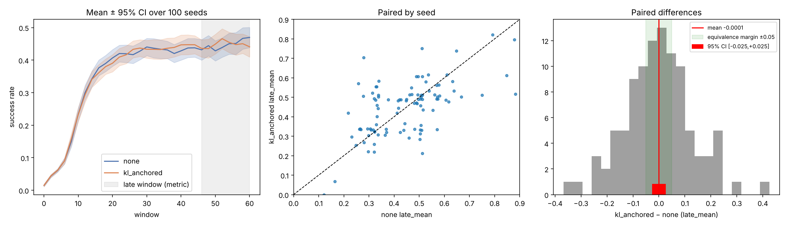<br><em>Left: mean success rate over the 100 seeds (shaded: bootstrap 95% CI of the mean); the grey band is the late window used by the primary metric. Middle: each seed's `late_mean` for the two arms (dashed: equality). Right: histogram of the paired differences, with the +-0.05 equivalence margin (green) and the 95% CI of the mean (red).</em>
</div>

The two mean curves overlap over the whole training. The 95% CI on the primary metric lies inside the
equivalence margin, and is in fact about half as wide as the margin: the standard deviation of the paired
difference is 0.13, so with 100 seeds an effect larger than about 0.025 in either direction is excluded on
this maze, this loop and these hyperparameters. The IQM (0.440 against 0.451), the median (0.460 against
0.484), the number of seeds that fail to take off (0 against 1) and the number that reach 0.5 or more (39
against 38) tell the same story. The late-window `approx_kl` and `clip_frac` are also nearly identical (about
0.10 and 0.27 in both arms), which is what we would expect if the weighting barely changes the update, but this
is an observation, not a diagnosis (see the next steps).

One statistic deserves a caveat rather than a conclusion: the *last* evaluation point alone is lower with the
method (-0.029, CI [-0.060, +0.003], Wilcoxon p = 0.027). It is not the pre-registered metric, it is one of five
statistics computed, it rests on a single noisy evaluation, and its CI contains zero. We do not read it as
harm, and the pre-registered rule is the one that decides.

Taken together with the 30-epoch ablation above, the method now shows **no detectable effect in either
from-scratch regime** (30 and 300 epochs per window of fresh data). This is a statement about those regimes,
this maze and these hyperparameters. It does not say the mechanism does nothing in the frozen-dataset
protocol where it was developed, and it does not explain why it did nothing here: the reading "fresh on-policy
data already has the right empirical distribution" remains an untested hypothesis.

**Limits.** Same maze and same start states for training and evaluation (in-distribution); one fixed
evaluation seed shared by all runs; `lr` and `beta`/`k` were not re-tuned for this regime (re-tuning on the same
evaluation would reintroduce the selection problem described above); the arms share the same seed, hence the
same initialization, which is why their per-seed results correlate (Pearson 0.58) and why the paired analysis is
the right one.

#### Next steps

The aim now is to understand why the method fails here, and what actually justified the improvement we saw
earlier, before developing it further.

**1. Why does the method do nothing in this loop?** Three cheap diagnostics, in this order.
- *Are the weights even different from uniform?* Log, per window, how far the effective weights `w(n)/n` are
  from the empirical ones (share of samples whose weight changes by more than a given factor, effective
  sample size ratio). If they are nearly uniform, the null is a mechanical consequence (the method is close to
  a no-op on fresh data, consistent with the identical `approx_kl` and `clip_frac`). If they are far from
  uniform and the result is still null, the weighting acts but does not help, which is a different
  explanation.
- *Is there an exploitation gap to close in this loop?* For each window, solve `pi_D*` of that window's data
  exactly (value iteration is exact in the discrete maze) and compare it with the policy after the window's
  update, i.e. apply the decomposition of the top of this README window by window. If the in-loop gap is
  already small, no training-side method can reduce it. If it is large and unchanged by the method, the
  weighting is not the right lever for that gap.
- *Does the data's staleness matter?* The hypothesis is that the weighting helps when the empirical
  distribution of `D` differs from the distribution of the current policy. This can be tested directly by
  varying that quantity: reuse the data of the last `K` windows (a replay of increasingly stale data) and
  see whether any `K` produces an effect.

**2. What justified the earlier improvement?** The evidence for it came from the fixed-`D` protocol: one
dataset, one prior, a single seed per configuration in the sweeps cited, and differences of the order of 0.01 to 0.02 (for example
mean 0.4289 against 0.4127 and best 0.4845 against 0.4720 for `k = 0.10` against the baseline), to be compared
with a standard deviation of 0.13 for the paired difference between seeds in the loops above and a
standard deviation of 0.05 to 0.07 along a single run's trajectory. `beta` and `k` were also selected on the same `D` and the same
evaluation seed. Three explanations, with different consequences, have to be separated:
- *Noise and selection.* Replicate the fixed-`D` protocol with many seeds, several independently drawn
  (`D`, prior) pairs, a fresh evaluation seed and a rule written down in advance. If the gain disappears, it
  was not real.
- *A real effect, specific to the frozen-`D` regime.* The finding is then narrow, and the contribution is to
  characterize when it appears (see the staleness test above).
- *A real effect that does not come from the counts.* Reweighting by `w(n)/n` also changes the scale of the
  loss, which interacts with the learning rate (the learning-rate sweep showed the useful window moving with
  `lr`). A control arm that keeps the same weight values but shuffles them across samples would show whether
  the information carried by the counts matters, or only the rescaling.

**3. Possible redirection of the question and of the method.**
- *The question.* Moving from the fixed-`D` protocol to from-scratch training quietly changed the question from
  "how much of the policy supported by `D` does PPO extract?" (the exploitation gap, measured against `pi_D*`)
  to "does a PPO variant reach a higher success rate?". The second question has no frozen `D` and no `pi_D*`,
  and it is the one the null answers. A more faithful reformulation is: in which regimes (data freshness, reuse,
  coverage) is there an exploitation gap in a realistic PPO loop, and is it addressable? The method then
  becomes one probe among others, and a characterization of those regimes, positive or negative, becomes the
  result.
- *The method of research.* From here on, a claim requires: a rule written before the run, many seeds,
  several independent draws of the environment instance (a second maze layout; the continuous environment
  is still to be chosen), a fresh evaluation seed, and `late_mean` or `best_reeval` rather than the best
  evaluation. Success rate and gap closure against `pi_D*` should both be reported where `pi_D*` exists.
- *To decide with the supervisor.* Whether to keep developing the method (conditional on the replication in
  point 2 and on the staleness test in point 1), or to switch to the characterization track above, which the
  existing negative results already support.


## Project structure


```
configs/                        # every experimental knob lives here, not in code
  phase1/                        # stochastic maze study (see docs/PHASE1_STOCHASTIC_MAZE.md)
    env_maze.yaml                  # maze layout, stochasticity, reward
    prior_training.yaml            # online PPO config for the checkpoint that generates D
    ppo_fixed_d_standard.yaml      # baseline fixed-D PPO hyperparameters
    ppo_fixed_d_modified.yaml      # example H4 ablation (edit/copy for other hypotheses)
    reference.yaml                 # pi_D* solver settings (gamma, unseen_penalty, VI tolerance)
    ...                            # (the rest of phase 1's sweep configs)
  phase2/                        # controlled-redundancy / variable-start study (see docs/PHASE2_CONTROLLED_MAZE.md)

src/ppo_exploitation/
  envs/stochastic_maze.py        # the custom discrete stochastic maze
  ppo/
    networks.py                  # actor-critic MLP
    buffer.py                    # Trajectory container + GAE
    online_agent.py              # standard online PPO (trains the prior only)
    fixed_d_trainer.py           # THE research instrument: one rigorous PPO
                                  # trust-region window on D, pi_old = pi_beta
  data/collect.py                # roll out the frozen prior to build D; save/load
  reference/experience_optimal.py# exact value iteration -> both pi_D* definitions
  eval/evaluate.py                # unified live-rollout scoring + gap-report table
  utils/config.py                 # YAML <-> dataclass config layer
  utils/seeding.py                # reproducibility

scripts/
  01_train_prior.py               # train the online PPO checkpoint to target success rate
  02_collect_dataset.py           # collect D from the frozen checkpoint
  03_compute_pi_d_star.py         # solve both pi_D* definitions exactly
  04_train_fixed_d_ppo.py         # standard OR modified PPO on D (same code, different YAML)
  05_evaluate_all.py              # evaluate everything, print/save the gap report
  run_pipeline.sh                 # runs 01-05 end to end

tests/
  test_env.py                     # Tier-1: maze connectivity, transition-kernel correctness
  test_reference.py               # Tier-1: value iteration vs. hand-derived closed forms
  test_fixed_d_trainer.py         # Tier-1: trainer smoke test (runs, stays finite, pi_old == pi_beta)
  tier0/
    frozen_lake_env.py             # gymnasium FrozenLake-v1 adapter (validation-only, not a src/ module)
    test_tier0_pipeline.py         # Tier-0: full pipeline exercised on FrozenLake instead of the maze

.github/workflows/
  tests.yml                       # runs `pytest tests/` (Tier-0 + Tier-1) on push and pull_request
```

## Setup

```bash
python -m venv .venv && source .venv/bin/activate
pip install -r requirements.txt
pip install -e .          # makes `ppo_exploitation` importable everywhere
```

## Running the tests

```bash
pytest tests/ -v
```

See "Two kinds of tests, kept deliberately separate" above.
`tests/test_reference.py` is the one worth reading closely if you want to
trust the ceiling numbers: it hand-derives the closed-form fixed point of a
tiny stochastic self-loop MDP (`V(0) = 0.45/0.55` for a specific
reward/gamma setup) and checks the value-iteration solver matches it to
`1e-4`. `tests/tier0/` is the one worth running first if you want to trust
the *pipeline as a whole* before spending time reading through the maze-
specific code — it validates the same D → π_D* → fixed-D-PPO → evaluate
chain against an environment neither of us built.

## Running the full pipeline

```bash
bash scripts/run_pipeline.sh
```

or step by step:

```bash
# 1. Train the online PPO prior to ~35% success rate (live environment)
python scripts/01_train_prior.py \
    --env-config configs/phase1/env_maze.yaml \
    --prior-config configs/phase1/prior_training.yaml \
    --out results/phase1/prior_checkpoint.pt

# 2. Freeze that checkpoint, collect the fixed dataset D from it
python scripts/02_collect_dataset.py \
    --env-config configs/phase1/env_maze.yaml \
    --checkpoint results/phase1/prior_checkpoint.pt \
    --n-episodes 4000 --seed 1 \
    --out results/phase1/dataset_D.pkl

# 3. Solve pi_D* exactly (both empirical and true-restricted definitions)
python scripts/03_compute_pi_d_star.py \
    --env-config configs/phase1/env_maze.yaml \
    --reference-config configs/phase1/reference.yaml \
    --dataset results/phase1/dataset_D.pkl \
    --out-empirical results/phase1/pi_d_star_empirical.pkl \
    --out-true-restricted results/phase1/pi_d_star_true_restricted.pkl

# 4. Train standard PPO and modified PPO on the SAME D and the SAME prior
#    checkpoint (pi_old = pi_beta = this checkpoint throughout -- see
#    "What fixed-D training means for PPO, operationally")
python scripts/04_train_fixed_d_ppo.py \
    --dataset results/phase1/dataset_D.pkl \
    --ppo-config configs/phase1/ppo_fixed_d_standard.yaml \
    --prior-checkpoint results/phase1/prior_checkpoint.pt \
    --out results/phase1/ppo_standard_on_D.pt \
    --history-out results/phase1/ppo_standard_on_D_history.csv

python scripts/04_train_fixed_d_ppo.py \
    --dataset results/phase1/dataset_D.pkl \
    --ppo-config configs/phase1/ppo_fixed_d_modified.yaml \
    --prior-checkpoint results/phase1/prior_checkpoint.pt \
    --out results/phase1/ppo_modified_on_D.pt \
    --history-out results/phase1/ppo_modified_on_D_history.csv

# 5. Evaluate everything under the identical live-rollout protocol
python scripts/05_evaluate_all.py \
    --env-config configs/phase1/env_maze.yaml \
    --prior-checkpoint results/phase1/prior_checkpoint.pt \
    --pi-d-star-empirical results/phase1/pi_d_star_empirical.pkl \
    --pi-d-star-true-restricted results/phase1/pi_d_star_true_restricted.pkl \
    --ppo-checkpoints standard=results/phase1/ppo_standard_on_D.pt modified=results/phase1/ppo_modified_on_D.pt \
    --n-episodes 500 --eval-seed 999 \
    --out results/phase1/gap_report.csv
```

`scripts/05_evaluate_all.py` accepts any number of `name=path` pairs after
`--ppo-checkpoints`, so once you've trained additional ablation configs
(H1–H7 or otherwise) from step 4, add them all to a single step-5 call to
compare every variant against the same `π_D*` reference in one table.

### Testing a new hypothesis

1. Copy `configs/phase1/ppo_fixed_d_modified.yaml` to a new file
   (e.g. `configs/phase1/ppo_fixed_d_h3_wide_clip.yaml`).
2. Revert the field(s) already changed back to the standard value, then
   change exactly one field to test your hypothesis (e.g. `clip_eps: 0.2 →
   0.4` for H3).
3. Re-run step 4 against the *same* `results/phase1/dataset_D.pkl` and the *same*
   `results/phase1/prior_checkpoint.pt` with the new config, then add it to step
   5's `--ppo-checkpoints` list.

Never regenerate `D` or the prior checkpoint between comparison runs — the
whole point of the design is that every variant sees byte-identical
experience and starts from a byte-identical `π_old`.

## What this codebase does *not* try to answer

- **Cross-algorithm comparison.** This is not "is PPO better than SAC/DQN
  at exploitation" — see the motivating paper for that broader comparison
  across algorithms and many environments. This project fixes PPO and
  varies only its own internals.
- **A principled offline-RL solution.** The fixed-D trainer here is one
  rigorous PPO trust-region window applied to static data — not a
  Conservative Q-Learning / decision-transformer-style offline method.
  Answering "how good could a *properly designed* offline method do on
  this same `D`" would be a natural and interesting extension of this
  codebase, but a different one.
- **Wall-clock/sample-efficiency claims.** All comparisons here are about
  final exploitation quality given a fixed `D`, not about how many epochs
  or how much compute each variant needed to get there (though
  `results/*_history.csv` records `approx_kl`, `clip_frac`, and both
  losses per epoch, enough to investigate that separately if useful).

## Relationship to the motivating paper

Berseth (2025) defines the experience-optimal policy as (for deterministic
environments) the single highest-return trajectory ever replayed from a
buffer, with two "softer" estimators for stochastic settings — the best 5%
and the most-recent-best-5% of collected trajectories by return — used
because a *sampled* trajectory can't be replayed deterministically to
reproduce its score in a stochastic environment. This project takes a
different, model-based approach precisely because the environment was
purpose-built to allow it: rather than estimating `π_D*` from top-quantile
trajectory returns, we solve for it exactly via tabular value iteration on
the (MLE or true-restricted) MDP implied by `D`. This is only possible
because the ground-truth state space here is small and fully enumerable —
it would not be a tractable substitute for the paper's estimator in the
large/continuous-state Atari- and MuJoCo-scale environments the paper
studies. The two approaches are answering the same underlying question
(how much of `D`'s latent value does the learned policy actually recover)
with different tools suited to different environment scales.

## Further analyses (not run by default)

These are real, separate questions this codebase could be extended to
answer, deliberately kept out of the primary standard-vs-modified
comparison so they don't get silently blended into one number. None of
this is implemented yet.

- **The multi-window (periodic-refresh) scheme.** Reusing `D` across many
  outer iterations, refreshing `π_old ← θ` periodically, does let PPO
  extract more from `D` cumulatively than a single window can — the
  question is whether that additional extraction is real (information
  `D` actually supports) or an artifact of the ratio's denominator drifting
  away from `π_β` (see docs/PHASE1_STOCHASTIC_MAZE.md, "What 'fixed-D
training' means for PPO, operationally"). Before trusting any result from that
  scheme, two passive diagnostics are cheap to add and would settle it:
  `KL(π_β ‖ π_θ)` on `D`'s own states, and the effective sample size of the
  importance ratio `π_θ/π_β` over `D` — both computable from quantities the
  codebase already has (`Trajectory.log_probs` is `π_β`'s real
  log-probability and is currently unused past the single-window trainer).
  Flat curves would mean the drift stayed small and the scheme's numbers
  can be trusted; growing curves would mean the extra extraction is
  confounded with drift and shouldn't be reported as a clean exploitation-
  gap number without correction.
- **An importance-weighted correction (H8).** A version of the multi-window
  scheme where the ratio is anchored to `π_β` instead of a periodically
  refreshed `π_old` — a real off-policy correction rather than PPO's native
  (single-window-only) trust region. Comparing its `J(π)` against the
  single-window result would give the actual size of the effect, not just
  its presence.
- **A properly designed offline-RL baseline** — a different
  question from "what does PPO's own update rule extract," but a natural
  point of comparison once that number is established.
- **Preserving the best intermediate policy during a training window.**
  The epoch-count analysis (see docs/PHASE1_STOCHASTIC_MAZE.md, "Results
  analysis") shows fixed-D
  optimization can be non-monotonic within a single window — a better
  policy can appear at an intermediate epoch and later be lost to
  continued training, not just plateau. A fixed epoch count chosen in
  advance has no mechanism to recover that best intermediate point. Worth
  exploring: tracking the best-observed checkpoint against a held-out
  signal during training itself (analogous to early stopping) — carefully,
  since using held-out performance to pick a checkpoint mid-training is
  itself a form of selection that would need the same scrutiny already
  applied elsewhere in this project (see the prior-checkpoint confirmation
  mechanism in `scripts/01_train_prior.py`).
- **Scheduling `clip_eps` over training**, analogous to learning-rate
  schedules, rather than treating it as a single fixed value for an
  entire window. The clip_eps sweep (see docs/PHASE1_STOCHASTIC_MAZE.md,
  "Results analysis") shows the
  ceiling is sensitive to this value and that looser settings trade a
  higher ceiling for more instability — a schedule (e.g. loosening early,
  tightening late) might capture the reach of a wide clip without its
  instability. Not known whether this is already standard practice
  elsewhere; worth checking before implementing.


## Literature

Papers this project's design or discussion draws on directly — not a
general reading list, only what's actually behind a specific decision or
claim made above.

**Motivating paper**

- Berseth, G. (2025). *Is Exploration or Optimization the Problem for Deep
  Reinforcement Learning?* arXiv:2508.01329.
  [arxiv.org/pdf/2508.01329](https://arxiv.org/pdf/2508.01329) — introduces
  the experience-optimal policy and practical sub-optimality concepts this
  project's entire decomposition is built on. See "Motivating paper" and
  "Relationship to the motivating paper" above for exactly how this
  project adapts it.

**Core algorithm and methods used directly**

- Schulman, J., Wolski, F., Dhariwal, P., Radford, A., & Klimov, O. (2017).
  *Proximal Policy Optimization Algorithms.* arXiv:1707.06347.
  [arxiv.org/abs/1707.06347](https://arxiv.org/abs/1707.06347) — the
  algorithm this whole project studies. Its Atari/MuJoCo hyperparameter
  tables (`K=3` vs. `K=10` epochs) are the reference point for how far
  this project's epoch-count analysis (H4) pushes beyond conventional
  usage.
- Schulman, J., Moritz, P., Levine, S., Jordan, M., & Abbeel, P. (2015).
  *High-Dimensional Continuous Control Using Generalized Advantage
  Estimation.* arXiv:1506.02438 (ICLR 2016).
  [arxiv.org/abs/1506.02438](https://arxiv.org/abs/1506.02438) — defines
  the GAE formula (`gae_lambda`'s bias/variance trade-off) this project's
  `FixedDPPOTrainer` implements directly, and whose `λ→0` vs. `λ→1`
  behavior is the basis for the entire "GAE lambda sweep" analysis.
- Kingma, D. P., & Ba, J. (2015). *Adam: A Method for Stochastic
  Optimization.* arXiv:1412.6980 (ICLR 2015).
  [arxiv.org/abs/1412.6980](https://arxiv.org/abs/1412.6980) — the
  optimizer used throughout every trainer in this project
  (`torch.optim.Adam`); its per-parameter moment estimates were relevant
  to reasoning about the `value_coef` / shared-gradient-clipping question.
- Cui, Y., Jia, M., Lin, T.-Y., Song, Y., & Belongie, S. (2019). *Class-Balanced 
  Loss Based on Effective Number of Samples.* arXiv:1901.05555 (CVPR 2019).
  [arxiv.org/abs/1901.05555](https://arxiv.org/abs/1901.05555) — the class-balancing 
  method used to account for imbalanced training data by re-weighting the loss 
  according to the effective number of samples in each class.
- Osband, I., Blundell, C., Pritzel, A., & Van Roy, B. (2016). *Deep
  Exploration via Bootstrapped DQN.* arXiv:1602.04621 (NeurIPS 2016).
  [arxiv.org/abs/1602.04621](https://arxiv.org/abs/1602.04621) — used as a representative
  of the exact count method with CB loss in the continuous and high dimension space :
  an ensemble of value heads whose disagreement serves as the confidence signal.

**Implementation verification reference**

- Raffin, A., Hill, A., Gleave, A., Kanervisto, A., Ernestus, M., &
  Dormann, N. (2021). *Stable-Baselines3: Reliable Reinforcement Learning
  Implementations.* Journal of Machine Learning Research, 22(268), 1–8.
  [jmlr.org/papers/v22/20-1364.html](https://jmlr.org/papers/v22/20-1364.html)
  — this project's single combined loss / single optimizer / single
  global `clip_grad_norm_` pattern (see "Value coefficient sweep") was
  checked directly against SB3's reference PPO implementation, confirming
  it matches standard practice rather than being a project-specific
  deviation.