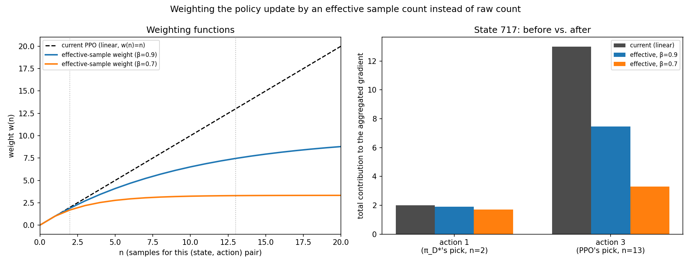
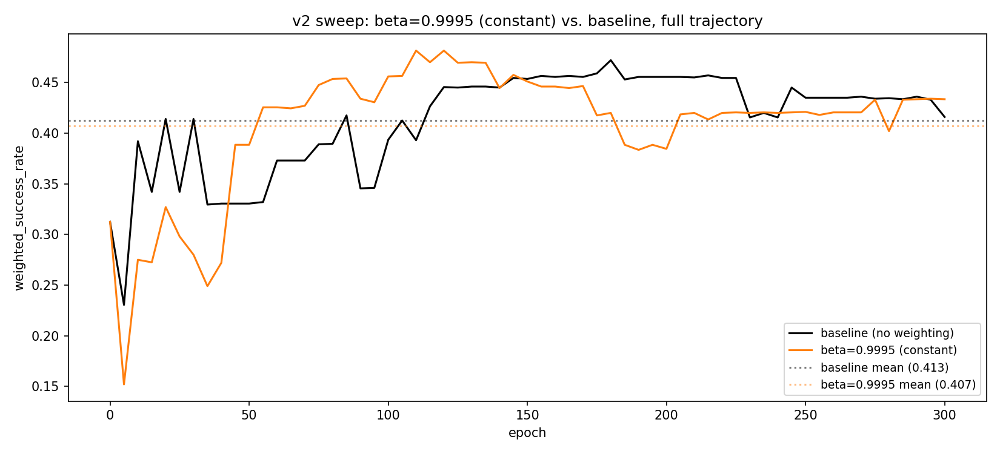
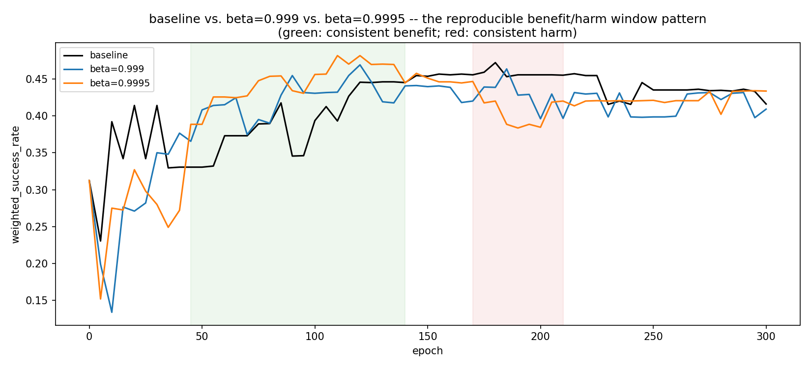
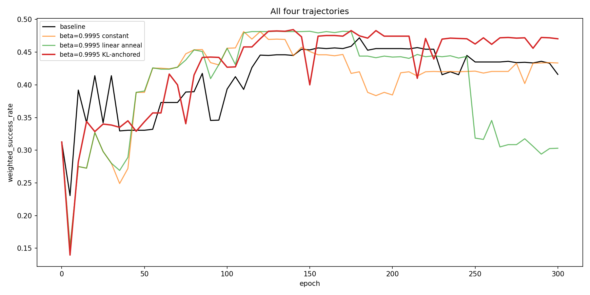
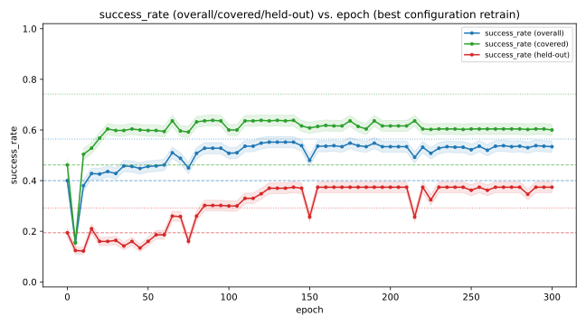
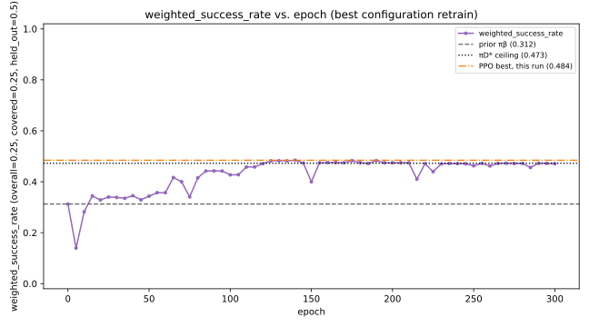
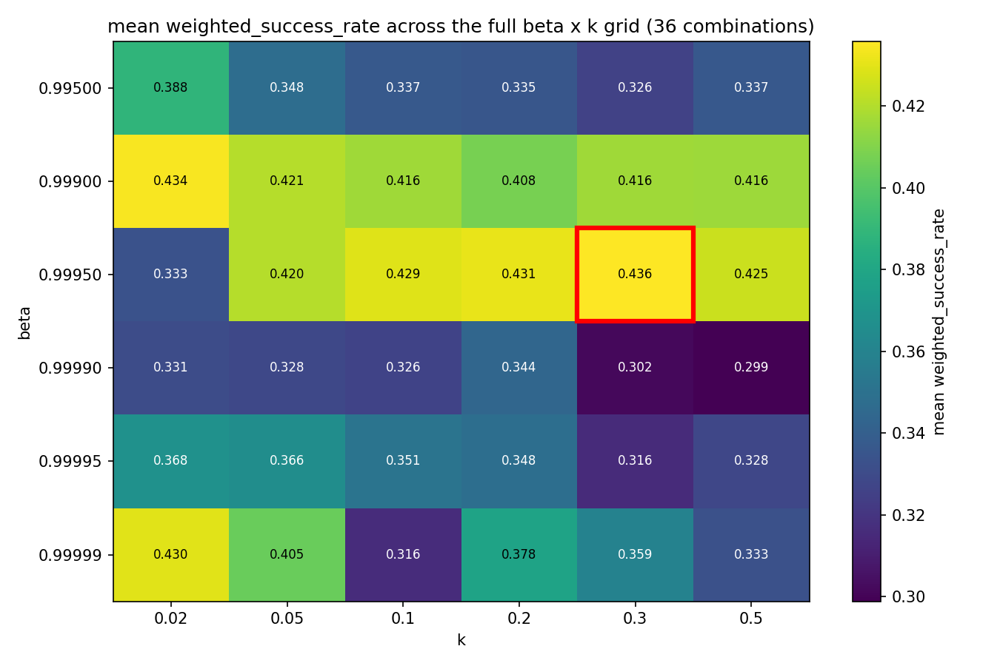

# Phase 2 — A Controlled Maze and the Effective-Sample-Weighting Fix

This document is the complete, self-contained record of the project's
second phase: redesigning the phase 1 maze with controlled redundancy and
a start-state distribution (so overfitting and disagreement-severity
become directly observable), a full seven-hyperparameter-group sweep on
this new task, the disagreement investigation that followed it, the
effective-sample-weighting fix this project ultimately adopts (with a
KL-anchored decay schedule and a full `beta x k` cross-sweep), and an
extensive, ultimately inconclusive search for a way to extend that fix to
continuous action spaces (critic ensembles, Random Network Distillation,
Bellemare et al.'s density-based pseudo-counts, and a direct
variance-weighted alternative that drops the pseudo-count idea entirely).

See the top-level [README](../README.md) for the general research
question, how to run this codebase, and where phase 3 picks up. See
[docs/PHASE1_STOCHASTIC_MAZE.md](PHASE1_STOCHASTIC_MAZE.md) for phase 1,
the original stochastic maze this phase's environment is adapted from.

---

## Why a more controlled experiment

Phase 1's disagreement investigation surfaced two problems with the
original maze as a testbed, not with the findings themselves: `π_D*`
(empirical) is a purely greedy, unregularized consumer of `D`'s raw
counts, with its own known failure mode at thin-sample bottlenecks; and
the maze's redundant paths let PPO disagree with that reference almost
for free, since most disagreement states turned out to be off the path a
real rollout ever takes. Phase 2 is designed around three explicit
requirements this phase's design didn't have, each fixing a specific gap
just identified:

1. **The task must stay hard enough to require genuine training and real
   policy improvement** -- not solvable near-trivially, or the whole
   exploitation-gap question stops being meaningful.
2. **A limited, deliberately small number of good decisions**, so that
   disagreeing with the reference policy is plainly visible in
   success_rate rather than absorbed by redundant paths -- this is what
   phase 1's redundant maze could not provide.
3. **Overfitting to `D` must be directly observable, not merely assumed
   absent.** Phase 1 could not have detected overfitting even where it
   mattered: `D` and evaluation were drawn from the exact same fixed
   start and maze instance, so "PPO overfits `D`" and "PPO generalizes
   well from `D`" would have produced an identical success_rate.

**Our choice: keep the same maze, change how it's started and connected,
rather than build a new environment.**

1. **Controlled, non-zero redundancy**, via the existing
   `extra_connection_prob` parameter, tuned to a handful of good routes
   rather than one (a perfect, spanning-tree maze was considered and
   rejected for this reason -- see docs/PHASE1_STOCHASTIC_MAZE.md's
   closing section -- a single unique path makes every disagreement
   maximally severe by construction, which removes the gradation phase
   1's findings depended on). Addresses requirement 2.
2. **A start-state distribution instead of a fixed start**, sampled
   unevenly on purpose when collecting `D`: some starts oversampled, some
   undersampled, a few withheld from `D` entirely. Evaluation then
   reports success_rate separately for well-covered vs. rarely- or
   never-seen starts -- a policy that excels on the former and collapses
   on the latter is the direct, previously unobtainable signature of
   overfitting. Addresses requirement 3.
3. **Reuse of the existing environment, solver, and training pipeline.**
   Value iteration already computes `V`/`Q` for every state regardless of
   start, so `π_D*` needs no changes at all; only the reset logic, `D`
   collection, and evaluation protocol need to change. This keeps the
   task exactly as hard as phase 1's maze (same size, hazards, and
   stochastic slip), addressing requirement 1 by construction rather than
   by redesigning the task from scratch.

This is a genuine second phase, not a continuation of the first: a new
prior, a new `D`, a new `π_D*`, and likely a fresh hyperparameter pass.

### Final environment parameters

| parameter | phase 1 | phase 2 | why it changed |
|---|---|---|---|
| `extra_connection_prob` | 0.08 | 0.08 | see below -- lowering this alone broke online training |
| `num_hazards` | 12 | 4 | see below -- this, not connectivity, was the real obstacle to exploration |
| `step_penalty` | -0.01 | -0.03 | needed so value differences between actions exceed slip-induced noise (see requirement 2 below) |
| `num_start_states` | 1 | 12 | the overfitting-detection axis (requirement 3) |

Getting here took a real detour. Lowering `extra_connection_prob` alone
(to 0.015, keeping phase 1's `num_hazards=12`) satisfied requirement 2's
redundancy target on paper, but made online PPO training's own
exploration collapse completely: 300 iterations produced exactly 0%
success, every time, regardless of `entropy_coef`. Diagnosed directly: a
pure uniform-random walk from a close start reached the goal in 9/10
trials at `num_hazards=4`, but died to *one of twelve* hazards in 5/5
trials at `num_hazards=12`, from the identical start -- undirected
exploration finds any one of many hazards far more easily than the one
specific goal. A separate check ruled out bad network initialization
luck: five different random seeds all showed the exact same
stuck-in-place behavior (an untrained network's action distribution is
correlated across similar states, unlike true independent-per-step
random sampling, so even a mild bias repeatedly walks into the same
wall). Restoring `extra_connection_prob` to 0.08 and lowering
`num_hazards` to 4 together fixed this -- real training curves emerged
without touching `entropy_coef` at all (see requirement 1 below).

A separate, structural bug surfaced along the way and is fixed rather
than worked around: at low redundancy, excluding only each start's
single BFS-shortest path from candidate hazard cells was not enough --
the value-optimal policy does not always follow that exact path, so a
hazard could still end up adjacent to the route actually taken. Four of
twelve starts had a real 0% success rate under the exact optimal policy
(not a gradient of risk -- a genuine trap) before this was caught.
Fixed via rejection sampling in `envs/stochastic_maze.py`
(`_verify_and_redraw_hazards`): every candidate hazard placement is
checked against the exact optimal policy's actual success rate from
every start, and redrawn from scratch if any start falls below 70% --
never by shaping hazard placement around a known solution, which would
make the property true by construction instead of testing it.

### Verifying requirement 1: task difficulty

 <em>Left: a uniformly random policy (2.0% success) against the full-information exact optimal policy (100%). Right: a genuine 300-iteration online PPO run, success_rate climbing from 0% to 39.3%.</em>

The random-vs-optimal gap (98 points) rules out the task being solvable
by luck. The training curve is not smooth -- it dips as low as 8.3% around
iteration 30 before climbing past 39% by iteration 300 -- but the
direction is unambiguous, and no change to `entropy_coef` was needed to
get it: the fix was `num_hazards` and `extra_connection_prob` above, not
the training algorithm's own exploration incentives.

### Verifying requirement 2: redundancy

 

`scripts/verify_redundancy_level.py` reports on-path states averaging
1.09 near-optimal actions (tolerance calibrated to roughly the value cost
of a one-step detour) -- the script's own built-in heuristic flags this
as possibly *too* low (near a perfect maze). That heuristic was
deliberately overridden by a direct behavioral check instead: starting
from the exact optimal policy, a controlled fraction of on-path states'
actions were corrupted (replaced with the worst available action) and
success_rate was measured live.

| states corrupted | aggregate success_rate |
|---|---|
| 0% | 100.0% |
| 10% | 36.7% |
| 25% | 11.3% |
| 50% | 0.0% |

A graceful, monotonic decline -- not a perfect maze's instant collapse at
any disagreement, but nowhere near phase 1's redundancy either. Checked
per-start too: most individual starts are already at 0% success by 25%
corruption, with only two or three more resilient outliers keeping the
aggregate above zero -- the aggregate number is not hiding a uniformly
tolerant reality.

### Verifying requirement 3: overfitting detectability

The first attempt at this used a deliberately "overfit-prone" fixed-D PPO
config (many more epochs than a baseline run, `entropy_coef=0`) and
compared its covered-vs-held-out gap against `π_β`'s own. It failed in an
instructive way: that config's gap (+0.238) came out *smaller* than
`π_β`'s own baseline gap (+0.268), because comparing it against a
10-epoch baseline confounded "trained for far longer" with "overfit" --
more gradient steps improved both tiers, masking whatever overfitting
signal existed. Adjusting epochs and entropy to isolate the effect
properly would have meant doing the actual hyperparameter analysis this
check is only supposed to prepare for -- so instead of tuning PPO
further, the check itself was redesigned.

`scripts/verify_overfitting_detectable.py` now builds a policy that is
overfit **by construction**: for every state, memorize whichever action
`D` shows most often there -- pure behavioral-cloning-style memorization,
no value estimation, no PPO training at all.

 <em>The memorization policy matches π_β on covered starts but collapses to zero on held-out; π_β itself (uniform starts during its own training) keeps a much smaller gap.</em>

| policy | covered | held-out | gap |
|---|---|---|---|
| `π_β` (baseline) | 46.2% | 19.4% | +0.268 |
| D-mode memorization | 46.4% | 0.0% | **+0.464** |

The memorization policy matches `π_β`'s covered performance almost
exactly (it deterministically replays `π_β`'s single most common local
choice there) while collapsing completely on held-out starts, where it
has no information at all -- roughly double `π_β`'s own gap. The
covered/held-out infrastructure does detect overfitting when a genuinely
overfit policy exists; the issue was never the infrastructure, only the
earlier PPO-specific definition of "overfit."

## Our new starting point: a three-way, weighted evaluation

Running the actual H4 baseline (the first real result after the three
requirements above) surfaced a gap in how this project was measuring
"better." Two things exposed it. First, `analyze_epochs.py`'s own
epoch-0 evaluation showed `success_rate=0.000` for `π_β` -- a network
that scores ~40% everywhere else -- because that script (like seven
other `analyze_*.py` scripts inherited from phase 1) had never been
updated to pass `num_start_states`, silently constructing a *different*
one-start maze instead of phase 2's twelve-start one. Second, and more
fundamentally: once that was fixed, it became clear that the
covered/held-out distinction requirement 3 introduced was only being
applied at the very end (`scripts/05_evaluate_all.py`'s final report) --
every intermediate decision along the way (which epoch counts as "best"
during a sweep, which checkpoint gets saved, which hyperparameter looks
better) was still being made on a plain, unweighted `success_rate` that
could just as easily reward memorization as the original PPO-vs-`π_D*`
comparison this project started from could.

**Every evaluation everywhere in this project now reports three numbers,
combined into one weighted score:**

| population | weight | what it measures |
|---|---|---|
| overall | 25% | the env's own default reset, uniform across all 12 starts |
| covered | 25% | the 8 well-/moderately-covered tier starts |
| held-out | 50% | the 4 starts never seen during `D` collection |

`weighted_success_rate = 0.25·overall + 0.25·covered + 0.50·held_out`.
Held-out is weighted most heavily **on purpose** -- not because it is the
single most representative population, but because it is the only one of
the three memorization cannot cheat: a policy that has simply memorized
`D`'s coverage looks identical to a genuinely good one on `overall` and
`covered`, and only reveals itself on `held_out`. Weighting it heaviest
means the number used to pick "the best epoch," "the best checkpoint," or
"the best hyperparameter" is itself protected against the same failure
mode requirement 3 was built to catch in individual policies -- the
selection *process*, not just the policies it selects between, is now
guarded against overfitting.

This is not a cosmetic addition. `scripts/eval/evaluate.py`'s
`evaluate_policy_weighted` is now the single shared implementation behind
every check in this project: `scripts/05_evaluate_all.py`'s final report,
the epoch/hyperparameter sweeps (`scripts/analyze_epochs.py`,
`scripts/analyze_sweep.py` -- checkpoint *selection* during training now
uses the weighted number, not raw `success_rate`), and both remaining
verification scripts (`scripts/verify_task_difficulty.py`'s training
curve, `scripts/verify_overfitting_detectable.py`'s comparison, and
`scripts/verify_redundancy_level.py`'s corruption-sensitivity check,
which had never actually been wired into that script as a re-runnable
feature before now).

**The three baseline policies, under this new protocol** (500 episodes,
seed 999):

| policy | overall | covered | held-out | **weighted** |
|---|---|---|---|---|
| `π_β` (prior) | 40.0% | 46.2% | 19.4% | **31.3%** |
| `π_D*` (empirical) | 56.4% | 74.2% | 29.2% | **47.3%** |
| `π_D*` (true-restricted) | 59.6% | 75.2% | 39.4% | **53.4%** |

Every one of these already shows the same pattern the whole design was
meant to expose: covered performance is well above overall, held-out is
well below -- even for `π_D*` itself, whose own ceiling depends on `D`'s
coverage exactly as any learned policy's would. The weighted column, not
any single one of the three raw numbers, is what "better" means from here
on -- this is the number the upcoming H1-H7 sweep is measured against,
replacing phase 1's plain `success_rate` gap entirely.

## Results analysis

### H4: epoch-count ceiling analysis

Same question as phase 1's H4: does the `epochs` hyperparameter alone,
pushed far beyond any realistic range (300, 30x the 10-epoch baseline),
keep helping, plateau, or eventually hurt? Config: `clip_eps=0.2`,
`gae_lambda=0.95`, `entropy_coef=0.01`, `minibatch_size=256`,
`lr=0.0003`, `hidden_sizes=[64,64]` -- otherwise identical to
`ppo_fixed_d_standard.yaml`, checkpointed every 5 epochs.

 <em>The three raw success_rate curves. covered is essentially flat from epoch 0 to 300; held-out collapses sharply around epoch 190-195.</em>

This is the clearest demonstration yet of exactly what phase 1 had no way
to see. Between epoch 190 and 195:

| epoch | overall | covered | held-out | weighted |
|---|---|---|---|---|
| 190 | 38.2% | 47.2% | 26.8% | 34.75% |
| 195 | 31.0% | 47.2% | 6.6% | 22.85% |

`covered` does not move at all (47.2% both epochs, to three significant
figures). `held-out` collapses by 20 points in a single 5-epoch step.
`overall` -- the only number phase 1's version of this analysis could
have reported -- shows a 7-point drop, small enough to plausibly read as
noise on its own. Phase 1's single-population evaluation could not have
distinguished "the policy got slightly worse" from "the policy stopped
generalizing to anything it hadn't memorized" -- this split can, and does.

 <em>weighted_success_rate alone -- the same collapse, in the number actually used to pick a checkpoint.</em>

**Checkpoint selection itself was checked against this, not assumed
safe.** The epoch that would have been picked under phase 1's old,
unweighted criterion (`success_rate_overall`, best at epoch 175: overall
38.4%, covered 47.2%, held-out 26.8%) and the epoch picked under the new
weighted criterion (best at epoch 95) both land inside the safe,
pre-collapse region -- in this particular run, the two selection rules
happen to agree, not because the weighted criterion made no difference,
but because neither one was fooled into reaching past epoch 190. The
value of the split here is in what the *curve* reveals, not in a
near-miss the new metric had to rescue this checkpoint from.

**Going forward with epoch 95** -- the weighted-best checkpoint:

| | value |
|---|---|
| hyperparameters | same as above (`clip_eps=0.2`, `gae_lambda=0.95`, `entropy_coef=0.01`, `minibatch_size=256`, `lr=0.0003`, `hidden_sizes=[64,64]`), stopped at epoch 95 |
| `success_rate` (overall) | 38.2% |
| `success_rate` (covered) | 47.2% |
| `success_rate` (held-out) | 27.0% |
| **`weighted_success_rate`** | **34.85%** |

### H3: clip range, an unplanned detour into a narrow failure band

Sweeping `clip_eps` (otherwise identical to H4's config, 300 epochs) at
0.1, 0.3, and 0.4 -- `0.2` already covered by H4 -- produced an odd,
non-monotonic pattern that took a real investigation to resolve.

 <em>clip_eps=0.4: noisier throughout, but no sustained held-out-specific collapse -- unlike 0.2's clean cliff (see H4 above).</em>

`0.1` stayed perfectly flat for the full 300 epochs. `0.3` showed only
brief, simultaneous dips across all three populations together (not
`held-out` alone), always recovering. `0.4` was noisier throughout but
never collapsed the way `0.2` had -- and scored the best of the four.
This raised an immediate objection: if `0.2`'s collapse really is
`theta` drifting cumulatively away from the fixed `pi_old = pi_beta`
anchor, a *wider* trust region should let that drift happen faster, not
slower or not at all. Extending `0.3` and `0.4` to 600 epochs, and
re-running `0.2` with a different training seed (same `D`, same
`pi_beta`, only the training randomness changed) to rule out a one-off
fluke, gave a clear answer: the seed change reproduced the same
collapse almost exactly (epoch ~200-205 instead of ~190-195); `0.3`
still showed nothing at 600 epochs; `0.4` eventually showed a real, but
much noisier and more gradual, held-out-specific degradation only after
epoch ~300.

Since `clip_frac` and `entropy` are computed *over `D`* -- which contains
zero held-out transitions -- they cannot see whatever is actually
happening at held-out states by construction, and showed nothing unusual
at the collapse epoch. Probing the network's own output distribution
*directly at the held-out states* (cheap forward passes, no rollout, no
gradient ever touches these states) told a different story:

 <em>KL(π_β‖π_θ) and entropy at held-out states drift smoothly and continuously throughout -- rising, falling to a minimum around epoch 150-185, then rising again -- with no discontinuity at the collapse epoch. Weight norm grows smoothly throughout, also uninformative about timing.</em>

Tracking each held-out state's action probabilities *individually*
(rather than aggregated) found the mechanism directly: of the four
held-out states, exactly one had two competing actions slowly trading
probability over ~200 epochs, crossing at epoch 210.

 <em>Three of four held-out states never come close to an argmax flip. The fourth (state 386) has two actions drift smoothly toward each other for 200 epochs and cross -- a continuous probability drift producing a discontinuous, deterministic-argmax behavioral change.</em>

This explains *how* a smooth drift produces a sudden cliff, but not why
`clip_eps=0.2` specifically. Testing `0.15` and `0.25` found that `0.25`
collapses in the *identical* epoch-190-to-195 window as `0.2`, while
`0.15` stays completely flat through the same window:

 <em>clip_eps=0.25 collapses in the same epoch window as 0.2 (see H4), including a brief partial recovery around epoch 210 -- the same epoch state 386's argmax flip occurred at under clip_eps=0.2.</em>

Narrowing further (`0.175`, `0.275`) confirmed a real, narrow band with
both edges clean:

| `clip_eps` | 0.1 | 0.15 | 0.175 | **0.2** | **0.25** | 0.275 | 0.3 | 0.4 |
|---|---|---|---|---|---|---|---|---|
| sustained held-out collapse? | no | no | no | **yes** | **yes** | no* | no | no (later, gradual) |
| best `weighted_success_rate` | 34.7% | 36.6% | 36.9% | 34.9% | 35.7% | 38.6% | 36.8% | **41.4%** |

\* `0.275` showed one brief dip (epoch 215-220) in the same epoch region
as `0.2`/`0.25`'s collapse, but recovered fully by epoch 225 -- a
flutter, not a lock-in.

**Conclusion: this is an artifact of this specific `D`/optimization
trajectory landing a close two-action decision boundary at one
particular state, not a property of PPO's mechanism the exploitation-gap
question needs to account for.** The band is narrow (0.2-0.25 out of the
0.1-0.4 range tested), both neighbors are clean, and nothing about it
generalizes into a claim like "moderate clip ranges are dangerous" --
`0.4`, further from `0.2` than `0.25` is, remains the best-performing
value tested. This thread is closed without a deeper mechanistic
explanation of why this exact band; chasing that further would be
investigating a curiosity of this one dataset's optimization landscape,
not the exploitation gap itself.

What *is* worth keeping: this entire detour started because the
covered/held-out split caught something a plain `success_rate` would
have shown only as a mild, easy-to-dismiss wobble. Every diagnostic tool
already in this project (`clip_frac`, `entropy`, both computed over `D`)
was blind to it by construction; only evaluating held-out states directly
-- the whole point of requirement 3 -- made it visible at all. Whatever
this specific band turns out to be, the evaluation redesign it surfaced
is doing exactly the job it was built for.

**Resolving "which clip_eps is best."** The initial 0.1→0.4 sweep looked
like performance kept rising with no peak in sight -- but that used the
single best epoch observed per run, which non-monotonic fixed-D training
(see "Epoch-count ceiling analysis" in the phase-1 doc) makes an
unreliable ranking criterion: an unstable config can post a high one-off
peak right before collapsing. Extending the sweep out to `clip_eps=0.7`
and switching the ranking criterion to the **mean** `weighted_success_rate`
over the full run -- which a short-lived peak cannot inflate -- recovers
a clean picture:

 <em>Mean weighted_success_rate vs. clip_eps, full run average. The two red points are the already-characterized 0.2/0.25 artifact, not a real dip in the underlying trend.</em>

A genuine peak at **`clip_eps=0.4`**, rising from 0.1 and falling away
past 0.45 (0.55's dip is the same general instability described above,
arriving earlier as `clip_eps` grows further; 0.6-0.7's partial recovery
is noise from testing only one seed per value, not a second real peak).
**`clip_eps=0.4` is adopted going forward** as this project's H3 answer:

 <em>clip_eps=0.4's own training curve -- the configuration this sweep confirms as best.</em>

### H5: entropy coefficient

Same design as phase 1's H5 -- `entropy_coef ∈ {0.0, 0.003, 0.01, 0.03, 0.1}`,
`clip_eps` now fixed at this project's H3 answer (0.4), 300 epochs,
ranked by mean `weighted_success_rate` from the start this time:

| `entropy_coef` | **0.0** | 0.003 | 0.01 | 0.03 | 0.1 |
|---|---|---|---|---|---|
| mean `weighted_success_rate` | **0.377** | 0.372 | 0.364 | 0.336 | 0.224 |
| std | **0.024** | 0.027 | 0.028 | 0.042 | 0.053 |

Monotonic, not a U-shape: less entropy pressure is consistently better
and more stable here, all the way down to `entropy_coef=0.0`. No further
sweeping needed on this side -- `0.0` is a hard floor, not an interior
point with room to keep searching past it.

 <em>entropy_coef=0.0: steady improvement across all three populations for the full 300 epochs, no instability.</em>

**`entropy_coef=0.0` is adopted going forward.** Current configuration:
`clip_eps=0.4`, `entropy_coef=0.0`, otherwise identical to
`ppo_fixed_d_standard.yaml`.

### H2: GAE lambda

`gae_lambda ∈ {0.0, 0.5, 0.90, 0.95, 1.0}`, `clip_eps=0.4` and
`entropy_coef=0.0` now both fixed. A genuine interior peak this time, no
mirage to resolve: mean `weighted_success_rate` rises from 0.227 (λ=0)
to 0.293 (λ=0.5) to 0.318 (λ=0.90) to **0.377 (λ=0.95)**, then falls to
0.324 (λ=1.0). `λ=0.95` was already this project's default -- H2
confirms the existing setting rather than improving on it (its numbers
match H5's own `entropy_coef=0.0` row exactly, since that row already
was `clip_eps=0.4, entropy_coef=0.0, gae_lambda=0.95`). **`gae_lambda=0.95`
stays.** Current best mean `weighted_success_rate`: 0.377.

### H1: value coefficient

`value_coef ∈ {0.0, 0.1, 0.25, 0.5, 1.0}`, `clip_eps=0.4`,
`entropy_coef=0.0`, `gae_lambda=0.95` all now fixed. Same null result as
phase 1: mean `weighted_success_rate` ranges from 0.3748 to 0.3767 across
the whole swept range -- a spread of 0.002, well inside noise. **H1 is
closed with no effect, exactly as in phase 1.** This is the intended
setup for the `value_coef × max_grad_norm` cross-sweep next: a null
result in isolation is precisely what that cross-sweep exists to
double-check, not a coincidence to move past.

### Cross-sweep 1/3: clip_eps x gae_lambda

Motivated by a direct methodological concern raised mid-project: H3-H1's
sequential, one-hyperparameter-at-a-time search finds each dimension's
best value while holding the others at whatever was previously chosen --
which is exactly right if hyperparameters don't interact, and can settle
into a local optimum if they do. `clip_eps` and `gae_lambda` were the
first pair checked, since the mechanism already documented for both
(README, H3's clip-width-dependent drift; GAE's reliance on the critic's
own possibly-stale estimate) plausibly compound: how far `theta` can
drift per update, and how trustworthy the signal driving that drift is,
are not obviously separable questions. Grid: `clip_eps ∈ {0.3, 0.4, 0.5,
0.55, 0.6}` x `gae_lambda ∈ {0.85, 0.90, 0.95, 1.0}` (not every cell
filled -- widened twice, first past 0.4's sequential optimum, then again
once 0.5 turned out to beat it), `entropy_coef=0.0` fixed (H5), ranked by
mean `weighted_success_rate` as usual:

| `clip_eps` ＼ `gae_lambda` | 0.85 | 0.90 | 0.95 | 1.00 |
|---|---|---|---|---|
| 0.30 | -- | 0.338 | 0.350 | 0.320 |
| 0.40 | -- | 0.318 | **0.377** (sequential choice) | 0.324 |
| 0.50 | 0.377 | 0.407 | 0.394 | 0.305 |
| 0.55 | 0.360 | **0.410** | 0.392 | -- |
| 0.60 | 0.374 | 0.399 | 0.369 | -- |

A genuine interior peak, not another edge mirage: every direction away
from `(0.55, 0.90)` decreases. **The sequential search's answer
(`clip_eps=0.4, gae_lambda=0.95`, 0.377) was a real local optimum, not
the joint one** -- `(0.55, 0.90)` reaches 0.410, ~9% higher, confirming
the interaction-blindness concern was not merely theoretical here.

 <em>clip_eps=0.55, gae_lambda=0.90: covered reaches ~0.59-0.60, held-out settles at a stable ~0.30-0.31 from epoch ~210 on -- no collapse, a genuine sustained improvement.</em>

**`clip_eps=0.55, gae_lambda=0.90` replaces the sequential choice going
forward.** Current configuration: `clip_eps=0.55`, `gae_lambda=0.90`,
`entropy_coef=0.0`, otherwise identical to `ppo_fixed_d_standard.yaml`.

### Cross-sweep 2/3: value_coef x max_grad_norm

Same design as phase 1's H7 x H1 cross-sweep, checking whether H1's null
result (README, H1: 0.375-0.377 across `value_coef ∈ [0.0, 1.0]`, all
`max_grad_norm=0.5`) was `max_grad_norm` clipping the gradient before
`value_coef`'s weight could matter, masking a real effect. Grid:
`value_coef ∈ {0.0, 0.5, 1.0}` x `max_grad_norm ∈ {0.05, 0.1, 0.5, 1.0,
2.0, 5.0}` (widened well past phase 1's `{0.1, 0.5, 1.0}` on both sides,
since `max_grad_norm` had never been individually swept in phase 2 at
all), `clip_eps=0.55`, `gae_lambda=0.90`, `entropy_coef=0.0` all fixed:

| `value_coef` ＼ `max_grad_norm` | 0.05 | 0.10 | 0.50 | 1.00 | 2.00 | 5.00 |
|---|---|---|---|---|---|---|
| 0.0 | 0.359 | 0.359 | 0.404 | 0.377 | 0.372 | 0.389 |
| 0.5 | 0.389 | 0.400 | **0.410** (previous best) | 0.386 | 0.381 | 0.390 |
| 1.0 | 0.414 | **0.415** | 0.395 | 0.391 | 0.375 | 0.390 |

The same interaction phase 1 found, reproduced here: at this project's
own `max_grad_norm=0.5`, `value_coef` barely moves the number (0.404 to
0.410 to 0.395 -- consistent with H1's null result). Only once the
gradient is clipped hard (`max_grad_norm ≤ 0.1`) does `value_coef` matter
at all, and there it matters a lot: 0.359 at `value_coef=0.0` vs. 0.415
at `value_coef=1.0`. `0.05` and `0.1` give near-identical results
(0.414 vs. 0.415, well inside noise of each other), so this looks like a
real plateau, not another still-rising edge.

 <em>value_coef=1.0, max_grad_norm=0.1: covered/overall ease off somewhat after epoch ~225 (0.58->0.52, 0.49->0.45) while held-out stays flat-to-improving throughout (0.37->0.38) -- the opposite of the overfitting signature documented under H4, not a reason to distrust this run.</em>

The late-training softening in `covered`/`overall` here is worth naming
explicitly, since it makes this run look less clean at a glance than
`clip_eps=0.55, gae_lambda=0.90` alone (previous section) was.
`held_out` does not degrade alongside them -- it holds steady through the
same window and ends slightly above its own mid-training level -- which
is the opposite of what an overfitting explanation would predict (README,
H4: overfitting collapses `held_out` while `covered` stays put; here
`covered` moves and `held_out` doesn't). It reads as ordinary
fixed-D training noise rather than the mechanism this project has been
tracking. Separately: none of the sweep scripts persist a checkpoint
mid-run (`save_best_checkpoint_path` is only wired into
`scripts/analyze_policy_agreement.py`), so once a final configuration is
settled, retraining it through that script -- which tracks and keeps the
single best-observed checkpoint rather than whatever epoch training
happens to end on -- is how this kind of late-run softening gets handled
in practice, not by re-picking hyperparameters over it.

**`value_coef=1.0, max_grad_norm=0.1` replaces the previous defaults
going forward.** Current configuration: `clip_eps=0.55`, `gae_lambda=0.90`,
`entropy_coef=0.0`, `value_coef=1.0`, `max_grad_norm=0.1`. Mean
`weighted_success_rate`: 0.415, up from 0.377 after the sequential pass
alone.

### Cross-sweep 3/3: clip_eps x gae_lambda x entropy_coef

`gae_lambda` reappearing here raised the same concern that motivated the
first cross-sweep in the first place: `entropy_coef` (H5) was found with
`clip_eps=0.4` still fixed -- the sequential value, not the
`clip_eps=0.55` the first cross-sweep later settled on. Re-running
`entropy_coef x gae_lambda` alone, at `clip_eps=0.55` held fixed, would
just move the same coordinate-search blind spot up one level instead of
closing it: gae_lambda would once again be optimized conditional on a
clip_eps value not itself re-checked at the same time. So this one
includes `clip_eps` as a third swept dimension rather than a fixed
input.

A full grid across every value each of the three has ever been tested at
would be 5x4x5 = 100 runs -- the first cross-sweep's own result is what
keeps this tractable instead: it already located the joint optimum's
neighborhood in `(clip_eps, gae_lambda)` and showed performance falling
away in every direction from it (see the grid two sections up), so
nothing is lost by searching only that neighborhood here rather than
the full range each dimension was originally swept across. Grid:
`clip_eps ∈ {0.5, 0.55, 0.6}` x `gae_lambda ∈ {0.85, 0.90, 0.95}` x
`entropy_coef ∈ {0.0, 0.003, 0.01}` (H5's own sweep showed a steep,
monotonic decline past `0.01`, so `0.03`/`0.1` are not worth re-including
here) -- 27 combinations, `value_coef=1.0`, `max_grad_norm=0.1` fixed
(this project's cross-sweep-2 answer).

| `clip_eps` | `gae_lambda` | `entropy_coef` | mean |
|---|---|---|---|
| 0.55 | 0.90 | **0.000** | **0.4152** |
| 0.50 | 0.90 | 0.010 | 0.4116 |
| 0.55 | 0.90 | 0.003 | 0.4085 |
| 0.55 | 0.95 | 0.000 | 0.3923 |

Decisive, and reassuring rather than surprising: the exact point already
in hand (`clip_eps=0.55, gae_lambda=0.90, entropy_coef=0.0`) tops the
full 27-combination grid. `entropy_coef=0.0` was NOT conditional on the
stale `clip_eps=0.4` after all -- letting all three vary jointly changed
nothing. The concern that motivated this cross-sweep was legitimate
methodology (a real risk, not a hypothetical one -- cross-sweep 1 had
already shown the sequential search failing exactly this way once), it
simply didn't fire again here.

**No change to the current configuration.** All three planned
cross-sweeps are now complete:

| | value |
|---|---|
| `clip_eps` | 0.55 |
| `gae_lambda` | 0.90 |
| `entropy_coef` | 0.0 |
| `value_coef` | 1.0 |
| `max_grad_norm` | 0.1 |
| mean `weighted_success_rate` | 0.415 |

## Best checkpoint, re-evaluated under the seed 999

A transparency note before the numbers: every hyperparameter sweep in
this project (H1-H5, all three cross-sweeps) used `eval_seed=24680` --
correct, since that seed exists precisely to keep checkpoint/config
*selection* uncontaminated by the episodes later used to report a
number. Now it's important to re evaluate the best checkpoint chosen from those sweeps under
`eval_seed=999` -- this project's reserved
final-report seed, the same one `π_D*`'s own ceiling was computed under. Since fixed-D training here is fully
deterministic (CPU only, fixed training seed, same `D` and `π_β` every
time), there is no retraining needed.

 <em>Best configuration, re-evaluated under seed=999: the three raw success_rate populations per checkpoint, epoch 0 through 300.</em>

 

 <em>The same run's weighted_success_rate curve. Best: epoch 180.</em>

 

| | overall | covered | held-out | weighted |
|---|---|---|---|---|
| `π_β` (prior) | 40.0% | 46.2% | 19.4% | 31.3% |
| **best checkpoint (epoch 180)** | **53.4%** | **60.6%** | **37.4%** | **47.2%** |
| `π_D*` (empirical) | 56.4% | 74.2% | 29.2% | 47.3% |
| `π_D*` (true-restricted) | 59.6% | 75.2% | 39.4% | 53.4% |

The evaluation has three different components. The results show that our best checkpoint is 
clearly closer to the references than the prior. So the hyperparameters analyses provided a 
real improvement to the policy training. What we can notice is that there is still a gap in overall
evaluation and also on evaluation episodes focused on states covered by `D`. But on held-out episodes, the 
empirical reference is surpassed. It's still valid and it clearly shows that the held-out dimension is really useful.
From what we know empirical `π_D*` uses the info in `D` to build its transition model estimate. Its prone to a bit
of overfitting. Which is why PPO's best checkpoint is doing better than it on situations that are not represented by `D`.
It's still reassuring that the true-restricted version isn't surpassed by our best checkpoint in any component of our evaluation.

## Digression : What it really means to have the best policy extractable from `D`

It's a question that is raised from the latest results. If we only focus on optimizing the success rate on covered states by greedily
using what `D` provides, we are at a risk of overfitting. And that's not the goal of any training. So it's really important during our
study of the question that we make sure it's not happening.

## What other improvements can we make ?

### Policy agreement and disagreement factors

Now the best checkpoint is still **13.6 points behind `π_D*` (empirical)** and **14.6 points behind `π_D*`
(true-restricted)**. The natural next step is to see where it disagrees with the references and performs worse. It will 
help us identify where and possibly how improvement can happen. We define disagreement on an action to take at a particular state 
as the combination of three conditions : 
1. Both the empirical and the true-restricted versions of `π_D*` agree on the same action to take.
2. The evaluated checkpoint disagrees and chooses another action.
3. During evaluation, the PPO checkpoint performs worse than both references.

The best checkpoint (epoch 180) was rolled out from every non-terminal
state to compare against both `π_D*` definitions, under the same
`eval_seed=999`.

 <em>Strict disagreement severity by cell (green = agrees with π_D* or no cost; red = large value loss). Concentrated in the upper-left region and near the goal, both areas D covers densely.</em>

Of 895 non-terminal states, 484 (54.1%) are covered by `D`. Raw argmax
disagreement with `π_D*` (empirical) is large -- 471 states, 52.6% --
but nearly all of it is noise: filtering to statistically significant
disagreement drops this to 97 states (10.8%), and requiring BOTH `π_D*`
definitions to agree on the SAME action, with the checkpoint choosing a
different one and performing worse than both (`is_disagreement_strict`)
drops it further to 66 states (7.4%). **Every one of those 66 is a
covered state -- zero are in the uncovered set.** This is the expected
shape, not a surprise: an uncovered state is exactly where `π_D*` itself
has no real information (its own tie-break there is as uninformed as
anything PPO could produce), so "disagreement" isn't a meaningful
category there to begin with.

#### What predicts disagreement severity, among the 66

 <em>Raw vs. partial (net of coverage) correlation with severity, across every tested factor.</em>

By far the strongest predictor, once overall coverage is controlled for,
is `log_pair_min_samples` -- the SMALLER of the two competing actions'
sample counts, whichever one that is (partial r = -0.35, vs. -0.14 raw).
`action_sample_gap` -- the signed difference, `best-config action's
samples − π_D*'s action's samples` -- correlates more modestly (partial
r = -0.12); most of that is inherited from its overlap with `log_n_best_
config_action` below rather than an independent directional signal (see
next section).

The nuance worth being precise about: this is not "PPO disagrees where
π_D*'s action was sampled less than PPO's own." Two states with the
exact same *positive* sample gap (PPO's action seen more than π_D*'s) can
land on opposite sides of the severity distribution depending only on
the smaller count -- gap +47 with counts (3, 50) behaves like a
high-severity state, gap +50 with counts (500, 550) does not, even
though both favor PPO's action by a similar or larger margin. A state
with the *opposite*-signed gap (counts (40, 4), π_D*'s action seen far
more) is just as much at risk as the first, because its minimum (4) is
just as low. Direction of the imbalance doesn't predict severity; the
absolute rarity of whichever action is the sparser one does. With too
few samples for either action, the value estimate each side is built
on -- π_D*'s empirical MDP as much as PPO's own critic -- is dominated
by noise rather than signal, and which action ends up looking better is
no longer reliably tracking which one actually is. `log_n_best_config_
action` (PPO's own chosen action's raw sparsity, not compared to π_D*'s)
shows the same pattern on its own (partial r = -0.30): PPO tends to be
confidently wrong specifically where its own preferred action had little
direct reinforcement, independent of how that compares to the
alternative. `distance to goal` has a modest positive effect (partial r
= +0.12); `hazard distance`, `local connectivity`, and `π_β`'s own
action-probability gap show essentially none.

#### Does PPO at least skew toward the more-sampled action?

A direct, cheap follow-up on the nuance above, using
`policy_agreement.csv`'s own `n_best_config_action` vs.
`n_pi_d_star_action` columns -- no retraining, no new rollouts. Among
the 66 strict-disagreement states, PPO picks the more-sampled of the two
competing actions 57.8% of the time (37/64, ties excluded) -- not
significant (binomial test vs. 50/50, p=0.260). Restricted to the
states where the imbalance should matter most, the ones with the lowest
`pair_min_samples`, the skew doesn't just weaken, it reverses: 46.9%
(15/32, p=0.860) -- indistinguishable from a coin flip.

That the effect fades exactly where the earlier factor analysis says
noise dominates most is itself informative: it rules out a residual
"popularity bias" hiding inside the low-sample regime (PPO simply
favoring whichever action happened to have marginally more
reinforcement, even when both are rare) as an alternative to the noise
account. The finding stays narrow, and is worth stating precisely rather
than in either stronger or weaker form: a large sampling imbalance
between the two competing actions predicts that PPO's preference between
them becomes unreliable -- but not which direction that unreliable
preference lands in. Direction is not recoverable from the sample counts
at all; only the fact that the comparison has become untrustworthy is.

#### A quick test to make sure agreement equals real better performance

Now that we know possibly where the best checkpoint fails and before trying to 
solve that in regard to the factor concerned, a useful check is to see if agreeing 
with the references systematically improves the best checkpoints performance. For that 
I designed a simple masked evaluation script. The script evaluates the best checkpoint on 
the same evaluation seed. The difference is that I apply a mask where there is disagreement with 
`π_D*` and instead of the checkpoint's action, I use `π_D*`'s suggested action. A better success 
rate on the components would be a good sign to try and close the disagreement gap between PPO 
and the references.

 <em>Unpatched best checkpoint vs. the same checkpoint with π_D*'s action substituted at exactly the 66 strict-disagreement states (38 of which were actually visited under this seed/episode count).</em>

| | overall | covered | held-out | weighted |
|---|---|---|---|---|
| unpatched (best checkpoint) | 53.4% | 60.6% | 37.4% | 47.2% |
| patched (66 states → `π_D*`) | 68.4% | 74.6% | 53.2% | 62.4% |
| delta | +15.0 | +14.0 | +15.8 | +15.2 |

Clear, substantial gains across every population, from patching a tiny
fraction of the state space (66 of 895 states, most never even visited
under this start distribution). This validates the disagreement metric
directly: it isn't flagging noise, it's flagging real, exploitable
mistakes. The `covered` result is the most telling one to compare
against the ceilings, since that's the population `π_D*` actually has
information about -- patched `covered` (74.6%) lands almost exactly on
`π_D*` (true-restricted)'s own ceiling (75.2%, a 0.6-point gap) and
just above `π_D*` (empirical)'s (74.2%, a 0.4-point gap). In other words: fixing
these 66 states alone closes essentially the entire remaining `covered`
gap this project has been tracking since "Best checkpoint, re-evaluated
under the seed 999" -- there is very little room left to close beyond
what disagreement already identifies, on the population where closing it
means what it's supposed to mean.

## An attempt to close the gap

The `covered` gap patching already validated (previous section) is real
and worth trying to close directly, not just detect. A concrete example,
already introduced when tracing the mechanism state by state, anchors
both ideas below: state 717.

State 717 has two live actions (the other two are walls, `Q=-50` under
both references). `π_D*` (empirical) and `π_D*` (true-restricted)
independently agree action 1 is best (`Q=0.553` / `0.529`) over PPO's
choice, action 3 (`Q=0.483` / `0.426`). Neither is a sparse-sample
artifact of the kind seen elsewhere in this project (README, "Policy
agreement"): both actions have a stable, well-established true
transition -- action 1 reaches state 747 (`V*=0.66`, the best
successor available) 92.5% of the time, action 3 reaches state 718
(`V*=0.52`, clearly worse) 92.5% of the time. Action 1 really is better.

What `D` actually contains at this state: action 3 appears 13 times
(realized GAE advantage, computed from `π_β`'s own critic, mean
-0.663, std 0.146), action 1 only twice (mean -0.772, std 0.180) -- LOWER
than action 3's, the opposite of what the true Q-values say. Two things
compound to produce this reversal:

- **GAE reflects the whole realized trajectory, not just the immediate
  transition.** With only 2 samples, there is no way to average out
  whatever happened downstream, under `π_β`'s own still-imperfect
  behavior, after reaching state 747 in those particular two episodes --
  unlike `π_D*`'s Q-value, which bootstraps through 747's own
  already-converged value, immune to any single trajectory's noise.
- **`π_β`'s own critic is itself substantially miscalibrated here**:
  it predicts `V(717) = -0.42`, against a true value of `+0.53` to
  `+0.55` -- a ~0.95-0.97 gap, consistent with `π_β` rarely exploiting
  this region well during its own training. Since advantages in this
  project's fixed-D trainer are computed ONCE, from this exact static
  critic, and never refreshed across the whole 300-epoch window (see
  `src/ppo_exploitation/ppo/fixed_d_trainer.py`), this miscalibration is
  locked in for the entire run, not just the first few epochs.

Where the actual training mechanism turns this into a wrong policy: the
fixed-D loss averages over individual *transitions*, not over unique
(state, action) *pairs* -- so action 3's 13 occurrences contribute 13
gradient pushes for every 2 that action 1 gets, every single epoch, for
300 epochs. Whichever action has more data dominates the cumulative
gradient regardless of which one's average is more reliable.

### First idea: updating the advantage estimation with the improved critic (set aside for now)

The idea: since `value_coef` trains the critic throughout the 300-epoch
window, and the critic demonstrably starts out wrong at states like 717,
periodically recomputing GAE with the *current* critic (not just `π_β`'s
frozen one) could let the advantage estimates self-correct as the critic
improves -- directly targeting the second failure mode identified above.

**Why standard PPO doesn't do this, mathematically.** In ordinary
(online) PPO, a training window lasts a handful of epochs (typically
3-10) on a freshly collected batch, and refreshing the critic only
happens BETWEEN windows, on a new rollout. Over so few epochs, the
critic simply doesn't have time to drift meaningfully -- refreshing the
advantage mid-window would change almost nothing there, so it isn't that
the idea was tried and rejected, it's that the problem it would solve
barely exists at that scale. It is specifically this project's choice to
stretch one window to 300 epochs on fixed data (to study extraction to
its limit) that manufactures the critic-staleness problem in the first
place -- something already visible indirectly in the epoch-driven
collapses documented under H3/H4.

**Where it could fail.** PPO's whole mechanism depends on a precise
consistency: the trust-region ratio always compares `θ_current` against
`θ_old` (= `π_β`, never refreshed), and the advantage is supposed to
measure quality relative to that SAME reference point. Refreshing the
critic (and therefore the advantage) without also refreshing `θ_old`
breaks that consistency: the trust region keeps protecting relative to
`π_β`, while the advantage now reflects a more recent critic's opinion --
a mismatch between what the trust region is guarding and what the
advantage is measuring, which could introduce a new instability, possibly
worse than the one it's meant to fix. Testable, but it deserves a real,
controlled experiment, not a small tweak -- set aside for now in favor of
the second idea.

### Second idea: weighting updates by effective sample confidence, not raw count

**The problem with the current, linear weighting.** The fixed-D loss is
a plain average over individual transitions in `D`, so a (state, action)
pair seen `n` times contributes `n` gradient pushes toward whatever its
average advantage says -- every occurrence counts equally, however
little total evidence backs it up. This is precisely what state 717
shows going wrong: action 3's 13 occurrences dominate action 1's 2 by a
6.5x margin in raw pull, regardless of which average is actually built
on enough evidence to trust.

**A natural but naive fix: full normalization.** Give every unique
(state, action) pair equal weight, regardless of `n` -- as already
discussed, this doesn't clearly help at a state like 278 either: with
only 1 sample, its lone realized advantage still gets treated as fully
reliable, and a single unlucky (or lucky) draw would carry exactly as
much weight as an average genuinely earned over hundreds of samples.
Normalization corrects the volume imbalance but throws away the
information *n* itself carries about how much to trust the average.

**Another natural idea: weight by inverse variance (precision).** Since
a sample mean's standard error shrinks as `1/√n`, precision-weighting
(`n/σ²`) is the classical statistical answer to "how much should this
estimate count" -- but it makes the imbalance WORSE, not better: weight
grows roughly as `n²` instead of `n`. Concretely at state 717: going
from `n=2` to `n=13` is already a 6.5x jump in raw pull; weighting by
precision would push that to roughly `(13/2)² ≈ 42x` -- exactly the
wrong direction when the 2-sample action is the one that's actually
better.

**What we actually want:** a weight that grows with `n` -- more data
should count for more, an estimate from 1 sample shouldn't be treated as
equal to one from hundreds -- but that SATURATES, so that beyond some
point, more data stops buying proportionally more influence. Every
observation is taken at its just value: neither the many-sample pair
inflated far past what its evidence has already established, nor the
few-sample pair discounted to nothing. This is the "effective number of
samples" construction (Cui et al., 2019, originally for class imbalance
in classification):

$$
w(n) = (1 − β^n) / (1 − β),   \text{ for a chosen } β < 1
$$

 <em>Left: the weighting function itself, linear (today) vs. effective-sample (two β choices). Right: state 717's two real actions, before and after -- the linear scheme gives action 3 a 6.5x pull over action 1; β=0.9 compresses that to 3.9x, β=0.7 to 1.9x.</em>

 

This has exactly the needed shape. Write `β = 1 − ε`, so `ε` is small
whenever `β` is close to 1. For `n` small relative to the saturation
scale `1/ε = 1/(1−β)`, a first-order expansion gives `βⁿ ≈ 1 − nε`, so:
 
$$
w(n) = (1 − β^n)/(1 − β) \sim nε/ε = n
$$
 
-- close to today's linear behavior, so no rare pair gets artificially
inflated to parity just for being rare. Once `n` grows past that same
scale, `βⁿ → 0` and `w(n) → 1/(1−β)`: a fixed ceiling no amount of
extra data can push past. `1/(1−β)` is therefore the one number that
matters when picking `β` -- it IS the sample count past which more data
stops buying proportionally more influence, not `β` itself read on its
own (β=0.9 → the scale is 10; β=0.7 → the scale is only ~3.3, so even
`n=2` is no longer "small" relative to it -- exactly why the figure
above already shows visible compression at `n=2` for that curve, not
just at `n=13`).
 
This construction also cleanly contains both extremes already discussed
as special cases, confirming it's the right generalization rather than
an arbitrary compromise: as `β → 1`, the saturation scale `1/(1−β) → ∞`,
so EVERY `n` is "small" relative to it and `w(n)/n → 1` throughout --
exactly today's linear weighting. As `β → 0`, the scale shrinks to 1, so
even `n=1` already saturates and `w(n) → 1` for every `n ≥ 1` -- full
normalization. `β` is therefore a single, interpretable dial between
these two extremes (equivalently, `1/(1−β)` is that dial expressed
directly in units of "samples before saturating") -- a new
hyperparameter to sweep, not a fixed constant.

**The new policy-loss update.** Today's fixed-D clipped objective
averages uniformly over transitions `i` in a minibatch:

$$
L(\theta) =
-\frac{1}{N}
\sum_{i=1}^{N}
\min\left(
r_i(\theta) A_i,
\textit{clip}\left(r_i(\theta),1-\epsilon,1+\epsilon\right) A_i
\right)
$$

The proposed change replaces each transition's uniform weight with
$w(n_{s,a})/n_{s,a}$, where $n_{s,a}$ is that transition's (state,
action) pair's total count in `D` -- so the pair's $n_{s,a}$
occurrences, which currently sum to a total pull of $n_{s,a}$, sum to
$w(n_{s,a})$ instead:

$$
L(\theta)=
-\frac{1}{Z}
\sum_{i=1}^{N}
\frac{w(n_{s_i,a_i})}{n_{s_i,a_i}}
\min\left(
r_i(\theta) A_i,
\textit{clip}\left(r_i(\theta),1-\epsilon, 1+\epsilon\right) A_i
\right)
$$

$$
Z=
\sum_{i=1}^{N}
\frac{w(n_{s_i,a_i})}{n_{s_i,a_i}}
$$

with `w(n) = (1 − βⁿ)/(1 − β)`. `β` joins the project's existing
hyperparameters as something to sweep, not a fixed constant.

## Testing our second hypothesis

The effective-sample-count weighting idea from the previous section --
give a (state, action) pair's contribution to the policy loss a
saturating weight `w(n)/n` instead of the plain `n` today's uniform
averaging gives it -- was tested directly against the fixed-D pipeline,
not just reasoned about.

### Calibrating the sweep against D's actual scale

A first sweep tested `beta` up to 0.99 (the scale that illustrated the
idea cleanly on state 717's n=2-vs-13 contrast). Every value in that
range made things uniformly worse, including `beta=0.99` itself, which
should have been close to a no-op. The reason: 96.5% of D's
*transitions* belong to a (state, action) pair with `n > 100` --
`beta=0.99`'s saturation scale (`1/(1-beta) = 100`) was already
suppressing the vast majority of the dataset's well-established signal,
not just the sparse pairs the idea was meant to protect. We calibrated `beta`
against D's own pair-count distribution
(median 33, 90th percentile 838, 99th percentile 5948, max 13899), not
against the specific illustrative example that motivated the idea.

### The properly-calibrated sweep

A second sweep tested `beta` from 0.995 up to 0.99999 (saturation
scales 200 to 100000), spanning D's real range, all other
hyperparameters fixed at the current best configuration's values (see
`configs/phase2/ppo_fixed_d_effective_sample_sweep_v2.yaml`):

| `beta` | saturation scale | mean | best | final | std |
|---|---|---|---|---|---|
| -- (baseline) | -- | **0.4127** | 0.4720 | 0.4160 | 0.0495 |
| 0.995 | 200 | 0.2955 | 0.3715 | 0.3160 | 0.0723 |
| 0.998 | 500 | 0.3254 | 0.3860 | 0.2520 | 0.0516 |
| 0.999 | 1000 | 0.4017 | 0.4690 | 0.4090 | 0.0604 |
| 0.9995 | 2000 | 0.4074 | **0.4815** | **0.4335** | 0.0643 |
| 0.9999 | 10000 | 0.3117 | 0.3750 | 0.2855 | 0.0268 |
| 0.99999 | 100000 | 0.3106 | 0.4265 | 0.2335 | 0.0741 |

By this project's own established criterion (mean over the run, not a
single peak epoch -- see "Our new starting point") no `beta` beats the
baseline. But `beta=0.9995` beats it clearly on `best` and `final`
while landing close on `mean` (0.407 vs. 0.413) -- worth a closer look
rather than a flat rejection on the mean alone:

 <em>beta=0.9995 (constant) vs. baseline, full 300-epoch trajectory.</em>

The trajectory shows why the mean undersells it: `beta=0.9995` clearly
leads for a long early-to-mid stretch, then falls behind later, roughly
cancelling out in the average despite the visibly different shape. The
same pattern reproduces at `beta=0.999`, not just this one run:

 <em>Both beta=0.999 and beta=0.9995 outperform baseline in a shared early/mid window (green) and underperform it in a shared later window (red).</em>

| | epoch 45-140 mean | epoch 170-210 mean |
|---|---|---|
| baseline | 0.393 | 0.457 |
| beta=0.999 | 0.422 (+0.029) | 0.427 (-0.030) |
| beta=0.9995 | 0.445 (+0.052) | 0.408 (-0.050) |

The effect scales with how far `beta` sits from 1 in both directions --
consistent with a real, reproducible phase-dependent pattern rather than
noise from a single run: the weighting helps while the policy is still
actively correcting `pi_beta`'s inherited biases, then adds instability
once training has mostly settled.

### Three ways to exploit the pattern

**Constant `beta`** (the sweep above) doesn't target the pattern at all
-- same weighting strength for all 300 epochs regardless of phase.

**Linear epoch-anneal** (`PPOHyperparams.effective_sample_beta_final`):
`beta` moves linearly from `effective_sample_beta` at epoch 0 to
`effective_sample_beta_final` at the last epoch. Tested at
`beta: 0.9995 -> 1.0`. This turned out to target the wrong thing: what
matters is the saturation *scale* (`1/(1-beta)`), and that quantity is
a highly non-linear function of `beta` near 1 -- linear steps in `beta`
translate into a scale that barely moves for most of training (2000 at
epoch 0 to only 3761 by epoch 140) and then explodes in the last ~50
epochs. The schedule stayed almost as strong through the harmful
170-210 window as through the beneficial 45-140 one, and hitting
`beta=1.0` exactly at the very last epoch produced an outright collapse
rather than a graceful return to baseline (see the results below). A
fixed epoch number is also a poor anchor on principle: a differently-
paced config (different `lr`, `clip_eps`) reaches the same point in
training at a different epoch, so a schedule tuned in epoch-space
wouldn't transfer.

**KL-anchored decay** (`PPOHyperparams.effective_sample_kl_anchor`,
`effective_sample_kl_k`): decays against `approx_kl` instead of the
epoch number. Since `pi_old` (`pi_beta`) never moves in this trainer,
`approx_kl` at any epoch already measures the *cumulative* divergence of
the current policy from `pi_beta`, not a per-epoch increment -- a
quantity every run already computes, and one that reflects how far
training has actually progressed rather than how many epochs have
ticked by. The saturation scale is recomputed every epoch from the
*previous* epoch's `approx_kl` (0.0 at epoch 0, i.e. full starting
strength):

$$
s(t) = s_{0}\left(1 + \frac{\left|\overline{\mathrm{KL}}_{t-1}\right|}{k}\right)
\qquad
\beta(t) = 1 - \frac{1}{s(t)}
$$

`effective_sample_kl_k` is a new hyperparameter -- how much cumulative
drift it takes to meaningfully weaken the effect. `k=0.1` (untuned, a
first guess) was used for the run below.

### Results

All three modes started from `beta=0.9995`, all other hyperparameters
fixed, all trained with `--save-all-checkpoints` under `eval_seed=999`:

| | mean | best (epoch) | final | std | strict disagreements |
|---|---|---|---|---|---|
| baseline | 0.4127 | 0.4720 (180) | 0.4160 | 0.0495 | 66 |
| constant `beta=0.9995` | 0.4074 | 0.4815 | 0.4335 | 0.0643 | 65 |
| linear anneal `-> 1.0` | 0.3999 | 0.4820 | 0.3030 | 0.0798 | 63 |
| **KL-anchored, `k=0.1`** | **0.4289** | **0.4845 (140)** | **0.4705** | 0.0679 | **51** |

 <em>All four trajectories. The linear anneal collapses sharply once beta hits 1.0 exactly (~epoch 245) rather than fading gracefully. The KL-anchored run is the only one that stays elevated through the back half of training instead of fading or collapsing.</em>

The KL-anchored run is the first configuration in this whole
investigation to beat the baseline on `mean` -- this project's own
standing criterion, chosen specifically to resist exactly the kind of
peak-chasing illusion a `best`-only reading would invite. It also cuts
strict disagreement from 66 down to 51 states (-23%), a state-level
confirmation that isn't just an artifact of how the aggregate is
computed.

### New best configuration

`clip_eps=0.55, gae_lambda=0.90, entropy_coef=0.0, value_coef=1.0,
max_grad_norm=0.1` (unchanged) plus `use_effective_sample_weighting=
true, effective_sample_beta=0.9995, effective_sample_kl_anchor=true,
effective_sample_kl_k=0.1` replaces the previous best configuration.
Best checkpoint: epoch 140, `weighted_success_rate=0.4845`.

 <em>The new best configuration evaluated under seed=999: the three raw success_rate populations per checkpoint, epoch 0 through 300.</em>

 

 <em>The same run's weighted_success_rate curve. Best: epoch 140.</em>

 

| | overall | covered | held-out | weighted |
|---|---|---|---|---|
| `π_β` (prior) | 40.0% | 46.2% | 19.4% | 31.3% |
| old best checkpoint (epoch 180) | 53.4% | 60.6% | 37.4% | 47.2% |
| **new best checkpoint (epoch 140, KL-anchored)** | **55.2%** | **63.8%** | **37.4%** | **48.5%** |
| `π_D*` (empirical) | 56.4% | 74.2% | 29.2% | 47.3% |
| `π_D*` (true-restricted) | 59.6% | 75.2% | 39.4% | 53.4% |

### A more rigorous sweep of the two new hyperparameters : $\beta$ and $k$

The `beta`/`k` search up to this point had a gap: `beta=0.9995` was fixed
first (chosen from the *constant*-weighting sweep, before KL-anchoring
existed), then `k` was swept only at that one `beta`. Nothing confirmed
`beta=0.9995` was still the right anchor once decay against cumulative KL
-- a mechanism that didn't exist when `beta` was first chosen -- was in
the loop. This section closes that gap: a full cross-sweep of
`effective_sample_beta x effective_sample_kl_k`, 6 betas (0.995, 0.999,
0.9995, 0.9999, 0.99995, 0.99999) x 6 k values (0.02, 0.05, 0.1, 0.2, 0.3,
0.5) = 36 combinations, all under this project's own KL-anchored decay,
`eval_seed=999`, selection by `mean` over the run (this project's
standing criterion throughout).

19 of the first 30 cells (5 betas x 6 k, `beta=0.9995` already covered by
the earlier k-only sweep) failed outright from a concurrent process
exhausting memory on the machine they were run on -- not a training or
code issue -- and were re-run separately in two follow-up batches once
that process was no longer competing for memory. The table and heatmap
below merge all three runs into the complete 36-cell grid.

 <em>mean weighted_success_rate across the full 6x6 beta x k grid. The best cell (beta=0.9995, k=0.30) is outlined in red.</em>

| beta | k | mean | best | final | std |
|---|---|---|---|---|---|
| **0.9995** | **0.30** | **0.4357** | 0.4840 | 0.4560 | 0.0679 |
| 0.999 | 0.02 | 0.4343 | 0.4855 | 0.4475 | 0.0655 |
| 0.9995 | 0.20 | 0.4310 | 0.4840 | 0.4610 | 0.0708 |
| 0.99999 | 0.02 | 0.4295 | 0.4850 | 0.4755 | 0.0754 |
| 0.9995 | 0.10 | 0.4289 | 0.4845 | 0.4705 | 0.0679 |

Two things stand out. First, `beta=0.999, k=0.02` and `beta=0.99999,
k=0.02` both come close to the winner -- but each is an isolated spike:
their own neighbors in the grid (same beta, adjacent k) drop off sharply,
which is the signature of a value that got lucky under this project's
single-seed evaluation, not a genuinely robust region. Second,
`beta=0.9995`'s entire row, by contrast, stays in the 0.42-0.436 band
across every k from 0.05 to 0.5 -- the widest, most consistently strong
region in the whole grid, not a single lucky cell. That breadth is a
better reason to trust `beta=0.9995` than the fact that its best cell
happens to be the single highest number.

**`beta=0.9995` was already the right anchor -- the wider search confirms
it rather than replacing it.** What it does change is `k`: `k=0.30` beats
the previously-reported `k=0.10` (0.4357 vs. 0.4289 mean, +1.6% relative),
consistent with the smaller, focused k-only sweep this project ran before
committing to a full cross-sweep.

### New best configuration (updated)

Same as before except `effective_sample_kl_k=0.30` (was `0.10`):
`clip_eps=0.55, gae_lambda=0.90, entropy_coef=0.0, value_coef=1.0,
max_grad_norm=0.1, use_effective_sample_weighting=true,
effective_sample_beta=0.9995, effective_sample_kl_anchor=true,
effective_sample_kl_k=0.30`. Best checkpoint: epoch 150,
`weighted_success_rate=0.4840` -- essentially tied with `k=0.10`'s own
peak (epoch 140, 0.4845; identical overall/covered/held_out breakdown to
three decimal places). The `mean` advantage this configuration was chosen
for (0.4357 vs. 0.4289) comes entirely from behaving better AWAY from
that peak across the run, not from a stronger peak itself.

### Disagreement analysis on `k=0.30`, and a genuine surprise

Re-running the full disagreement pipeline (`analyze_policy_agreement.py
--save-all-checkpoints`, `analyze_disagreement_factors.py`,
`analyze_patched_disagreement_states.py`) on `k=0.30`'s own best
checkpoint, exactly as done for `k=0.10` above, gives:

| | strict disagreements | patch delta (weighted) |
|---|---|---|
| `k=0.10` | 51 | +0.1380 |
| `k=0.30` | 62 | +0.1385 |

**`k=0.30`'s 62 disagreements are a strict superset of `k=0.10`'s 51: all
51 persist unchanged, plus 11 new ones -- zero states got fixed by moving
from `k=0.10` to `k=0.30`.** The higher mean weighted_success_rate that
made `k=0.30` the sweep winner is not explained by resolving more local
policy/`pi_D*` disagreements; the two checkpoints are functionally tied on
that front, and `k=0.30`'s is nominally worse.

The 11 new disagreements are not random: their median `q_gap` (0.0188) is
even smaller than the 51 persistent ones' (0.0428) -- the tightest true
decisions in the whole dataset, tighter than anything `k=0.10` ever got
wrong. `k=0.30`'s slower decay keeps the reweighting effect meaningfully
stronger for longer into training (see "Three ways to exploit the
pattern" above), which plausibly pushes the policy to keep trying to
differentiate decisions so close to indifferent that forcing an answer
either way is close to a coin flip -- occasionally landing on the wrong
side of ties `k=0.10`'s faster-fading effect never disturbed. The
near-goal exploration pocket (states 717-719, 747, 749) is absent from
both the 51 persistent and the 11 new states -- still completely
untouched by this mechanism regardless of `k`, consistent with it being
an exploration failure, not an exploitation one (see the scope
discussion above).

`analyze_disagreement_factors.py` confirms the same dominant mechanism as
`k=0.10`: `log_pair_min_samples` remains the strongest factor
(net of coverage: -0.34; net of coverage and prior preference: -0.30),
essentially unchanged in magnitude from `k=0.10`'s own -0.27/-0.21.
`analyze_patched_disagreement_states.py` confirms the 62 states are still
real, exploitable mistakes (+0.1385 weighted, patched `covered` reaching
0.746 -- the same `pi_D*` ceiling as every other patch validation in this
project).

**Practical takeaway**: `k=0.30` is a legitimate, validated choice by this
project's own `mean` criterion, but it is not a strictly better
configuration at the state level -- it trades a handful of very close
calls for a smoother trajectory over the rest of training. Anyone
prioritizing fewer local disagreements over the aggregate `mean` might
reasonably still prefer `k=0.10`.

### Decision: `k=0.10` is the practical choice going forward

Between the two, **`k=0.10` is adopted as this project's practical
configuration**, not `k=0.30`. The two peak checkpoints are functionally
tied on every aggregate number that matters (`weighted_success_rate`,
`overall`, `covered`, `held_out`, all identical to two or three decimal
places), so `k=0.30`'s only real advantage -- a higher `mean` over the
full run -- comes entirely from smoothing out epochs away from that peak,
not from a better policy. Against that modest, diffuse benefit, `k=0.30`
introduces 11 additional state-level disagreements with `pi_D*` that
`k=0.10` never has, for zero disagreements fixed in return. Preferring
fewer concrete, checkable mistakes over a marginal gain in an aggregate
average is the more conservative, more defensible choice, and the one
this project makes from here on: **`effective_sample_kl_k=0.30` is
recorded above for completeness, but `k=0.10` is what phase 2 concludes
with.**

## Next steps

Testing the KL-anchored fix on a realistic multi-window training loop
(short epoch windows, refreshed `pi_old`, not this phase's single
stretched `E=300` window), and finding a way to extend it to continuous
action spaces. Both are picked up in phase 3 -- see the top-level
[README](../README.md#phase-3-realistic-training-and-continuous-actions)
for what each involves.
